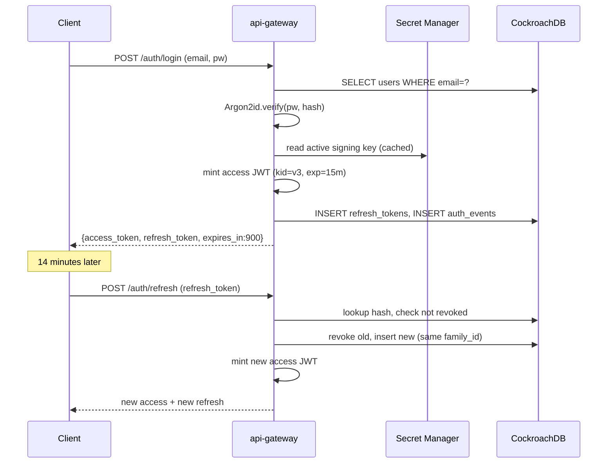

# Auth: End-to-End Identity, Not a Dev Token Mint

*Design document for roadmap item 2.1.*

## Problem

The current `api-gateway` ships `POST /api/v1/auth/token` (`api-gateway/src/main/java/.../controller/AuthController.java`) — a development convenience endpoint that hands a signed JWT to any caller who supplies a `userId` string. It is on the `permitAll` list in `SecurityConfig.java:50`. There is no signup, no password, no OAuth, and no identity verification anywhere in the system. The `users` table in `database/init.sql:4` has only `id` and `username` columns — no credential storage at all.

The JWT signing secret is `random_password.jwt_secret` held in Terraform state (`infra/gcp/terraform/main.tf:157`), so every `tofu destroy && apply` cycle silently invalidates every token in circulation. There is no key versioning, no rotation, and no path to recovering after a key compromise that does not also nuke every active session.

The system cannot host real contestants until it can answer four questions: who is this caller, can they prove it, can we revoke them, and can we rotate signing material without ejecting everybody. None of those answers exists today.

## Design

### Storage

Extend the `users` table with credential and audit columns:

```sql
ALTER TABLE users
  ADD COLUMN password_hash STRING NOT NULL,           -- Argon2id encoded string
  ADD COLUMN password_algo STRING NOT NULL DEFAULT 'argon2id',
  ADD COLUMN email STRING NOT NULL UNIQUE,
  ADD COLUMN email_verified BOOL NOT NULL DEFAULT false,
  ADD COLUMN role STRING NOT NULL DEFAULT 'user',     -- 'user' | 'admin'
  ADD COLUMN status STRING NOT NULL DEFAULT 'active', -- 'active' | 'locked' | 'deleted'
  ADD COLUMN created_at TIMESTAMPTZ NOT NULL DEFAULT now(),
  ADD COLUMN last_login_at TIMESTAMPTZ;

CREATE INDEX users_by_email ON users(email);
```

The `password_hash` column stores the full Argon2id-encoded string (algorithm, parameters, salt, hash all in one — the same format `argon2` CLI produces). Parameters: `m=65536, t=3, p=4` — tuned to ~250 ms on the api-gateway VM. Re-tune as hardware moves.

A new `refresh_tokens` table backs refresh-token rotation:

```sql
CREATE TABLE refresh_tokens (
  id UUID PRIMARY KEY DEFAULT gen_random_uuid(),
  user_id UUID NOT NULL REFERENCES users(id) ON DELETE CASCADE,
  token_hash BYTES NOT NULL,        -- SHA-256 of the opaque refresh token
  family_id UUID NOT NULL,          -- shared across rotated tokens in one login chain
  issued_at TIMESTAMPTZ NOT NULL DEFAULT now(),
  expires_at TIMESTAMPTZ NOT NULL,
  revoked_at TIMESTAMPTZ,
  user_agent STRING,
  ip_address INET,
  INDEX refresh_by_family (family_id),
  INDEX refresh_by_user (user_id, expires_at)
);
```

The `family_id` is the refresh-token-rotation anchor: when a refresh token is presented and accepted, the previous row gets `revoked_at = now()` and a new row is issued under the same `family_id`. If a *revoked* token from the same family is ever presented, the entire family is revoked — a textbook stolen-refresh-token detection.

A third table `auth_events` captures every authentication-related action for audit and abuse triage:

```sql
CREATE TABLE auth_events (
  id UUID PRIMARY KEY DEFAULT gen_random_uuid(),
  event_type STRING NOT NULL,       -- 'signup' | 'login_success' | 'login_fail' | 'refresh' | 'logout' | 'password_reset'
  user_id UUID,                     -- nullable on login_fail with unknown email
  email STRING,
  ip_address INET NOT NULL,
  user_agent STRING,
  failure_reason STRING,            -- 'bad_password' | 'locked' | 'no_user' | ...
  created_at TIMESTAMPTZ NOT NULL DEFAULT now(),
  INDEX events_by_user (user_id, created_at DESC),
  INDEX events_by_ip (ip_address, created_at DESC)
);
```

### Endpoints

Public (in `SecurityConfig.permitAll`): `/actuator/health`, `/api/v1/auth/signup`, `/api/v1/auth/login`, `/api/v1/auth/refresh`. Everything else demands a valid access token. `POST /api/v1/auth/logout` requires a valid access token (you must prove you are the session being torn down). The legacy `POST /api/v1/auth/token` is deleted.

`POST /api/v1/auth/signup` accepts `{username, email, password}`. Password rules: minimum 12 characters, not on a deny-list of the top 10,000 common passwords (vendored at build time). The handler hashes with Argon2id, inserts into `users`, fires a `signup` audit row, and returns 201 with no body (the caller must explicitly log in next — signup is not auto-login).

`POST /api/v1/auth/login` accepts `{email, password}`. The handler:

1. Looks up the user by email.
2. Verifies the password against `password_hash`. If the row is missing, performs a dummy Argon2 verify against a fixed string to avoid timing-side-channel disclosure of email existence.
3. On success, issues an access token (JWT, 15-minute TTL) and an opaque refresh token (32 bytes of CSPRNG, base64url-encoded, 7-day TTL). The refresh token's SHA-256 is stored; the raw value is returned only on issuance.
4. Writes an `auth_events` row. On failure, the response is a single generic 401 — no distinction between "no such email" and "wrong password".

`POST /api/v1/auth/refresh` accepts `{refresh_token}` in the body. The handler hashes the presented token, looks it up, checks `revoked_at IS NULL AND expires_at > now()`, revokes the row, issues a new refresh token under the same `family_id`, and returns a fresh access + refresh pair. If the token is found but already revoked, every row sharing its `family_id` is also revoked and the call returns 401 — see refresh-token rotation above.

`POST /api/v1/auth/logout` reads the JWT, revokes every refresh token in the same family, and writes a `logout` event. The access token itself is not revoked (it expires in ≤15 minutes anyway); the gateway does not maintain a JWT blacklist.

### JWT structure

```json
{
  "iss": "online-judge",
  "sub": "<user-uuid>",
  "iat": 1715923200,
  "exp": 1715924100,
  "kid": "v3",
  "scope": "user",
  "username": "alice",
  "region": "asia-south1"
}
```

`kid` (key id) is the version label of the signing key. The api-gateway holds the active key and the two most recent prior keys, and trusts tokens signed by any of them — this is the rotation handover window.

Keys live in Secret Manager as separate secret resources: `oj-jwt-key-v1`, `oj-jwt-key-v2`, `oj-jwt-key-v3`, etc. Each secret holds a 64-byte HMAC key (HS256). The api-gateway reads all three on startup via the existing GCP SDK path that already fetches the GCS signer key. A scheduled job (Cloud Scheduler → Cloud Run, or a Spring `@Scheduled` task inside api-gateway itself) creates a new key version every 30 days. The rotation procedure: write a new version `vN+1`, deploy api-gateway so it knows about it, flip the `active_kid` config flag, deploy again. Old `vN-2` can be deleted from Secret Manager once no in-flight tokens reference it (≥15 minutes after deactivation).

### Endpoint gating

`SecurityConfig` after the change:

```
.permitAll:
  /actuator/health
  /actuator/info
  /api/v1/auth/signup
  /api/v1/auth/login
  /api/v1/auth/refresh
  /v3/api-docs/**, /swagger-ui/**  (dev profile only)

.authenticated:
  everything else, including /api/v1/auth/logout
```

Admin endpoints introduced later (problem CRUD per roadmap item 18) gate additionally on `scope=admin` in the JWT.

### Rate limiting

The existing `RateLimitService` runs a Lua atomic-check on Redis ([[rate-limiting]], [[leaky-bucket]]). It already supports per-key buckets. We add three new buckets, isolated from the submission bucket:

| Bucket name        | Key                  | Rate           | Burst | Purpose                                     |
|--------------------|----------------------|----------------|-------|---------------------------------------------|
| `auth:login:ip`    | client IP            | 10/min         | 20    | Brute-force resistance per source IP        |
| `auth:login:user`  | email (lowercased)   | 5/min          | 10    | Per-account lockout against credential-stuffing |
| `auth:signup:ip`   | client IP            | 3/hour         | 5     | Abuse-prevention against signup floods      |

A consumer hitting `auth:login:user` twenty times triggers an automatic 15-minute lockout (`status='locked'` on the user row, lifted by a cron sweep). The bucket isolation matters: a brute-force attempt against `/auth/login` from a contest LAN must not consume the submission-bucket budget that legitimate users on the same NAT need during a contest window.

### Sequence



## Implementation phases

**Phase A (2d) — schema and signup.** Apply the `users`, `refresh_tokens`, `auth_events` migrations as a single Flyway V3. Implement `POST /auth/signup`. Add Argon2id encoder bean. No frontend yet — verified with curl plus a developer-only `GET /admin/users/by-email` (deleted before launch).

**Phase B (2d) — login and access tokens.** Implement `POST /auth/login`. Wire `auth:login:ip` and `auth:login:user` buckets. Add the Argon2 timing-equalisation dummy on missing-email. Replace `JwtTokenProvider`'s in-memory secret with the Secret Manager fetch.

**Phase C (1d) — refresh and rotation.** Implement `POST /auth/refresh` and `POST /auth/logout`. Implement family-revocation on replay.

**Phase D (1d) — gating cleanup.** Delete `POST /api/v1/auth/token`. Update `SecurityConfig` to the new gating list. Add `kid` claim and multi-version verifier.

**Phase E (1d) — audit and observability.** Add Prometheus counters: `auth_login_total{result=success|fail}`, `auth_signup_total`, `auth_refresh_total{result=ok|replay_detected}`. Cloud Monitoring alert on `auth_login_total{result=fail}` exceeding 50/min for 5 minutes (likely credential-stuffing).

## Risks

**Argon2 cost on a 4 GB VM.** The api-gateway JVM is capped at 384 MB heap on an e2-medium with 4 GB system memory. Argon2id with `m=65536` (64 MiB per hash) and a login burst of 20 concurrent users means transient ~1.3 GB of off-heap Argon2 working set. This is the realistic ceiling — bump to `m=32768` if memory pressure shows up, accepting weaker offline-attack resistance.

**Refresh-token theft window.** The 7-day TTL is a tradeoff: longer means fewer refresh churns and a worse mobile UX, but a stolen token is usable for up to 7 days unless replay-detected. The family-revoke-on-replay mitigates: as soon as either the legitimate client or the attacker rotates a stale token, the family burns. Document the tradeoff in the runbook.

**Secret Manager fetch latency on cold start.** Three secrets per gateway boot, ~80 ms each. Acceptable for a JVM that takes ≥10 s to come up anyway, but the fetches must happen in parallel and fail-fast — a Secret Manager outage should not take 30 s to surface.

**Account enumeration via signup.** `POST /auth/signup` with an existing email currently returns 409, which lets an attacker enumerate registered addresses. Mitigation: always return 200 OK for signup, and rely on the email-verification path to disambiguate. Phase A defers email verification, so v1 ships the 409 with the explicit accepted risk; rate-limiting (`auth:signup:ip = 3/hour`) is the compensating control.

## Acceptance criteria

1. `POST /api/v1/auth/token` returns 404.
2. A signup with a 12-character password, followed by login with the same password, returns an access + refresh pair.
3. Login with the wrong password 21 times within 60 seconds from the same IP returns 429 on attempt 21.
4. Login with the wrong password 6 times against the same email locks the account; subsequent correct-password attempts return 401 with `failure_reason=locked` in the audit row until the 15-minute lockout expires.
5. A refresh-token replay (presenting a token whose row has `revoked_at IS NOT NULL` but `family_id` matches an active session) revokes every token in the family and returns 401.
6. Signing-key rotation: writing a new `oj-jwt-key-vN+1` secret and bumping the `active_kid` config flag results in newly-issued tokens carrying `kid=vN+1`, while in-flight tokens with `kid=vN` continue to verify until their natural expiry.
7. Every login attempt, signup, refresh, and logout writes exactly one row to `auth_events`.
8. The Cloud Monitoring alert `auth_login_failures_high` fires when synthetic credential-stuffing exceeds 50 fails/min for 5 minutes.

## Related

- [[rate-limiting]] — bucket isolation between `/auth/*` and `/submissions`
- [[leaky-bucket]] — the algorithm backing the existing `RateLimitService`
- [[idempotency-keys]] — pattern reused for refresh-token rotation
- [[cockroachdb]] — where `users`, `refresh_tokens`, `auth_events` live
