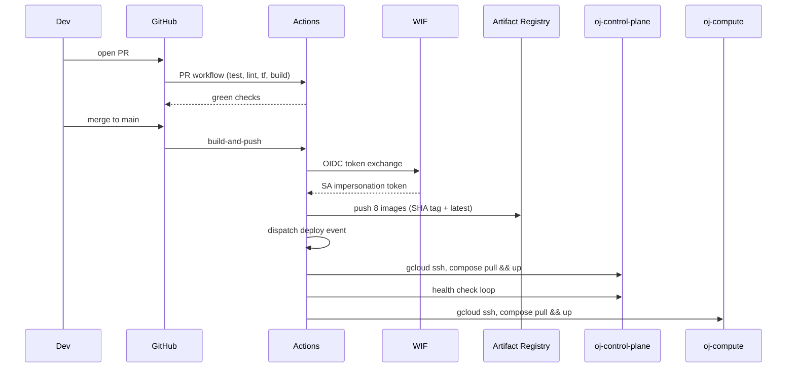

# CI/CD via GitHub Actions

*Design document for roadmap item 3.11.*

## Problem

There is no CI today. Every change to `code-all/online-judge-at-scale` is built and deployed manually:

```
./gradlew :api-gateway:bootJar
docker buildx build --platform linux/amd64 --push -t asia-south1-docker.pkg.dev/.../api-gateway:latest .
gcloud compute ssh oj-control-plane --tunnel-through-iap --command 'docker compose pull && docker compose up -d api-gateway'
```

The same shape repeats per service, per push. Three categories of problem:

1. **No safety net before merge.** Broken tests can land on `main`. A typo in a Spring config crashes a container only after manual deploy.
2. **Manual deploys cannot be audited or rolled back.** There is no record of which image SHA is running on which VM at any moment. Reverting means re-running the build for the previous commit.
3. **Service-account keys for image push.** The current operator pushes to Artifact Registry using their personal `gcloud auth` session, which inherits broad project permissions. There is no machine-scoped credential.

The fix is a GitHub Actions pipeline split into three workflows: per-PR validation, merge-to-main build-and-push, and deploy-to-VMs. Cloud authentication via Workload Identity Federation, not a stored SA key.

## Design

### Repository layout

The monorepo at `code-all/online-judge-at-scale` already separates services into Gradle subprojects. Each service has its own `Dockerfile`. As of the audit, the services that ship Docker images:

- `api-gateway` — `Dockerfile` exists
- `problem-service` — `Dockerfile` exists
- `execution-worker` — `Dockerfile` exists (uses Alpine base)
- `sandbox-manager` — `Dockerfile` exists (Alpine + privileged runtime)
- `scoring-pipeline` — `Dockerfile` exists (Flink image base)
- `leaderboard-service` — `Dockerfile` exists
- `contest-service` — `Dockerfile` exists (committed, not yet in compose)
- `analytics-pipeline` — `Dockerfile` exists (Flink batch base)

Eight images total. `common` is a Gradle library only, no image.

### Workflow 1 — PR validation

`.github/workflows/pr.yml`:

```yaml
name: PR
on:
  pull_request:
    branches: [main]

jobs:
  test:
    runs-on: ubuntu-22.04
    strategy:
      matrix:
        module:
          - common
          - api-gateway
          - problem-service
          - execution-worker
          - sandbox-manager
          - scoring-pipeline
          - leaderboard-service
          - contest-service
          - analytics-pipeline
      fail-fast: false
    steps:
      - uses: actions/checkout@v4
      - uses: actions/setup-java@v4
        with:
          distribution: temurin
          java-version: 21
      - uses: gradle/actions/setup-gradle@v3
      - name: Test ${{ matrix.module }}
        run: ./gradlew :${{ matrix.module }}:test --no-daemon
      - name: Upload test results
        if: failure()
        uses: actions/upload-artifact@v4
        with:
          name: test-results-${{ matrix.module }}
          path: ${{ matrix.module }}/build/reports/tests/

  lint-format:
    runs-on: ubuntu-22.04
    steps:
      - uses: actions/checkout@v4
      - uses: actions/setup-java@v4
        with:
          distribution: temurin
          java-version: 21
      - uses: gradle/actions/setup-gradle@v3
      - run: ./gradlew spotlessCheck --no-daemon

  terraform:
    runs-on: ubuntu-22.04
    defaults:
      run:
        working-directory: infra/gcp/terraform
    steps:
      - uses: actions/checkout@v4
      - uses: opentofu/setup-opentofu@v1
      - run: tofu fmt -check -recursive
      - run: tofu init -backend=false
      - run: tofu validate

  buildable:
    runs-on: ubuntu-22.04
    steps:
      - uses: actions/checkout@v4
      - uses: actions/setup-java@v4
        with:
          distribution: temurin
          java-version: 21
      - uses: gradle/actions/setup-gradle@v3
      - run: ./gradlew assemble --no-daemon
```

Matrix parallelisation across nine modules keeps wall-clock under 8 minutes on Actions' standard runners. `fail-fast: false` so a flaky test in one module surfaces failures in others rather than aborting at the first red.

`spotlessCheck` is added to the root Gradle config; one-time setup work. The Terraform job catches accidental `*.tf` drift before it hits an apply.

### Workflow 2 — merge-to-main build and push

`.github/workflows/build-and-push.yml`:

```yaml
name: build-and-push
on:
  push:
    branches: [main]

permissions:
  id-token: write    # required for Workload Identity Federation
  contents: read

jobs:
  build:
    runs-on: ubuntu-22.04
    strategy:
      matrix:
        service:
          - api-gateway
          - problem-service
          - execution-worker
          - sandbox-manager
          - scoring-pipeline
          - leaderboard-service
          - contest-service
          - analytics-pipeline
    outputs:
      sha: ${{ steps.meta.outputs.sha }}
    steps:
      - uses: actions/checkout@v4

      - id: meta
        run: |
          echo "sha=$(git rev-parse --short HEAD)" >> "$GITHUB_OUTPUT"

      - uses: google-github-actions/auth@v2
        with:
          workload_identity_provider: projects/<PROJECT_NUMBER>/locations/global/workloadIdentityPools/github-pool/providers/github
          service_account: gha-deployer@online-judge-hk.iam.gserviceaccount.com

      - uses: google-github-actions/setup-gcloud@v2
      - run: gcloud auth configure-docker asia-south1-docker.pkg.dev --quiet

      - uses: actions/setup-java@v4
        with:
          distribution: temurin
          java-version: 21
      - uses: gradle/actions/setup-gradle@v3

      - name: Build jar
        if: matrix.service != 'sandbox-manager'
        run: ./gradlew :${{ matrix.service }}:bootJar --no-daemon

      - name: Build & push image
        uses: docker/build-push-action@v5
        with:
          context: ${{ matrix.service }}
          file: ${{ matrix.service }}/Dockerfile
          push: true
          platforms: linux/amd64
          tags: |
            asia-south1-docker.pkg.dev/online-judge-hk/oj/${{ matrix.service }}:${{ steps.meta.outputs.sha }}
            asia-south1-docker.pkg.dev/online-judge-hk/oj/${{ matrix.service }}:latest
          cache-from: type=gha,scope=${{ matrix.service }}
          cache-to: type=gha,mode=max,scope=${{ matrix.service }}

  trigger-deploy:
    needs: build
    runs-on: ubuntu-22.04
    steps:
      - uses: actions/checkout@v4
      - uses: peter-evans/repository-dispatch@v3
        with:
          event-type: deploy
          client-payload: |
            {"sha": "${{ needs.build.outputs.sha }}"}
```

Every image gets two tags: the git SHA and `:latest`. The SHA tag is the rollback handle. Artifact Registry retention policy keeps the most recent 30 SHA-tagged images per service; older versions auto-purge.

`sandbox-manager` skips the Gradle step because it's a Go service (or whatever the actual stack is — confirm during implementation). The matrix entry still runs the Docker build.

GHA cache (`cache-from/cache-to: type=gha`) cuts subsequent builds to ~90 seconds per service after first warm-up.

### Workflow 3 — deploy

`.github/workflows/deploy.yml`:

```yaml
name: deploy
on:
  repository_dispatch:
    types: [deploy]
  workflow_dispatch:
    inputs:
      sha:
        description: 'Image tag to deploy'
        required: true
        type: string

permissions:
  id-token: write
  contents: read

concurrency:
  group: deploy-prod
  cancel-in-progress: false

jobs:
  deploy-control-plane:
    runs-on: ubuntu-22.04
    environment: production-control-plane
    steps:
      - uses: actions/checkout@v4
      - uses: google-github-actions/auth@v2
        with:
          workload_identity_provider: projects/<PN>/locations/global/workloadIdentityPools/github-pool/providers/github
          service_account: gha-deployer@online-judge-hk.iam.gserviceaccount.com
      - uses: google-github-actions/setup-gcloud@v2
      - name: Deploy control plane
        run: |
          SHA="${{ github.event.client_payload.sha || github.event.inputs.sha }}"
          gcloud compute ssh oj-control-plane \
            --tunnel-through-iap \
            --zone=asia-south1-a \
            --command="cd /opt/oj && IMAGE_TAG=${SHA} docker compose -f control-plane-compose.yml pull && \
                       IMAGE_TAG=${SHA} docker compose -f control-plane-compose.yml up -d"
      - name: Smoke test
        run: |
          for i in $(seq 1 30); do
            STATUS=$(gcloud compute ssh oj-control-plane --tunnel-through-iap --zone=asia-south1-a --command='curl -fs http://localhost:8088/actuator/health' 2>/dev/null | jq -r .status)
            [ "$STATUS" = "UP" ] && exit 0
            sleep 5
          done
          echo "Health check never returned UP"
          exit 1

  deploy-compute:
    needs: deploy-control-plane
    runs-on: ubuntu-22.04
    environment: production-compute
    steps:
      - uses: actions/checkout@v4
      - uses: google-github-actions/auth@v2
        with:
          workload_identity_provider: projects/<PN>/locations/global/workloadIdentityPools/github-pool/providers/github
          service_account: gha-deployer@online-judge-hk.iam.gserviceaccount.com
      - uses: google-github-actions/setup-gcloud@v2
      - run: |
          SHA="${{ github.event.client_payload.sha || github.event.inputs.sha }}"
          gcloud compute ssh oj-compute --tunnel-through-iap --zone=asia-south1-a --command="cd /opt/oj && IMAGE_TAG=${SHA} docker compose -f compute-compose.yml pull && IMAGE_TAG=${SHA} docker compose -f compute-compose.yml up -d"
```

Two phases (control plane first, then compute) so that schema migrations from api-gateway's Flyway run before the worker picks up new code that depends on them. `environment: production-*` triggers GitHub's manual-approval gate if the env is configured with one — useful for a launch-window freeze.

`concurrency: deploy-prod` serialises deploys so two simultaneous merges don't race.

The compose files reference `image: asia-south1-docker.pkg.dev/.../api-gateway:${IMAGE_TAG:-latest}` so the SHA is plumbed via the env var.

### Workload Identity Federation

The OIDC trust between GitHub Actions and the project. No SA key on disk:

```hcl
resource "google_iam_workload_identity_pool" "github" {
  workload_identity_pool_id = "github-pool"
  display_name              = "GitHub Actions"
}

resource "google_iam_workload_identity_pool_provider" "github" {
  workload_identity_pool_id          = google_iam_workload_identity_pool.github.workload_identity_pool_id
  workload_identity_pool_provider_id = "github"
  attribute_mapping = {
    "google.subject"       = "assertion.sub"
    "attribute.repository" = "assertion.repository"
    "attribute.ref"        = "assertion.ref"
  }
  attribute_condition = "assertion.repository == 'hemantkgupta/online-judge-at-scale'"
  oidc {
    issuer_uri = "https://token.actions.githubusercontent.com"
  }
}

resource "google_service_account" "gha_deployer" {
  account_id = "gha-deployer"
}

resource "google_service_account_iam_member" "gha_workload_user" {
  service_account_id = google_service_account.gha_deployer.name
  role               = "roles/iam.workloadIdentityUser"
  member             = "principalSet://iam.googleapis.com/${google_iam_workload_identity_pool.github.name}/attribute.repository/hemantkgupta/online-judge-at-scale"
}

resource "google_project_iam_member" "gha_artifact_writer" {
  project = var.project_id
  role    = "roles/artifactregistry.writer"
  member  = "serviceAccount:${google_service_account.gha_deployer.email}"
}

resource "google_project_iam_member" "gha_compute_iap" {
  project = var.project_id
  role    = "roles/iap.tunnelResourceAccessor"
  member  = "serviceAccount:${google_service_account.gha_deployer.email}"
}

resource "google_project_iam_member" "gha_compute_admin" {
  project = var.project_id
  role    = "roles/compute.osLogin"
  member  = "serviceAccount:${google_service_account.gha_deployer.email}"
}
```

The `attribute_condition` is the security boundary: only OIDC tokens from this specific repository can mint the impersonation token. Branch-level restriction (`attribute.ref == 'refs/heads/main'`) is added to the deploy workflow's impersonation specifically.

### Branch protections

GitHub repository settings:

- `main` is protected.
- Require pull request before merging.
- Require status checks before merging: `test (common)`, `test (api-gateway)`, `test (problem-service)`, `test (execution-worker)`, `test (sandbox-manager)`, `test (scoring-pipeline)`, `test (leaderboard-service)`, `test (contest-service)`, `test (analytics-pipeline)`, `lint-format`, `terraform`, `buildable`.
- Require branches to be up to date before merging.
- Require linear history (squash-merge).
- Restrict who can push to matching branches: nobody (only PR merges).

### Rollback

The deploy workflow's `workflow_dispatch` input takes any SHA tag. To roll back to last-known-good:

```
gh workflow run deploy.yml -f sha=abc1234
```

Artifact Registry's lifecycle policy retains 30 SHA-tagged images per service (about a month of merges at one merge per workday). For longer-term rollback, the `:latest` tag of a known-good commit can be re-pinned by re-tagging in AR.

### Sequence



## Implementation phases

**Phase A (1d) — Workload Identity Federation.** Terraform for the pool, provider, SA, and bindings. Verify with a hello-world workflow that runs `gcloud auth print-access-token`.

**Phase B (1d) — PR workflow.** All four jobs (test matrix, lint, terraform, buildable). Set as required checks once verified.

**Phase C (2d) — build-and-push workflow.** Per-service Dockerfile audit (some may need touching up). Verify all eight images push successfully on the first merge.

**Phase D (1d) — deploy workflow.** Verify the two-phase deploy on a staging clone first. Confirm `IMAGE_TAG` env var propagates correctly through compose.

**Phase E (1d) — branch protections and runbook.** Lock down `main`. Write the rollback runbook step-by-step.

**Phase F (1d) — observability.** A Slack/email notification on deploy completion. A weekly job that prunes the GHA artifact cache.

## Risks

**Image build cache invalidation cascade.** Gradle's `bootJar` produces an output that changes on every commit. The Dockerfile `COPY build/libs/*.jar` invalidates the image cache layer. Mitigation: structure the Dockerfile in two stages — first stage layers dependencies (rarely change), second stage layers the application JAR (always changes). The `cache-from/cache-to` lines in `build-push-action` then cache the first stage across builds.

**Workload Identity Federation misconfig.** If the `attribute_condition` is too permissive, any GitHub repo could impersonate the deployer SA. Mitigation: scope condition explicitly to `hemantkgupta/online-judge-at-scale`, and audit periodically with `gcloud iam workload-identity-pools providers describe`.

**Deploy in the middle of a contest.** The workflow has no awareness of contest state. A merge during a live contest could restart api-gateway. Mitigation: a manual freeze flag (a tag on the main branch, or a check-file in a bucket) that the deploy job consults before running. Document the freeze procedure in the launch runbook.

**Flaky tests block merges.** A non-deterministic integration test (e.g. one of the Testcontainers-based ones) flakes ~5% of the time today. CI will make this immediately painful. Mitigation: budget a separate flake-stabilisation pass before declaring CI mandatory.

**Cost of GHA minutes.** With eight images × ~5-minute builds × matrix parallelism, a merge costs ~40 minute-hours. At 100 merges/month that is ~70 hours/month, well within the GHA free tier for a public repo or comfortably within a paid tier for a private one.

## Acceptance criteria

1. Opening a PR triggers the test matrix; all nine test jobs run in parallel.
2. Merging a PR to `main` triggers `build-and-push`; all eight images land in Artifact Registry tagged with both the SHA and `latest` within 10 minutes of merge.
3. `build-and-push` completion triggers `deploy`; both VMs are running the new SHA within 5 minutes of build success.
4. The `:latest` and SHA-tagged images are byte-identical for the same commit.
5. `workflow_dispatch` with a prior SHA rolls back both VMs to that SHA.
6. No GCP service-account key file exists anywhere in the repo or in GitHub Secrets.
7. Branch protection on `main` rejects pushes that bypass the PR flow.
8. A deliberate failing test on a PR blocks merge (button is greyed out in GitHub UI).

## Related

- [[control-plane-data-plane-split]] — why the two-phase deploy matters
- [[outbox]] — pattern affecting safe restart ordering
- [[feature-flags]] — complementary to SHA-tag rollback
