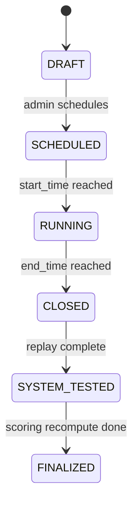
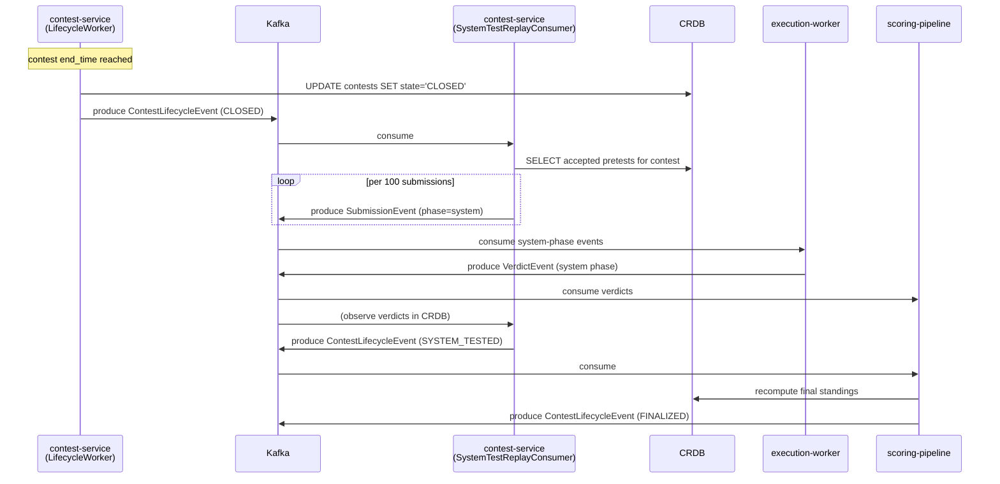

# Contest-Close System-Tests Replay

*Design document for roadmap item 4.23.*

## Problem

The system runs every submission through two phases by design:

- **Pretest phase.** A small, fast subset of test cases. The contestant gets a verdict in seconds. ACCEPTED here means the solution passed the pretests — not the full test set.
- **System phase.** The full, large test corpus, run after the contest closes. This is what determines final standings.

The infrastructure for the phase distinction exists. The proto `SubmissionEvent` already carries a `phase` field ("pretest" | "system"). `SubmissionConsumer:120` (in `execution-worker`) re-publishes onto `submissions.system` immediately when a Phase-1 verdict is ACCEPTED. The idempotency key in `IdempotencyService` is scoped by phase, so a Phase-1 ACCEPTED re-published to the system topic gets a distinct execution.

What does *not* exist is the contest-close hook. The replay today only fires on the per-submission real-time path. If a contest closed and you wanted to:

- Re-run every ACCEPTED-on-pretest submission against the full system tests,
- Or re-run every submission for a problem whose test cases were updated mid-contest,

…there is no trigger. Only submissions that ACCEPTED during the live window get system-tested. A submission that ACCEPTED in the last minute of the contest with the system topic backed up gets system-tested late; a submission that ACCEPTED right at the second the contest closed and got cleanly published may never be system-tested at all (it depends on consumer cadence — racy).

The fix: a deterministic contest-close trigger that walks the submissions for the closing contest's problem set and produces an explicit batch of system-phase SubmissionEvents.

## Design

### Trigger

`contest-service` already has a `ContestStateMachine` and `LifecycleWorker` (per the roadmap audit). The state transition `RUNNING → CLOSED` is the trigger point. The lifecycle worker, on observing this transition, emits an event on a new Kafka topic `contests.lifecycle`:

```proto
message ContestLifecycleEvent {
  string contest_id = 1;
  string previous_state = 2;
  string new_state = 3;
  int64 transition_time_ms = 4;
  repeated string problem_ids = 5;
  string region = 6;
}
```

The topic is partitioned by `contest_id` to maintain ordering per contest. Replication factor 3, min ISR 2.

### Consumer choice

The system-tests-replay logic lives in a new lightweight consumer. Two reasonable homes:

- **Inside `execution-worker`.** Already consumes Kafka, already knows how to publish SubmissionEvents. Lowest new-component count.
- **Inside `contest-service`.** Owns the contest-lifecycle domain, has the contest's problem set in cache.

The choice is `contest-service`. The replay logic is contest-domain logic, not execution logic — the execution-worker should not have to know about contests at all. Its job is "given a SubmissionEvent, produce a verdict". Letting it consume contest-lifecycle events bloats its responsibilities.

A new `SystemTestReplayConsumer` in `contest-service` subscribes to `contests.lifecycle` on a consumer group `contest-service.lifecycle.replay`. On a `CLOSED` transition for a contest, it executes:

```sql
SELECT s.id, s.user_id, s.problem_id, s.language, s.source_uri, s.region
FROM submissions s
WHERE s.problem_id = ANY(:problem_ids)
  AND s.contest_id = :contest_id
  AND s.status = 'ACCEPTED'
  AND s.phase = 'pretest'
ORDER BY s.created_at;
```

For each row, it publishes a new SubmissionEvent on `submissions.system` with:

- `submission_id = original.submission_id` (same ID; the phase scoping in idempotency keys handles uniqueness)
- `phase = "system"`
- `replay_reason = "contest_close"` (new field on the proto, see below)
- `user_id`, `problem_id`, `language`, `source_uri` copied from the original submission

The replay is batched by yielding from the SELECT in chunks of 100 and publishing each chunk with a small inter-batch sleep (5 ms) to avoid overwhelming the worker pool. A 5000-submission contest produces 5000 system runs; at the steady-state worker throughput of ~30 submissions/sec on the launch-tier compute VM, that is ~3 minutes of post-close churn. Document this in the contest runbook.

### Proto extension

`common/src/main/proto/events.proto` adds two fields to `SubmissionEvent`:

```proto
message SubmissionEvent {
  // ... existing fields ...
  string phase = 11;            // already present
  string replay_reason = 12;    // NEW: "live" | "contest_close" | "manual_retest"
  string contest_id = 13;       // NEW: set when this submission was part of a contest
}
```

Proto3 makes both additions backwards-compatible. Old consumers see them as default empty string.

### Idempotency

`IdempotencyService` keys submissions on `(submission_id, phase)`. A system-phase replay of an already-system-tested submission is rejected at the idempotency layer — there is no double-run.

The "contest-close" replay specifically may encounter submissions whose real-time path already drove them into system. Those are no-ops, accounted for by the existing idempotency check. The metric `replay_skipped_already_tested_total` tracks how many of the replayed events were superfluous (high values indicate the real-time path is already keeping up; low values indicate the close-trigger is doing real work).

### Final scoring

`scoring-pipeline` (Flink) consumes `evaluated_results` and writes to the leaderboard. It currently does not distinguish phase. The change:

1. The pipeline materialises two views of the verdict stream: `pretest_verdicts` and `system_verdicts`, keyed by `(user_id, problem_id, contest_id)`.
2. While the contest is in `RUNNING`, the leaderboard reflects pretest verdicts.
3. On `CLOSED`, the pipeline awaits a "system replay done" signal (see below) and recomputes final standings using only `system_verdicts`. For any `(user, problem)` pair without a system verdict, the pretest verdict stands (this handles problems that were not contest-eligible for system replay).
4. The "final standings" leaderboard is published to a separate Redis sorted set (`leaderboard:{contest_id}:final`), preserving the live `leaderboard:{contest_id}:live` set for audit.

The "system replay done" signal: `contest-service`'s `SystemTestReplayConsumer` publishes a `ContestLifecycleEvent` with a new `new_state = "SYSTEM_TESTED"` once it has produced the last batch *and* observed verdicts in CRDB for all of them. The scoring pipeline subscribes to this and triggers the recompute.

### Replay reason field for observability

The `replay_reason` field exists primarily for the dashboards. A spike of `replay_reason=manual_retest` indicates an admin used the (separately-built) admin endpoint to re-trigger system tests for a known-bad problem. A spike of `replay_reason=contest_close` is the expected post-close churn. A spike of `replay_reason=live` outside of a contest is a smoke-test or an abuse.

### State machine summary



Each transition emits a `ContestLifecycleEvent`. The `CLOSED → SYSTEM_TESTED` transition is the new piece this design adds.

### Sequence



### Edge cases

**A contest with no ACCEPTED submissions.** The replay query returns zero rows. The state machine still transitions to `SYSTEM_TESTED` immediately. The scoring pipeline's recompute is a no-op.

**Worker pool too small to drain the replay in a reasonable time.** A 50,000-submission contest produces 50,000 system runs. At 30 submissions/sec, that is 28 minutes of replay. Acceptable if documented in the launch runbook; less acceptable if a future contest grows to 500K submissions. Mitigation: a configurable rate-limit on the replay producer (the 5 ms inter-batch sleep is the knob), tunable per contest. If launch traffic warrants it, also bump `executor-worker` pool count.

**A pretest verdict that is wrong-because-test-set-was-wrong.** This is the original motivation for replay: a problem-author discovers a flaky pretest. They edit the problem's test set, then trigger a manual `replay_reason=manual_retest` via an admin endpoint that re-uses the same `SystemTestReplayConsumer` logic, scoped to one problem's submissions. Same code path.

**SPOT preemption mid-replay.** If the compute VM is preempted while the replay is in flight, the in-progress system-phase SubmissionEvents already on the topic will be consumed by the next worker that comes up — no message loss with the 3-broker Kafka. The replay consumer's progress is itself idempotent: re-running the SELECT and re-publishing every event is rejected by `IdempotencyService` on the second pass.

**Replay never reaches SYSTEM_TESTED because some submissions hang.** A poison submission that the worker keeps reclaiming (per roadmap 2.5) will never produce a verdict. The replay consumer's "verdicts in CRDB for all of them" check needs a timeout (default 10 minutes per contest size, configurable). On timeout, transition to `SYSTEM_TESTED` anyway with a flag indicating partial completion, and emit an alert.

## Implementation phases

**Phase A (1d) — proto extension.** Add `replay_reason` and `contest_id` to `SubmissionEvent`. Regenerate protos. Update producers in api-gateway (set `replay_reason="live"`).

**Phase B (1d) — `contests.lifecycle` topic and event emission.** Add the topic. Update `LifecycleWorker` to emit on every state transition.

**Phase C (2d) — `SystemTestReplayConsumer`.** Subscribe to `contests.lifecycle`, implement the batched select-and-publish loop, with the inter-batch rate limit. Wire `IdempotencyService` for the verification side. Add the metric `replay_skipped_already_tested_total`.

**Phase D (1d) — `SYSTEM_TESTED` transition.** Implement the "verdicts observed for all replayed submissions" check. Emit the next lifecycle event.

**Phase E (2d) — scoring pipeline phase split.** Materialise the two views in Flink. Wire the recompute trigger on `SYSTEM_TESTED`. Publish the `:final` leaderboard set.

**Phase F (1d) — admin manual-retest endpoint.** A small `POST /admin/problems/{id}/retest` endpoint on `contest-service` that produces the same replay events, scoped to one problem. Gated on the admin scope from the auth design doc.

## Risks

**Final-leaderboard ambiguity during the replay window.** Between `CLOSED` and `SYSTEM_TESTED`, the leaderboard shown to contestants is the pretest one — but the contest is over. Some contestants will refresh and see their standing change unexpectedly when the replay finishes and `:final` overrides `:live`. Mitigation: the UI displays a banner "system tests in progress, standings preliminary" while the contest is in `CLOSED` but not `SYSTEM_TESTED`. The state is queryable on `GET /api/v1/contests/{id}`.

**Replay storm collides with the live submission stream.** The replay produces onto the same `submissions.system` topic that real-time ACCEPTED-pretest submissions land on. If a contest closes right as another contest is mid-flight, the worker pool sees ~5000 backlog items in front of new live submissions. Mitigation: a separate topic per contest replay (`submissions.system.replay.{contest_id}`) consumed by a lower-priority consumer group, with the existing `submissions.system` reserved for the live ACCEPTED-then-system path. Worth doing if multi-contest concurrency is a launch target; can defer if only one contest runs at a time.

**Idempotency-key explosion.** Every system replay creates a new row in `idempotency_keys`. A 50K-submission contest doubles the table. Mitigation: add a TTL-based cleanup (`DELETE FROM idempotency_keys WHERE created_at < now() - INTERVAL '30 days'`) as a Cloud Scheduler cron.

**Recompute order matters.** If the scoring pipeline runs the recompute before all system verdicts are in CRDB, the final standings are wrong. The "verdicts observed" gate is the protection. Test thoroughly.

## Acceptance criteria

1. Closing a contest with 100 ACCEPTED-on-pretest submissions produces 100 system-phase SubmissionEvents on Kafka within 10 seconds.
2. Each replayed submission has `phase="system"`, `replay_reason="contest_close"`, and the original `submission_id`.
3. A second `CLOSED` event for the same contest is a no-op (idempotency-rejected at every level).
4. After all system verdicts are produced, a `ContestLifecycleEvent` with `new_state="SYSTEM_TESTED"` is emitted.
5. The scoring pipeline produces a `:final` leaderboard set whose top entries differ from `:live` when at least one submission's system verdict disagrees with its pretest verdict.
6. The admin manual-retest endpoint, called for one problem, produces system-phase events only for that problem's ACCEPTED-pretest submissions.
7. A test where 1 of 100 replayed submissions hangs for 20 minutes shows the `SYSTEM_TESTED` transition firing after the 10-minute partial-completion timeout, with the partial-completion flag set.
8. The Cloud Monitoring metric `replay_skipped_already_tested_total` is non-zero in a contest where the live path kept up with the ACCEPTED rate.

## Related

- [[idempotency-keys]] — phase-scoped key, the foundation of the replay
- [[idempotent-consumer]] — pattern
- [[outbox]] — how `LifecycleWorker` emits transactionally
- [[reconciliation-scanner]] — sibling pattern for stuck submissions
- [[dead-letter-queue]] — destination for poison submissions discovered during replay
- [[redis-leaderboard]] — `:live` and `:final` sorted sets
