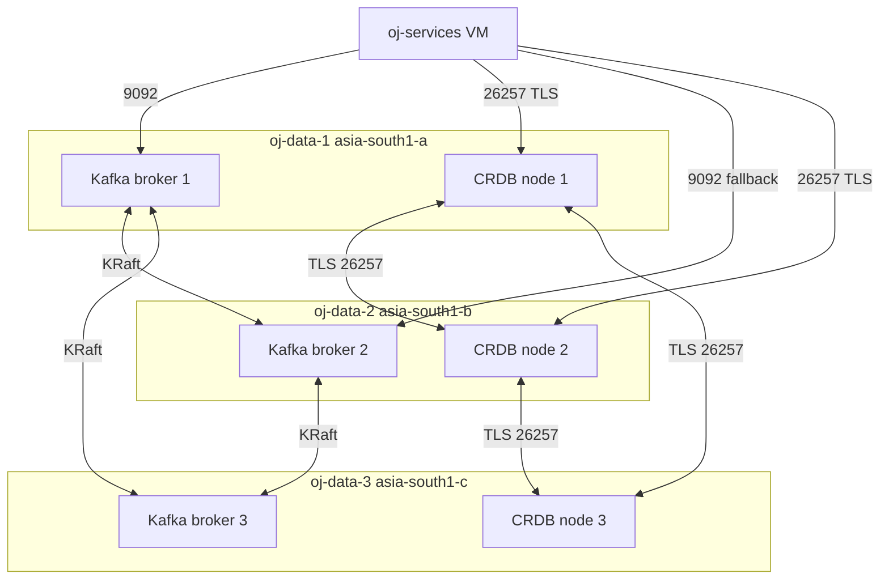

# Kafka Cluster and CockroachDB Cluster

*Design document for roadmap item 2.7.*

## Problem

Both stateful systems are single-node today:

- **Kafka.** `KAFKA_BROKER_ID: 1` with `KAFKA_OFFSETS_TOPIC_REPLICATION_FACTOR: 1` (compose lines 47, 55) and a sibling Zookeeper container. A single broker silently drops uncommitted producer batches when restarted; `acks=1` (the producer default in some places) acknowledges before disk flush, so a restart at the wrong moment loses messages.
- **CockroachDB.** `cockroachdb start-single-node --insecure` (compose line 66). Inter-node TLS is moot when there is one node, but the bigger issue is durability: a single node has no replicas, so a disk corruption or VM termination is total data loss.

Both systems already share one VM (`oj-control-plane`, e2-medium, 4 GB RAM). The nightly Cloud Scheduler `STOP` at 23:00 IST drops both data planes simultaneously — fine in the prototype where state is regenerated by seed scripts, fatal for a system holding real contestant submissions.

The target is a 3-broker Kafka in KRaft mode (Zookeeper retired) and a 3-node CRDB cluster with mutual TLS. The non-trivial questions are: do they share VMs, what is the cert chain story, and how do we migrate without downtime.

## Design

### VM topology

Three options:

1. **Three e2-medium VMs, both clusters co-located.** Each VM runs one Kafka broker + one CRDB node. 4 GB RAM is tight: Kafka broker (1.5 GB heap), CRDB (1.5 GB), OS + monitoring (0.5 GB), plus the colocated services from the existing control plane (api-gateway, problem-service, etc.) which already consume ~1.5 GB. This doesn't fit.

2. **Three e2-standard-2 VMs, both clusters co-located, services moved off.** Each VM gets 8 GB RAM and 2 vCPUs. Kafka + CRDB fit comfortably (~3 GB each). The JVM services (api-gateway, problem-service, leaderboard-service, contest-service, scoring-pipeline) move to a separate "services" VM (or distribute across the three). Cleanest mental model.

3. **Six e2-small VMs, one role each.** Three Kafka, three CRDB. Operational overhead doubles, cost doubles. Worth it only at substantially higher throughput than v1 targets.

**Pick option 2.** Three e2-standard-2 VMs (`oj-data-1`, `oj-data-2`, `oj-data-3`) in `asia-south1-a/b/c`. Each runs one Kafka broker and one CRDB node. A separate VM (`oj-services`, the existing control-plane re-used) holds the JVM services, Redis, and the OTel collector. The existing `oj-compute` continues to hold workers and sandbox manager.

Memory math per data VM:

| Component        | Heap / RSS | Notes                                      |
|------------------|-----------|--------------------------------------------|
| Kafka broker     | 1.5 GB    | `-Xmx1500m`, page cache uses remainder     |
| CRDB node        | 2.5 GB    | `--cache=.25 --max-sql-memory=.25` of 8 GB |
| OS + container   | 0.8 GB    |                                            |
| Headroom         | 3.2 GB    | OS page cache, mostly serving Kafka log    |

Disk: each VM gets a 200 GB pd-balanced volume mounted at `/var/lib/oj-data`. Kafka log directory `/var/lib/oj-data/kafka`, CRDB store `/var/lib/oj-data/cockroach`. Single disk shared between the two — acceptable for v1 because write volume is modest (~10 MB/s peak) and IOPS budgets do not collide.

Failure domains: the three VMs are in three zones of `asia-south1`. A zone outage takes down exactly one broker and one CRDB node. Both clusters remain available: Kafka with `min.insync.replicas=2` still accepts writes, CRDB with replication factor 3 still has quorum.

### Compose vs separate VMs

Compose stays. Each data VM runs its own `docker-compose.yml` with two services (`kafka`, `cockroachdb`) plus the OTel agent. Inter-VM communication is over the VPC internal network using the GCE-assigned internal hostnames (`oj-data-1.c.<project>.internal`, etc.).

Why compose instead of bare systemd units: the team already runs compose, image-pinning conventions are established, and the operational story (`docker compose pull && up -d`) is uniform with the rest of the stack. The downside is one extra process layer (containerd → Kafka JVM), worth ~30 MB RAM per container — negligible at this scale.

### Kafka KRaft setup

Zookeeper is retired. KRaft (Kafka Raft) consolidates metadata storage into the Kafka process itself. As of 3.6 KRaft is production-grade for clusters of this size.

Each broker takes both roles: `process.roles=broker,controller`. The controller quorum is the three brokers themselves — there is no separate controller cluster, which is the recommended posture below ~30 brokers.

Per-broker config (varies by `node.id`):

```properties
node.id=1                                    # 2, 3 on the other two
process.roles=broker,controller
controller.quorum.voters=1@oj-data-1.c.<proj>.internal:9093,2@oj-data-2.c.<proj>.internal:9093,3@oj-data-3.c.<proj>.internal:9093
listeners=PLAINTEXT://0.0.0.0:9092,CONTROLLER://0.0.0.0:9093,INTERNAL://0.0.0.0:29092
advertised.listeners=PLAINTEXT://oj-data-1.c.<proj>.internal:9092,INTERNAL://oj-data-1.c.<proj>.internal:29092
listener.security.protocol.map=PLAINTEXT:PLAINTEXT,CONTROLLER:PLAINTEXT,INTERNAL:PLAINTEXT
inter.broker.listener.name=INTERNAL
controller.listener.names=CONTROLLER

log.dirs=/var/lib/oj-data/kafka
num.partitions=6
default.replication.factor=3
min.insync.replicas=2
offsets.topic.replication.factor=3
transaction.state.log.replication.factor=3
transaction.state.log.min.isr=2

# durability
unclean.leader.election.enable=false
log.flush.interval.messages=10000
log.flush.interval.ms=1000
```

PLAINTEXT inside the VPC is acceptable because the firewall already restricts cross-VM traffic to the `10.0.0.0/24` subnet only. TLS on the inter-broker listener adds complexity (certificate management overlapping with CRDB's) for limited gain in this threat model; it stays as a post-launch hardening item.

All application topics are declared with `replication.factor=3, min.insync.replicas=2, acks=all` enforced at producer side. The relevant topics are `submissions.pretest`, `submissions.system`, `evaluated_results`, `contests.lifecycle`, `submissions.dlq`. Producer config in every service:

```properties
acks=all
enable.idempotence=true
retries=2147483647
max.in.flight.requests.per.connection=5
delivery.timeout.ms=120000
```

Cluster bootstrap is a one-time `kafka-storage.sh format --cluster-id <uuid> --config server.properties` on each broker before first start. The `cluster-id` is a single UUID checked into the deploy repo (not state-managed — it's a public-ish identifier).

### CRDB cluster and cert chain

Three nodes, each with `--locality=region=asia-south1,zone=asia-south1-{a|b|c}`. Inter-node and client TLS via `--certs-dir`. The cert chain:

- **CA**: one root CA (`ca.crt`, `ca.key`) generated once via `cockroach cert create-ca`. The key lives in Secret Manager (`oj-crdb-ca-key`), accessible only to a one-off "cert minting" workflow.
- **Node certs**: per-node `node.crt` and `node.key`, signed by the CA, with SAN entries for `oj-data-N.c.<proj>.internal`, the public hostname (if any), and `localhost`. Created with `cockroach cert create-node`.
- **Client certs**: one per JVM service (`api-gateway`, `problem-service`, `execution-worker`, `leaderboard-service`, `scoring-pipeline`, `contest-service`). Each cert's CN equals the SQL role it authenticates as. Created with `cockroach cert create-client <role>`.

Distribution: the certs (node.crt/key, ca.crt for nodes; ca.crt + client.{role}.crt/key for services) live in Secret Manager as secrets named `oj-crdb-cert-node-1`, `oj-crdb-cert-client-api-gateway`, etc. Each container fetches them on boot via a small init script (mirrors the existing GCS-signer-key fetch pattern). No certs on disk in plaintext outside the running container.

Rotation cadence: node certs are 1-year. Client certs are 90-day. The rotation procedure (90-day case): mint a new client cert with the same CN, push it to Secret Manager as a new version, restart the service (it picks up the new version on boot). CRDB accepts both old and new during the overlap. Old version revoked at the next minting cycle.

Storage on each node:

```bash
cockroach start \
  --certs-dir=/cockroach/certs \
  --store=/var/lib/oj-data/cockroach \
  --locality=region=asia-south1,zone=asia-south1-a \
  --join=oj-data-1.c.<proj>.internal:26257,oj-data-2.c.<proj>.internal:26257,oj-data-3.c.<proj>.internal:26257 \
  --advertise-addr=oj-data-1.c.<proj>.internal \
  --cache=.25 --max-sql-memory=.25 \
  --background
```

Cluster init (run once after all three start): `cockroach init --certs-dir=... --host=oj-data-1.c.<proj>.internal`.

### Topology



### Rolling update story

The critical invariant: a `docker stop` of any single broker or CRDB node produces zero message loss and zero data loss.

For Kafka, the validation script:

```
1. Start sustained 50 RPS producer with acks=all to submissions.pretest
2. Start consumer with enable.auto.commit=false, manually committing after each message
3. After 60 s, docker compose -f /data/compose.yml kill -SIGKILL kafka on oj-data-2
4. Wait 30 s
5. Stop producer
6. Verify consumer received every produced offset (no gaps, no duplicates beyond the configured retry window)
7. Restart oj-data-2's kafka, wait for ISR convergence (kafka-topics --describe shows all 3 in ISR)
```

For CRDB, equivalent: sustained 50 INSERT/s into `submissions`, kill one node, verify `SELECT count(*)` matches the producer's count once the killed node returns to the cluster.

### Migration plan from single-node

The data being migrated is small (today's prototype submissions table is < 10 MB) so a stop-the-world migration is acceptable for v1:

1. **Stand up the new cluster in parallel.** All three new VMs running, both clusters bootstrapped and healthy, no traffic.
2. **Dump and restore CRDB.** `cockroach dump` from the single node, replay into the cluster via `cockroach sql --execute=@dump.sql`. Adjust connection strings in every service's config to point at the new endpoints.
3. **Re-create Kafka topics on the new cluster.** No data migration needed — submissions in-flight at cutover are re-driven by the reconciliation scanner ([[reconciliation-scanner]]) defined in roadmap item 9.
4. **Cutover window.** Stop all services for ~5 minutes, repoint configs, restart. Submissions accepted during the window get retried client-side after a 503.
5. **Decommission the single-node VMs.** Keep them stopped (not deleted) for 7 days as rollback insurance.

Post-v1, a zero-downtime migration would use CRDB's `BACKUP/RESTORE` with online ingest and dual-write to both Kafka clusters during cutover, but the 5-minute outage is well within an acceptable launch maintenance window.

## Implementation phases

**Phase A (2d) — VM provisioning and bootstrap.** Terraform: three e2-standard-2 VMs, persistent disks, firewall rules for `:9092` and `:26257` between the four VMs. Verify SSH-over-IAP works.

**Phase B (2d) — Kafka KRaft cluster.** Compose file, broker configs, cluster format + first boot. Smoke test: produce/consume from a separate client VM.

**Phase C (2d) — CRDB cluster with TLS.** Cert minting workflow. Secret Manager setup. Compose file with cert-fetch init container. Bootstrap and init. Smoke test: `cockroach sql --certs-dir=...` from each service container.

**Phase D (2d) — service repointing.** Update `application.yml` in every JVM service to use the new bootstrap-servers and JDBC URL. Service-by-service rollout under feature flag, then full cutover.

**Phase E (2d) — failure-mode validation.** Run the two validation scripts above. Document outcomes in the runbook. Fix anything that doesn't match the durability promise.

**Phase F (1d) — old-cluster decommission.** Stop the old VMs, leave them around for 7 days, then delete.

## Risks

**Disk co-tenancy.** Kafka and CRDB share the same pd-balanced volume per VM. A Kafka log compaction spike that pins IO can stall CRDB Raft heartbeats and cause a node to be declared dead. Mitigation: cgroup-based IO limits on the Kafka container (`blkio.weight=400`, CRDB gets `600`). Pre-launch validation should include a compaction event under load.

**KRaft maturity.** KRaft has been production-stable since 3.5 but the operational tooling is still less battle-tested than Zookeeper-mode. Specifically, recovering from controller-quorum loss is more involved than recovering from ZK quorum loss. Mitigation: document the recovery procedure in the runbook before launch, including the `kafka-storage.sh format --ignore-formatted` escape hatch.

**Cert distribution race on cold boot.** If all three CRDB containers boot simultaneously and all three try to fetch from Secret Manager simultaneously, there is a small risk of quota throttling on the Secret Manager read API. The quota is 6000 reads/min/project, well above three reads, but worth a backoff loop in the init script.

**Cross-zone latency on quorum writes.** Inter-zone latency in `asia-south1` is ~1.5 ms. CRDB Raft quorum writes are 2 RTTs = ~6 ms. The api-gateway already absorbs this; it does not change p50 perceptibly but adds ~12 ms to p99 of writes. Acceptable.

**Cost.** Three e2-standard-2 + 200 GB pd-balanced ≈ $200/mo per VM ≈ $600/mo total, plus egress. The prototype runs at ~$80/mo. The 7-8x cost is the price of durability.

## Acceptance criteria

1. `kafka-topics.sh --bootstrap-server oj-data-1:9092 --describe submissions.pretest` shows ISR `[1,2,3]` for every partition.
2. `cockroach node ls --certs-dir=...` shows three live nodes.
3. `docker kill kafka` on `oj-data-2` followed by a 60-second sustained produce/consume run shows zero message loss.
4. `docker kill cockroachdb` on `oj-data-2` followed by a 60-second sustained INSERT run shows zero row loss; the killed node rejoins cleanly on restart.
5. All JVM services connect with TLS to CRDB (`SHOW SESSIONS` reports `ssl=true`).
6. Producer config in every service enforces `acks=all` and `enable.idempotence=true`; this is checkable via `kafka-configs.sh --describe --entity-type clients`.
7. Cert rotation procedure documented and dry-run executed for one client cert.
8. The migration runbook executes end-to-end on a staging clone in under 30 minutes.

## Related

- [[apache-kafka]] — broker internals
- [[cockroachdb]] — multi-node architecture
- [[raft]] — quorum semantics under both systems
- [[fenced-lease]] — what gets broken by losing the broker
- [[reconciliation-scanner]] — covers in-flight messages during cutover
- [[quorum]] — replication-factor semantics
