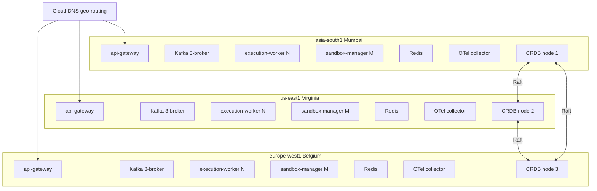
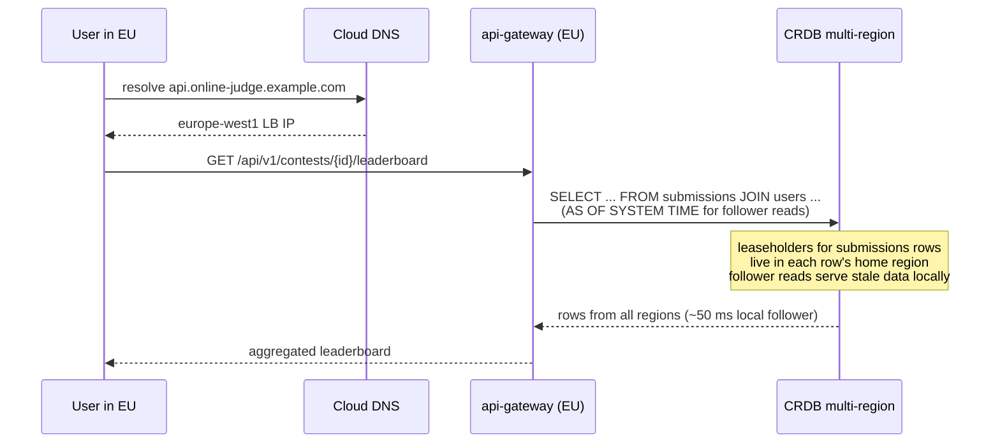

# Multi-Region Rollout

*Design document for roadmap section 5.*

## Problem

The single-region prototype runs in `asia-south1`. A contestant in São Paulo or Berlin pays ~250 ms RTT per request before considering anything else. For a contest where every keystroke in the editor saves to localStorage and every submission triggers a sequence of API calls, the cumulative latency badly degrades the user experience.

The code already carries the bones of multi-region support: `submissions` and `outbox_events` have a `region` column, `RegionResolver` reads `X-Region` from the gateway request, and `database/multi-region-setup.sql` documents the three CRDB `ALTER` statements needed to enable `LOCALITY REGIONAL BY ROW`. None of it is wired into a deployment.

The target: three regions (`asia-south1` Mumbai, `us-east1` Virginia, `europe-west1` Belgium) serving users via geo-routed DNS, with submissions written and verdicts produced *entirely within* the user's home region, but with a global CRDB cluster so that cross-region leaderboards still merge correctly.

## Design

### Region choice rationale

| Region        | Why                                                        |
|---------------|------------------------------------------------------------|
| asia-south1   | Existing footprint; high contestant density in India       |
| us-east1      | Lowest median RTT to North American and South American users; cheaper than us-west1 |
| europe-west1  | Lowest median RTT to EU and African contestants            |

Three regions is the minimum for a useful multi-region story: it gives RF=3 CRDB with one replica per region (a single zone outage anywhere does not break availability) and it covers the three populated continental masses with <100 ms p99 RTT to most contestants.

### Per-region topology

Each region is a self-contained execution unit:



Each region runs the full app-tier stack — api-gateway, problem-service, leaderboard-service, contest-service, scoring-pipeline, execution-worker, sandbox-manager. Each region has its own Kafka cluster (three brokers, one per zone). The only globally-shared system is the CRDB cluster, with one node per region.

The CRDB-per-region is a deliberate scale choice. For nine-node CRDB (three per region) the per-region read latency improves but inter-region Raft costs grow proportionally. For v1 multi-region launch, 3 nodes total — one per region — is the cheapest setup that still gives quorum-based durability across continental failures. Three nodes per region (9 total) is a post-launch scale-up.

### CRDB multi-region configuration

Each CRDB node starts with locality flags:

```bash
cockroach start \
  --locality=region=asia-south1,zone=asia-south1-a \
  ...
```

After cluster bootstrap, apply `database/multi-region-setup.sql`:

```sql
ALTER DATABASE onlinejudge PRIMARY REGION "asia-south1";
ALTER DATABASE onlinejudge ADD REGION "us-east1";
ALTER DATABASE onlinejudge ADD REGION "europe-west1";

ALTER TABLE submissions SET LOCALITY REGIONAL BY ROW AS "region";
ALTER TABLE outbox_events SET LOCALITY REGIONAL BY ROW AS "region";
ALTER TABLE idempotency_keys SET LOCALITY REGIONAL BY ROW AS "region";
ALTER TABLE auth_events SET LOCALITY REGIONAL BY ROW AS "region";

ALTER TABLE problems SET LOCALITY GLOBAL;
ALTER TABLE test_cases SET LOCALITY GLOBAL;
ALTER TABLE users SET LOCALITY REGIONAL BY ROW AS "home_region";
ALTER TABLE contests SET LOCALITY GLOBAL;
```

The locality taxonomy:

- **REGIONAL BY ROW** for hot-write tables: submissions, outbox, idempotency, auth events. Writes are local to the home region; reads from other regions incur ~100 ms RTT for the leaseholder, mitigated by [[external-consistency]] follower reads for stale-tolerant queries.
- **GLOBAL** for read-mostly tables: problems and contests. Writes are slow (multi-region Raft), reads are local everywhere. Acceptable because problem CRUD is admin-only and low-frequency.
- **REGIONAL BY ROW** on users keyed by `home_region` — a user's profile lives in their home region. Login queries are local.

Application order matters: SET PRIMARY first, then ADD other regions, then ALTER TABLE statements. CRDB rejects ALTER LOCALITY if a region is referenced that has not been ADDed yet.

### Per-region Kafka without cross-region mirror

Each region's Kafka cluster is isolated. A submission accepted in `us-east1` produces onto `us-east1`'s Kafka. The verdict, produced by `us-east1`'s worker, lands on `us-east1`'s `evaluated_results`. Only `us-east1`'s leaderboard-service consumes it.

There is no MirrorMaker, no Confluent Replicator. Inter-region telemetry of submissions is via the CRDB query against the global submissions table — not via Kafka.

Topic naming makes the regional confinement explicit: `submissions.{region}.pretest`, `submissions.{region}.system`, `evaluated_results.{region}`. The api-gateway in `asia-south1` produces only onto `submissions.asia-south1.pretest`; `us-east1`'s gateway produces onto `submissions.us-east1.pretest`. Workers subscribe to their region's topic only.

Trade-off: a contestant whose submission was routed to `us-east1` but who refreshes the page from `europe-west1` (e.g. they switched networks mid-flight) cannot read live verdict updates from `europe-west1`'s api-gateway — the WS subscription is regional. Mitigation: the verdict is also written to the CRDB submissions table by the worker, and `europe-west1`'s api-gateway can fall back to polling that. Acceptable degraded experience for a rare scenario.

### Worker affinity by user region

api-gateway already stamps `region` on the submission per `RegionResolver` (the value comes from the `X-Region` header set by Cloud Load Balancing based on the user's geo-routed entry point). The submission's `region` field is the routing key for which Kafka topic to produce onto.

The worker side is constrained by consumer group membership. The execution-worker pods in `us-east1` configure:

```yaml
kafka:
  consumer:
    bootstrap-servers: oj-data-us-east1-1:9092,oj-data-us-east1-2:9092,oj-data-us-east1-3:9092
    group-id: execution-worker.us-east1.pretest
    topics: submissions.us-east1.pretest
```

A worker can only consume its own region's topic. There is no cross-region failover at the worker layer in v1 — if `us-east1`'s entire compute fleet dies, submissions routed there queue indefinitely on the local Kafka until ops manually re-routes (changes Cloud DNS to take `us-east1` out of the rotation, causing new traffic to land in `europe-west1` or `asia-south1`).

### DNS layer

Cloud DNS with geo-routing policies on `api.online-judge.example.com`:

```hcl
resource "google_dns_record_set" "api_geo" {
  managed_zone = google_dns_managed_zone.public.name
  name         = "api.online-judge.example.com."
  type         = "A"
  ttl          = 60
  routing_policy {
    geo {
      location = "asia-south1"
      health_checked_targets {
        internal_load_balancer { ... ip_address = google_compute_address.lb_asia.address ... }
      }
    }
    geo {
      location = "us-east1"
      health_checked_targets {
        internal_load_balancer { ... ip_address = google_compute_address.lb_us.address ... }
      }
    }
    geo {
      location = "europe-west1"
      health_checked_targets {
        internal_load_balancer { ... ip_address = google_compute_address.lb_eu.address ... }
      }
    }
  }
}
```

Default fallback (no matching geo): `us-east1` — chosen because Virginia has the lowest combined RTT to "everywhere not Asia or Europe".

Health-check failure cascade: if `us-east1`'s health check fails, Cloud DNS removes that endpoint from the geo answer and serves the next-nearest region. A user in Brazil normally routed to `us-east1` gets `europe-west1` (or, transiently, until DNS TTL expires, the old `us-east1` answer). The 60-s TTL keeps the failover window short.

The SPA's `app.` hostname can stay a single-region Cloud Storage bucket fronted by Cloud CDN — static assets cache globally, no benefit to regional split.

### Sequence for a global standings query



`AS OF SYSTEM TIME '-5s'` on the cross-region leaderboard query gives [[follower-reads]] semantics: reads are ≤5 s stale but served locally without crossing the WAN to the leaseholder. Acceptable for the leaderboard, which already runs on best-effort eventual consistency.

### Cost estimate

Per region, the data tier (3 e2-standard-2 VMs + 200 GB pd-balanced) costs ~$600/mo. Add the services tier (~$200/mo) and the compute tier (n2-standard-2 SPOT, ~$100/mo). Three regions: ~$2700/mo. Plus inter-region egress for CRDB Raft (~$50/mo at this scale). Plus Cloud DNS and load balancer (~$50/mo).

Total monthly: ~$2800/mo, roughly 3.5x the current $800/mo single-region cost. The 3.5x (not 3x) accounts for the cross-region egress that single-region doesn't pay.

## Implementation phases

**Phase A (3d) — second region cold standby.** Stand up `us-east1` identically to `asia-south1`. Do not route traffic yet. CRDB joins the cluster as a third node. Verify cross-region Raft latency is within ~80 ms p99.

**Phase B (3d) — third region.** Same for `europe-west1`.

**Phase C (2d) — apply multi-region locality.** Run `multi-region-setup.sql`. Verify with `SHOW LOCALITY` and `SHOW ZONE CONFIGURATION FOR TABLE submissions`.

**Phase D (3d) — per-region Kafka topic naming.** Update producer config to route by region. Update worker config to subscribe by region. Validate cross-region isolation via traffic test.

**Phase E (2d) — Cloud DNS geo-routing.** Configure the geo policy, health checks, fallback. Test from synthetic clients in each region.

**Phase F (3d) — global standings query.** Update `leaderboard-service`'s read path to use `AS OF SYSTEM TIME` follower reads. Validate p99 cross-region leaderboard latency <200 ms.

**Phase G (2d) — observability and runbooks.** Per-region dashboards. Cross-region trace continuity validation. Runbooks for "one region down", "CRDB lost quorum", "DNS misrouting users".

## Risks

**CRDB cross-region Raft latency.** Writes to RBR tables are single-region, but the writes to GLOBAL tables (problems, contests) cross all three regions and pay 2 RTTs. At ~150 ms inter-region RTT, that is ~600 ms per write. Admins creating a problem from a slow-region console see this. Mitigation: bulk problem inserts batched; admin UI shows a loading state; document the expected latency.

**Submissions table grows fast under multi-region.** RBR storage carries per-region replicas of every row. Total storage is 3× the single-region count. Combined with full retention for system-test reproduction, the disk grows fast. Mitigation: rolling 90-day retention with archival to GCS.

**A user roaming mid-contest.** A contestant whose VPN flips them from Indian routing to UK routing mid-contest will produce submissions tagged `asia-south1` and then `europe-west1`. The submissions land on different Kafka clusters but write to one CRDB. The leaderboard sees both. Their live-verdict WS subscription in `asia-south1` cannot push EU-produced verdicts. Mitigation: pin region per session in the JWT — `region` claim — and ignore `X-Region` updates for subsequent calls in the same session. Re-evaluate on next login.

**Health check flapping.** A flaky health check on one region causes Cloud DNS to thrash. Mitigation: use a multi-probe health check (3 consecutive failures) with conservative thresholds.

**DNS TTL during failover.** Some resolvers ignore the 60-s TTL. A failed region's traffic may continue arriving for hours. Mitigation: also publish a `Retry-After` header on health-check failures from the regional LB itself, so well-behaved clients retry against DNS. For the worst case, accept the degraded window and rely on the per-region Kafka acks=all to absorb any in-flight submissions.

**Test-case bytes locality.** The GCS bucket `oj-test-cases-online-judge-hk` is in `asia-south1`. Workers in `us-east1` and `europe-west1` cross-region-read from it on every test case. At ~10 MB per problem, with N submissions running, this is real egress. Mitigation: a per-region replica of the bucket via Storage Transfer Service, with each region's problem-service signing URLs against its local bucket.

**Cost.** 3.5x burn is real money. Justify only when the single-region p99 user latency is the binding constraint.

## Acceptance criteria

1. `cockroach node ls` shows three nodes with `region=asia-south1`, `region=us-east1`, `region=europe-west1`.
2. `SHOW CREATE TABLE submissions` shows `LOCALITY REGIONAL BY ROW AS region`.
3. An insert into `submissions` with `region='us-east1'` lands on `us-east1`'s leaseholder; the local commit latency is <20 ms p99.
4. A user resolving `api.online-judge.example.com` from a US IP gets the `us-east1` LB IP; from an EU IP gets `europe-west1`.
5. A submission flow initiated from a US-IP user produces onto `submissions.us-east1.pretest`, is consumed by a `us-east1` worker, and the verdict appears on `evaluated_results.us-east1` only.
6. Killing all of `us-east1` (simulated by removing it from Cloud DNS) routes US users to the next-nearest region within 2 minutes of TTL expiry; their next submission lands successfully in that region.
7. A global leaderboard query for a contest with submissions across all three regions returns merged results in <200 ms p99.
8. Per-region dashboards display submission funnels and sandbox pool depth for that region only; cross-region drill-down is one click away.

## Related

- [[external-consistency]] — CRDB's consistency model under multi-region
- [[follower-reads]] — what makes cross-region leaderboard reads cheap
- [[geo-dns-anycast]] — Cloud DNS geo-routing concept
- [[regionalised-ingestion]] — pattern this follows
- [[cockroachdb]] — multi-region operational story
- [[apache-kafka]] — why per-region Kafka without mirror
- [[quorum]] — RF=3 with one replica per region
- [[truetime]] — for the curious; CRDB uses HLC, not TrueTime, but the consistency comparison comes up
