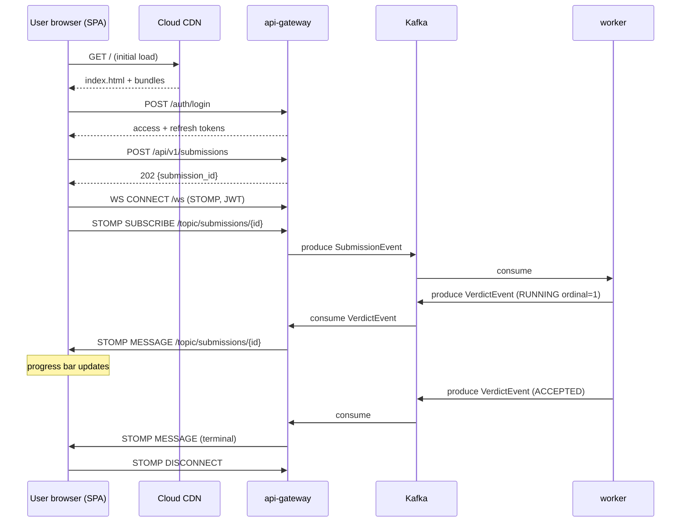

# React SPA and WebSocket Verdict Push

*Design document for roadmap item 4.20.*

## Problem

The system today has no UI. Contestants submit code by publishing a proto message to Kafka — a path that exists only because every developer on the team can do so from the command line. Real contestants cannot.

The user-facing surface needs to cover:

1. Sign up and log in.
2. Browse the problem catalogue, pick a problem.
3. Edit code in a syntax-aware editor (Python, C++, Java).
4. Submit and see verdict status update live (PENDING → COMPILING → RUNNING → ACCEPTED/WA/TLE/...).
5. See per-test breakdown on failure (per-ordinal verdict breakdown from roadmap item 2.4).
6. View past submissions for a problem.

The MVP target is a single-page React application served as static assets from Cloud Storage behind Cloud CDN, talking to the existing `api-gateway` over HTTPS REST plus a single WebSocket per active submission for live verdict updates.

## Design

### Stack

- **React 18 + TypeScript** + Vite for the build tooling.
- **react-router** for client-side routing.
- **monaco-editor** (via `@monaco-editor/react`) for code editing — the same engine that runs in VS Code, with first-class syntax modes for Python, C++, Java.
- **TanStack Query** for REST data fetching with caching and stale-while-revalidate semantics.
- **STOMP-over-SockJS** client (`@stomp/stompjs`) for the WebSocket connection.
- **Tailwind CSS** for styling. No component library — the surface area is small enough to hand-build.

The bundle target is ~400 KB gzipped on the critical path, with monaco-editor lazy-loaded (it's ~2 MB on its own) only when the user navigates to a problem detail page.

### Page structure

```
/                            → redirect to /login or /problems
/login                       → email + password form
/signup                      → username + email + password form
/problems                    → table of problems
/problems/:id                → problem statement + editor + history
/submissions/:id             → submission detail (used in the URL when verdict arrives)
```

Authentication state lives in a React context, hydrated from `localStorage` on boot. Access token in memory; refresh token in `localStorage` (acceptable XSS-wise because the SPA is the only thing that runs in the origin and we maintain strict CSP). On 401 from any REST call, the TanStack Query global error handler attempts a refresh, retries the original call once, and on failure boots to `/login`.

### Backend integration

REST endpoints used:

| Method | Path                                      | Returns                                |
|--------|-------------------------------------------|----------------------------------------|
| POST   | `/api/v1/auth/signup`                     | 201                                    |
| POST   | `/api/v1/auth/login`                      | `{access_token, refresh_token, ...}`  |
| POST   | `/api/v1/auth/refresh`                    | same shape                             |
| GET    | `/api/v1/problems`                        | `[{id, title, difficulty, ...}]`       |
| GET    | `/api/v1/problems/{id}`                   | `{id, title, statement_md, language_choices, ...}` |
| POST   | `/api/v1/submissions`                     | `{submission_id}`                      |
| GET    | `/api/v1/submissions/{id}`                | full submission with verdict-if-known  |
| GET    | `/api/v1/submissions?problem_id=...`      | user's history for a problem           |

`POST /api/v1/submissions` already exists on the gateway and returns 202 with the submission ID. The SPA then opens a STOMP subscription to `/topic/submissions/{id}` to receive verdict events.

### WebSocket choice and implementation

Spring Boot already has `spring-boot-starter-websocket` available in `api-gateway`'s dependency graph (verify by inspecting `api-gateway/build.gradle.kts` during implementation). The natural choice is STOMP-over-SockJS:

- **STOMP** gives us subscribe-by-destination semantics for free, which is exactly what we need (`/topic/submissions/{id}`).
- **SockJS** provides fallback transports (XHR streaming, long polling) for environments that block raw WebSockets. Contest venues with restrictive corporate firewalls happen.
- The existing `WebSocketConfig` reference in `SubmissionController:51` already points at a `/ws/leaderboard` endpoint — extend the same `WebSocketMessageBrokerConfigurer` rather than introducing a parallel mechanism.

Server side:

```java
@Configuration
@EnableWebSocketMessageBroker
public class WebSocketConfig implements WebSocketMessageBrokerConfigurer {
    @Override
    public void configureMessageBroker(MessageBrokerRegistry config) {
        config.enableSimpleBroker("/topic", "/queue");
        config.setApplicationDestinationPrefixes("/app");
        config.setUserDestinationPrefix("/user");
    }
    @Override
    public void registerStompEndpoints(StompEndpointRegistry registry) {
        registry.addEndpoint("/ws")
                .setHandshakeHandler(jwtHandshakeHandler())
                .setAllowedOriginPatterns("https://app.online-judge.example.com")
                .withSockJS();
    }
}
```

`jwtHandshakeHandler` extracts the JWT from the `Authorization` STOMP CONNECT header (or a `?access_token=` query param fallback for SockJS transports that don't support custom headers), validates it via the existing `JwtTokenProvider`, and attaches the user principal to the WebSocket session.

The server-side fan-out is simple: `VerdictPushConsumer` (already exists, today on `leaderboard-service` but moving to api-gateway makes more sense — the gateway is the only thing that holds the user-facing WebSocket sessions) consumes the `evaluated_results` Kafka topic and pushes each `VerdictEvent` to `/topic/submissions/{submissionId}` via `SimpMessagingTemplate`. The subscription is authorised: the WebSocket interceptor checks that `verdict.user_id == session.user.id` before delivering.

### Single-broker simplicity

For v1 the in-memory SimpleBroker is enough — a single api-gateway pod (or a small N pods behind a sticky-session load balancer) can hold all live WebSocket sessions for an active contest of up to ~5000 concurrent users. Each session is ~10 KB of heap and one TCP connection. At higher scale the next step is a Redis Pub/Sub-backed external broker ([[redis-pub-sub]]), but that is a post-v1 concern.

If the gateway scales to >1 replica, the load balancer must be configured for sticky sessions on the WS path. SockJS uses the `JSESSIONID` cookie by default; GCLB's "Generated cookie" affinity is the recommended setup.

### Hosting

Static SPA assets (the Vite build output: `index.html`, hashed JS bundles, CSS, monaco worker chunks) are uploaded to a Cloud Storage bucket `oj-spa-assets` with public read. A Cloud CDN sits in front:

```hcl
resource "google_storage_bucket" "spa" {
  name          = "oj-spa-assets"
  location      = "ASIA-SOUTH1"
  uniform_bucket_level_access = true
  website {
    main_page_suffix = "index.html"
    not_found_page   = "index.html"   # SPA fallback
  }
}

resource "google_compute_backend_bucket" "spa" {
  name        = "oj-spa-backend"
  bucket_name = google_storage_bucket.spa.name
  enable_cdn  = true
  cdn_policy {
    cache_mode  = "CACHE_ALL_STATIC"
    default_ttl = 3600
    max_ttl     = 86400
  }
}
```

The URL map routes:

- `app.online-judge.example.com/*` → `oj-spa-backend` (static bucket)
- `api.online-judge.example.com/*` → existing api-gateway backend
- `api.online-judge.example.com/ws/*` → api-gateway backend with the WebSocket-compatible session affinity

The SPA's API base URL is `https://api.online-judge.example.com`. CORS on the gateway permits `https://app.online-judge.example.com`.

`not_found_page: index.html` is the SPA-fallback hack: any 404 on the bucket (i.e. any client-side route the bucket doesn't have a static file for) serves `index.html`, which then runs the SPA's router to render the correct view. This is the canonical Cloud Storage SPA hosting pattern.

Cache strategy: `index.html` is served with `Cache-Control: no-cache` (force the CDN/browser to revalidate every load), and all hashed JS/CSS bundles are served with `Cache-Control: public, max-age=31536000, immutable` because their filenames contain the content hash and never collide.

### Verdict status state machine in the UI

The submission detail page maintains a state machine driven by incoming WebSocket events:

```
PENDING (initial) ─→ COMPILING ─→ RUNNING (k/n tests) ─→ ACCEPTED
                  ↘ COMPILE_ERROR (terminal)        ↘ WRONG_ANSWER (terminal)
                                                    ↘ TIME_LIMIT_EXCEEDED (terminal)
                                                    ↘ MEMORY_LIMIT_EXCEEDED (terminal)
                                                    ↘ RUNTIME_ERROR (terminal)
```

Each intermediate event updates a progress bar (current ordinal / total tests, fed by the `per_test` field added in roadmap item 2.4). On terminal verdict, the WebSocket subscription is closed and the page renders the breakdown.

Idempotency: the page tolerates receiving the same event twice (network reconnect during a SockJS fallback) by keying off `submissionId + status + ordinal`.

### Reconnection

SockJS handles transient disconnects with automatic reconnect. The application layer handles the longer outage case: if the WS has been disconnected for >10 s, the UI falls back to polling `GET /api/v1/submissions/{id}` every 3 s. When the WS reconnects, polling stops.

### Sequence



### Security

- **CSP** on `index.html`: `default-src 'self'; script-src 'self'; connect-src 'self' wss://api.online-judge.example.com https://api.online-judge.example.com; img-src 'self' data:; style-src 'self' 'unsafe-inline'`. monaco-editor's inline styles necessitate `'unsafe-inline'` for styles; scripts are strict.
- **XSS in problem statements.** Problem statements are stored as Markdown. The renderer (e.g. `react-markdown`) is configured to disable raw HTML (`remarkRehypeOptions: {allowDangerousHtml: false}`) and to whitelist URI schemes (`http`, `https`, `mailto`) on links.
- **Code injection via editor content.** The editor content is a string never `eval`'d in the browser; it is sent as a JSON field. No risk vector.
- **WebSocket auth.** Every STOMP CONNECT presents the JWT. Subscriptions are authorised against the user principal; a user attempting to subscribe to another user's submission topic is dropped.

## Implementation phases

**Phase A (3d) — scaffold and auth.** Vite + React + TS + Tailwind project skeleton. Login / signup pages wired to the new auth endpoints (depends on the auth-end-to-end design doc). Routing, auth context, token refresh.

**Phase B (3d) — problem browse and detail (read-only).** Problem list, problem detail with rendered Markdown statement, monaco-editor integration (lazy-loaded).

**Phase C (3d) — submission flow.** Submit button → POST. Submission detail page with polling. History list for a problem.

**Phase D (3d) — WebSocket verdict push.** Spring side: `WebSocketConfig`, JWT handshake interceptor, VerdictPushConsumer rewire. Client side: STOMP client, subscription on submission detail, state machine, fallback-to-polling on WS drop.

**Phase E (2d) — hosting and CDN.** Terraform for the bucket and CDN. Build pipeline that uploads to the bucket on merge to main. Custom domain + cert.

**Phase F (2d) — polish.** Error states, loading skeletons, mobile-responsive layout (the launch is desktop-first, but contestants on tablets shouldn't see a broken page), accessibility pass (keyboard navigation, screen-reader labels).

## Risks

**monaco-editor bundle size.** ~2 MB raw, ~600 KB gzipped, plus worker chunks. Lazy-load is essential, and even then the problem-detail page first-paint will lag on slow connections. Mitigation: prefetch the monaco chunks on the problems-list page so they are warm by the time the user clicks through.

**STOMP-over-SockJS overhead.** Two layers of framing on top of TCP. For low-frequency verdict events (a handful per submission) this is fine. Not the right tool for a high-frequency stream — if leaderboard tickers later get a live feed, that should be raw WS or SSE, not the same SimpleBroker.

**SimpleBroker not horizontally scalable.** A two-pod api-gateway with sticky sessions works, but a verdict consumed by pod A cannot be delivered to a user on pod B. Mitigation for v1: single api-gateway pod with overprovisioned resources. Post-launch: move to a Redis-Pub/Sub backed broker.

**SPA fallback on Cloud Storage 404.** The `not_found_page: index.html` setting returns the SPA for *every* unmatched path, including for a malformed API request that hit `app.` instead of `api.`. That returns an HTML page where the client expected JSON, and the resulting parse error is confusing. Mitigation: the SPA's API base URL is hard-coded to `api.`; document this in the developer setup notes.

**Editor state loss on refresh.** Contestants will type a 200-line C++ solution and lose it if they accidentally close the tab. Mitigation: autosave editor content to `localStorage` per `(user, problem)` tuple, restored on page load. Wipe on successful submit.

**Mobile constraint.** Real contestants on phones won't enjoy editing C++ on a 6-inch screen, but the page must not be unusable. Mitigation: detect viewport <768 px, hide the editor, show "use a desktop for this problem" with read-only statement view.

## Acceptance criteria

1. A new user signs up, logs in, opens a problem, types a Python solution, submits, and sees the verdict update live without page refresh.
2. The verdict updates traverse PENDING → COMPILING → RUNNING (k/n) → terminal state visibly in the UI within 1 s of the worker publishing each event.
3. Closing the browser and reopening to the submission URL shows the current verdict (via REST poll fallback if the WS is not reconnected yet).
4. Disconnecting the network during a long-running submission and reconnecting recovers the WS subscription and the user sees subsequent events.
5. The initial page load is <1 MB gzipped on the critical path; monaco loads asynchronously after the problem-detail navigation.
6. A user cannot subscribe to another user's submission topic (verified by attempted manual STOMP subscribe with a forged ID).
7. The CDN serves `index.html` with `Cache-Control: no-cache` and hashed bundles with `Cache-Control: immutable`.
8. CSP violations are zero on a clean run-through of the user-flow.

## Related

- [[websocket]] — protocol
- [[redis-pub-sub]] — future broker
- [[resumable-websocket-session]] — pattern for reconnect logic
- [[signed-url-auth]] — companion pattern for test-case access (not used by SPA directly)
- [[gateway-timestamping]] — server-side time for verdict ordering
