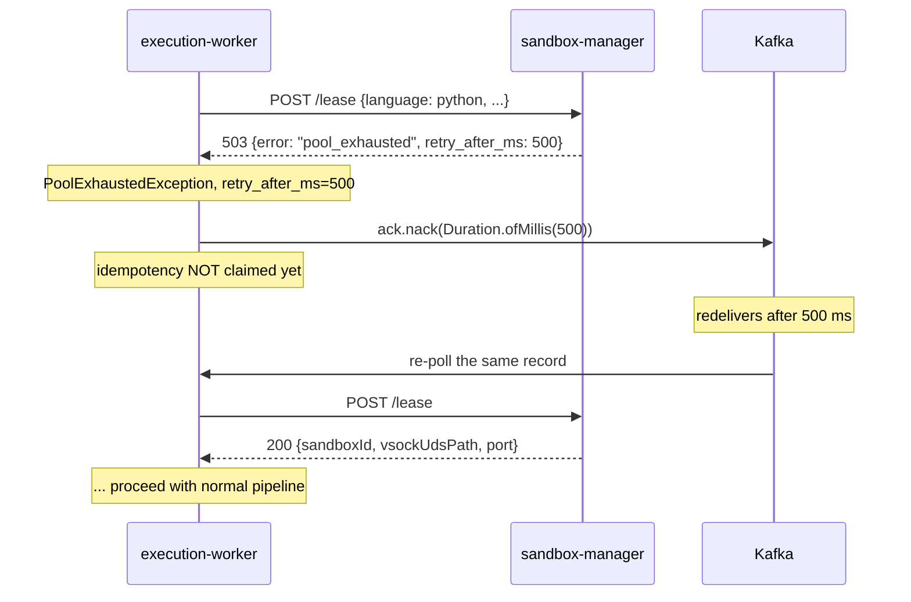

# Pool Exhausted — Backpressure to the Contestant

> Last reconciled with the repo on 2026-05-19.
>
> The path through the system when sandbox-manager has no warm microVMs to lease. The contestant must never see this as a `RUNTIME_ERROR`; it is a server-side capacity event and the system absorbs it transparently.

## 1. Why this flow exists

Without explicit handling, a pool-empty event becomes either:
- A long synchronous boot that blows the verdict SLA, OR
- A spurious failure verdict ("RUNTIME_ERROR") for code that never ran.

Both are unacceptable. The right answer is to retry the lease — but the retry has to be careful not to consume idempotency budget (the worker's protection against poison-loops) or trigger Kafka rebalance.

## 2. Sequence



## 3. Step-by-step walkthrough

1. **Worker calls `/lease`.** `SandboxManagerClient.lease(...)` issues the HTTP POST. The response body on capacity events: `503 {error: "pool_exhausted", retry_after_ms: <int>}`.

2. **Client maps the 503 to a typed exception.** `SandboxManagerClient` parses the body and throws `PoolExhaustedException(language, retryAfterMs)`. This is a checked-style behaviour: the worker's `processSubmission` catches it explicitly, separate from generic I/O errors.

3. **Worker nacks with the broker-recommended retry delay.** `processSubmission`:
   ```java
   } catch (PoolExhaustedException ex) {
     log.info("[worker:{}] Pool exhausted for submission={} language={}; nacking with retry_after={}ms",
              phase, submissionId, ex.language, ex.retryAfterMs);
     ack.nack(Duration.ofMillis(ex.retryAfterMs));
     return;
   }
   ```
   `ack.nack` parks the offset; Kafka redelivers after the duration (or sooner if the consumer-group's session-timeout heartbeat lapses, but `retry_after_ms` is typically far smaller).

4. **The critical invariant: the idempotency row was NOT created.** The claim happens AFTER successful lease (see [`services/execution-worker.md#33`](../services/execution-worker.md) §3.3). Because the lease failed, no row exists; the attempt counter is untouched; the contestant's submission has not consumed any of its 5 idempotency attempts.

5. **Kafka redelivery.** After `retry_after_ms`, the consumer thread polls the same record. Same submissionId; same payload bytes. Lease is retried. By now the spawner has likely produced one or more new READY VMs (typical boot time ~150 ms < default `retry_after_ms` of 500 ms).

6. **Successful lease on retry.** The worker proceeds through the normal pipeline. The contestant sees a ~500 ms latency bump but receives the correct verdict; no anomaly in their submission history.

## 4. Why "claim after lease" — the bug history

The earlier design was claim-then-lease: insert the idempotency row first, then ask SM for a sandbox. Under a sustained burst that depleted the pool, every redelivery did:
- `claim` → INSERT or UPDATE attempts++
- `/lease` → 503
- nack
- redelivery → `claim` → UPDATE attempts++
- `/lease` → 503
- ... after 5 cycles, the row went `POISON` and the submission landed in the DLQ.

The contestant had done nothing wrong; the server simply ran out of capacity. The fix moved the claim to *after* a successful lease — the idempotency counter only ticks for "real" attempts that actually had a sandbox.

This is one of the highest-leverage bug-history learnings in the codebase. See [ADR-0003](../adr/0003-idempotency-claim-after-lease.md) for the full reasoning.

## 5. Failure modes

| Failure | Detection | Behaviour |
|---|---|---|
| Sustained pool depletion (target rate > spawn rate) | `pool_exhausted` rate > 1% over 5 min | alert fires; operator increases `app.pool.targets.<lang>` or scales compute VM |
| `retry_after_ms` clamped by Kafka session timeout | session timeout < retry_after_ms | partition rebalance during the nack interval; the next consumer picks up — same logical retry, different worker |
| Worker crashes during the nack interval | rebalance after session timeout | record is delivered to another consumer; same flow re-evaluates lease |
| SM returns 503 without `retry_after_ms` | missing field | client defaults to 1000 ms; logged as anomaly |
| Worker takes longer than `retry_after_ms` to issue the next poll (e.g., other ops in flight) | timing-only | the record waits; redelivery is upper-bound by `auto.commit.interval.ms` |

## 6. Operator runbook for sustained pool exhaustion

1. `kafka-consumer-groups --describe --group execution-worker-pretest` — see lag.
2. `curl http://oj-sandbox-manager:9100/health` — see current pool depths per language.
3. If one language depleted: `app.pool.targets.<lang>` is too low for current load. Bump and roll SM.
4. If all languages depleted: compute VM is at KVM/cgroup limits. Add capacity (vertical or another compute VM).
5. Watch `sandbox_boot_seconds` percentiles — if p99 climbs above 500 ms, KVM contention is the cause; reduce concurrent spawn cap.

## 7. Related material

- The mechanical pool state machine: [`pool-replenishment.md`](./pool-replenishment.md).
- The idempotency-state machine the worker drives: [`kafka-redelivery-and-idempotency.md`](./kafka-redelivery-and-idempotency.md).
- Owner page: [`services/execution-worker.md`](../services/execution-worker.md) §3.4 and §3.6.
- ADR: [`adr/0003-idempotency-claim-after-lease.md`](../adr/0003-idempotency-claim-after-lease.md).
