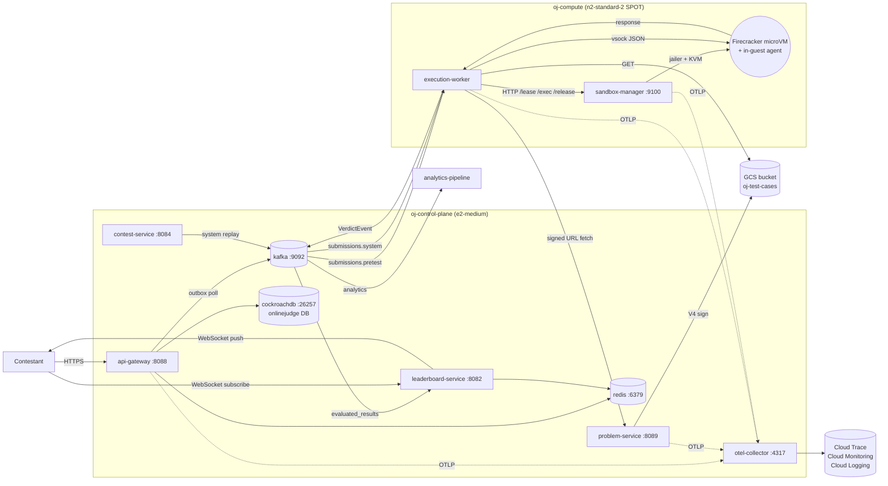
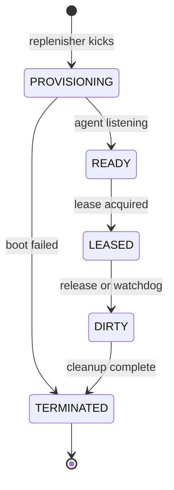
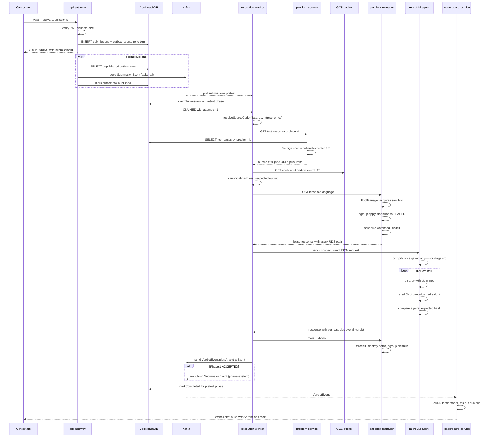

# Online Judge at Scale — Technical Specification

> Canonical reference for the system as it exists on `main`. Last reconciled with the repo on **2026-05-18**. Updated alongside material code changes — when behaviour and this spec disagree, treat the spec as authoritative *intent* and file a ticket against whichever side is wrong.
>
> Audience: a Principal SWE joining the team cold. Should be enough to answer "where does X happen, why was Y chosen, what breaks Z" without reading every file.
>
> Companions: [`docs/ci-cd.md`](./ci-cd.md), [`docs/code-companion.md`](./code-companion.md), the per-feature [design docs](./design-docs/) (index in [Appendix D](#d-design-doc-index)), and the [prod-readiness roadmap](https://github.com/hemantkgupta/CSE-Raw/blob/main/raw-blog/oj-prod-readiness-roadmap.md).

---

## Table of contents

1. [System overview](#1-system-overview)
2. [Goals, non-goals, and SLOs](#2-goals-non-goals-and-slos)
3. [Architecture](#3-architecture)
4. [Component catalogue](#4-component-catalogue)
5. [Wire formats and data models](#5-wire-formats-and-data-models)
6. [Sandbox architecture (deep dive)](#6-sandbox-architecture-deep-dive)
7. [Auth and security](#7-auth-and-security)
8. [Reliability mechanisms](#8-reliability-mechanisms)
9. [Observability](#9-observability)
10. [Deployment](#10-deployment)
11. [Operations](#11-operations)
12. [Multi-region (future)](#12-multi-region-future)
13. [Testing strategy](#13-testing-strategy)
14. [Known limitations and debt](#14-known-limitations-and-debt)
15. [Glossary](#15-glossary)
16. [Appendices](#16-appendices)
    - [A. Submission round-trip sequence diagram](#a-submission-round-trip-sequence-diagram)
    - [B. Per-language rootfs toolchain](#b-per-language-rootfs-toolchain)
    - [C. Wire-protocol decoder example](#c-wire-protocol-decoder-example)
    - [D. Design doc index](#d-design-doc-index)

---

## 1. System overview

The online judge accepts source code from contestants over an HTTP API, runs it against a private suite of test cases inside a hardware-isolated sandbox, and publishes a verdict (ACCEPTED / WRONG_ANSWER / RUNTIME_ERROR / TIME_LIMIT_EXCEEDED / MEMORY_LIMIT_EXCEEDED / COMPILE_ERROR / INTERNAL_ERROR) on Kafka. Downstream consumers update a Redis sorted-set leaderboard, write analytics events, and propagate ACCEPTED pretest submissions onto a deferred system-test phase that runs the full suite.

The system supports three languages today: Python, Java (class `Solution`), and C++ (single TU). Each microVM runs one submission to completion, then is destroyed. The pool of warm microVMs is replenished asynchronously.

The deployment target is GCP — two VMs (`oj-control-plane` and `oj-compute`) in a single zone (`asia-south1-a`). The local-dev path uses `docker compose` against the same container images.

The canonical narrative version of this material is the production architecture blog at `raw-blog/execution-service-gcp.md`. This spec is the technical reference; the blog is the story.

---

## 2. Goals, non-goals, and SLOs

### Goals
- **Sub-2-second pretest verdict** at the 99th percentile, on a problem with ≤ 10 test cases each within its declared `time_limit_ms`.
- **Hardware-isolated sandboxing** — a contestant's process cannot read another submission's data, the host filesystem, or the public internet.
- **Exactly-once verdict per (submission, phase)** — Kafka redelivery never produces a duplicate verdict on `evaluated_results`.
- **Cross-language consistency** — the same canonical-hash rule applies to Python, Java, and C++ stdout, so a buggy newline normalisation in one language does not produce false WRONG_ANSWERs in others.
- **Operability** — the entire stack reproduces from `tofu apply` + image push in under ten minutes from a clean GCP project.

### Non-goals (v1)
- Federated identity (Google / GitHub OAuth) — self-hosted signup.
- A polished UI — the React SPA is a roadmap item; submissions today go via a Python harness directly to Kafka.
- Real-time collaboration, mobile clients, plagiarism detection, anti-cheat keystroke logging.
- Languages beyond Python / Java / C++.
- Custom problem checkers or interactive (judge-driven) problems — v1 is hash-compare against a pre-known canonical output.

### Service Level Objectives (target, not measured in v1)

| SLI | Target | Notes |
|---|---|---|
| Pretest verdict latency (gateway accept → `evaluated_results` publish), p99 | < 2 s | Includes Kafka hop + signed-URL fetch + microVM lease + per-test loop. Measured only after the OTel collector lands in prod. |
| Verdict correctness — same submission across two runs | 100 % match | Destroy-never-reuse + canonical-hash invariant; any drift is a P0. |
| Sandbox pool readiness — % of leases that find a warm VM | ≥ 99 % | Below this the pool sizing or replenishment cadence is wrong. |
| Submission acceptance availability | 99.5 % monthly | Bounded by Kafka + CRDB + api-gateway HA; today's single-broker / single-node deployment cannot meet this. The 3-broker / 3-node move is on the roadmap. |

---

## 3. Architecture

The system splits into three trust zones (from Part 7 of the design blog):

1. **Execution Service** — unprivileged, public-facing. Owns the contestant API, persists submissions, drives the per-submission verdict pipeline. Lives entirely on the control plane VM. Components: `api-gateway`, `execution-worker`'s consumer side, plus the supporting `problem-service` / `contest-service` / `leaderboard-service`.
2. **Sandbox Manager** — privileged. Owns `/dev/kvm`, the Firecracker binary, the harness rootfs, and the lease/release REST API. Lives on the compute VM. Never sees contestant code; only sandbox lifecycle.
3. **Execution Agent** — runs inside each microVM as PID 1. Receives JSON-over-vsock requests from the worker, runs the contestant binary, returns per-test verdicts. Cannot reach anything except the vsock control channel back to the host.



**Data plane vs control plane.** The data plane is the per-submission pipeline: Kafka → worker → SM lease → microVM → verdict back to Kafka. The control plane is what the operator interacts with: terraform, CI/CD, the contest-service admin endpoints (future), and the OTel pipeline. Failures in the control plane do not cause data loss; failures in the data plane do.

A full submission round-trip is rendered as a sequence diagram in [Appendix A](#a-submission-round-trip-sequence-diagram).

---

## 4. Component catalogue

Each subsection follows the same shape: purpose, tech stack, external interfaces, key internal mechanisms, failure modes, configuration knobs of interest, pointers to code.

### 4.1 api-gateway

**Purpose.** Public-facing HTTP API. Authenticates contestants, accepts submission requests, persists the row in CRDB, publishes a `SubmissionEvent` to Kafka via the outbox pattern. Also owns Flyway migrations — it is the canonical schema owner for every JVM service.

**Tech stack.** Spring Boot 3.2.4 on Java 17; PostgreSQL JDBC against CRDB; Spring Kafka; Spring Data JPA + Redis; Spring Security; Flyway 9.22.3.

**External interfaces.**
- `POST /api/v1/auth/{signup,login,refresh,logout}` — see §7.1.
- `POST /api/v1/submissions` — accept a submission. Body capped at 64 KiB (`@Size(max=65536)` + Tomcat-level body caps). Produces a row in `onlinejudge.submissions` with `status='PENDING'`.
- `GET /api/v1/submissions/{id}` — poll the verdict. The verdict lands here via the same Kafka stream that drives the leaderboard.
- `GET /actuator/health` — liveness/readiness for compose + Kubernetes-style probes.
- Kafka: produces `SubmissionEvent` to `submissions.pretest`; consumes nothing.

**Key internal mechanisms.**
- **Outbox pattern.** `POST /submissions` writes both the `submissions` row AND an `outbox_events` row in one transaction. A polling publisher reads unpublished outbox rows and sends to Kafka, marking them published. Survives the api-gateway crashing between the two writes (the row is consistent because they're in the same txn) and survives Kafka being down (the publisher retries until it succeeds).
- **Reconciliation scanner** (roadmap §3.9). A `@Scheduled` sweep runs every 60 s, finds `submissions WHERE status='PENDING' AND created_at < now()-15min AND reconcile_attempts < 10`, and re-publishes the `SubmissionEvent` to `submissions.pretest`. Catches the failure mode where the outbox row was never inserted (e.g. api-gateway crashed between the submission INSERT and the outbox INSERT, even though both are in one txn — bug class for the future). Above the attempts cap, the row is `markFailed` and dead-lettered to `submissions.dlq`. See `api-gateway/src/main/java/com/onlinejudge/gateway/scanner/ReconciliationScanner.java`.
- **Rate limiting.** A Lua-script leaky-bucket runs in Redis (`RateLimitService`). Buckets per IP and per user; configured via `app.rate-limit.{per-ip,per-user}.*` properties. Today's defaults are dev-grade — tuning is a roadmap item.

**Failure modes & handling.**
- Kafka down → outbox publisher backs off; the api-gateway endpoint still returns 200 because the row is persisted. The contestant sees their submission was accepted; the verdict will appear once Kafka recovers.
- CRDB lease loss mid-txn → Spring's JTA rollback unwinds both writes; the contestant sees 503 and retries.
- Worker crash-loop → submissions pile up on `submissions.pretest` with no consumer. The reconciliation scanner is the safety net for *gateway-side* drops; *worker-side* stuck submissions surface through the idempotency-attempts-cap → DLQ path (§8.3).

**Configuration knobs.**
- `app.jwt.{kid-current,kid-previous,keys.v1,keys.v2,access-ttl-seconds,refresh-ttl-seconds,issuer}` — see §7.1.
- `app.reconciliation.{enabled,interval-seconds,stale-after-seconds,batch-size,max-attempts}` — defaults `{true, 60, 900, 500, 10}`.
- `app.kafka.topic.{pretest,evaluated-results,analytics,dlq}` — topic names.
- `spring.flyway.{baseline-on-migrate=true,baseline-version=0}` — required when the canonical `onlinejudge` database is bootstrapped against a partially-populated state (see §10.4).

**Code pointers.**
- Controllers: `api-gateway/src/main/java/com/onlinejudge/gateway/controller/`
- Auth subsystem: `.../security/{JwtTokenProvider,JwtAuthenticationFilter,SecurityConfig}.java` + `.../service/AuthService.java`
- Migrations: `api-gateway/src/main/resources/db/migration/V1__init.sql` through `V8__reconcile_attempts.sql`

### 4.2 execution-worker

**Purpose.** Kafka consumer that pulls each submission, executes it via the Sandbox Manager, and publishes the verdict. The "translator" between the asynchronous Kafka world and the synchronous lease/exec API.

**Tech stack.** Spring Boot 3.2.4; Spring Kafka with 4 concurrent pretest consumers + 2 system consumers; JPA against CRDB (only for `idempotency_keys` reads/writes); JDK `HttpClient` for outbound HTTP to `problem-service` + the SM.

**External interfaces.**
- Consumes `submissions.pretest` (consumer group `execution-worker-pretest`, concurrency 4) and `submissions.system` (group `execution-worker-system`, concurrency 2).
- Produces `evaluated_results`, `analytics`, and on Phase-1 ACCEPTED also re-publishes to `submissions.system`. Publishes to `submissions.dlq` on attempts-cap exceeded.
- Outbound HTTP: `problem-service:8089` for test-case URLs; `sandbox-manager:9100` for sandbox lifecycle.

**Key internal mechanisms.**
- **Two-phase pipeline.** Phase 1 (`pretest`) is real-time during the contest — first 10 test ordinals only, fast verdict back to the user. Phase 2 (`system`) runs all ordinals; triggered automatically when Phase 1 returns ACCEPTED OR via the contest-close replay path (§4.7).
- **Per-test loop in the agent, not the worker.** The worker hands the agent a single JSON request containing the source + all per-test specs (input string + expected hash). The agent compiles once, runs N times, returns one consolidated response with per-ordinal results. This is "Option α" from Workstream B — no mounted code drive, no per-test vsock chatter.
- **Idempotency.** Every submission claims an `idempotency_keys` row scoped by `(submissionId, phase)` BEFORE leasing a sandbox. Three outcomes: CLAIMED (proceed), COMPLETED (skip, ack — duplicate), IN_PROGRESS (nack with 5 s backoff — another consumer is mid-flight). The claim is moved AFTER sandbox lease so transient `pool_exhausted` 503s don't burn an attempt. See §8.3 for the attempts-cap + DLQ mechanism.
- **Pool-exhausted handling.** When the SM returns `503 pool_exhausted`, the worker throws `PoolExhaustedException`, `releaseClaim`s the idempotency row, and `ack.nack(retry_after_ms)` so Kafka redelivers. The contestant never sees a RUNTIME_ERROR for a transient backpressure event.

**Failure modes & handling.**
- Problem-service unreachable → `TestCaseFetcher.fetch()` throws; the worker `ack.nack(5s)`. The idempotency row was released (the claim happens after the lease, so a fetch failure never poisons the idempotency state).
- Agent crashes mid-execution → vsock connection drops; the worker sees the bridge process exit non-zero, emits `INTERNAL_ERROR` (mapped to RUNTIME_ERROR in the verdict — debatable; flagged for refinement in [`design-docs/microvm-egress-lockdown.md`](./design-docs/microvm-egress-lockdown.md)).
- Worker container crashes → the in-flight submission's idempotency row stays `processing` for 300 s, then is reclaimed by the next consumer's `claimSubmission` call (with attempts++). After 10 consecutive reclaim-and-fail cycles, the row goes `poisoned` and is DLQ'd.

**Configuration knobs.**
- `app.sandbox.backend={docker|firecracker}` — `firecracker` in prod, `docker` for local dev / CI smoke.
- `app.sandbox.docker.runtime={runc|runsc}` — gVisor lives here.
- `app.problem-service.{required,url}` — `required=true` in prod, `false` for the bypass smoke. URL defaults to `http://oj-control-plane:8089`, overridden via `APP_PROBLEM_SERVICE_URL` env on the compute VM (DNS doesn't cross VMs).
- `app.idempotency.{processing-lease-seconds,max-attempts}` — defaults `{300, 5}`.
- `app.sandbox.in-process-pool.enabled` — defaults `false`. The legacy embedded pool is gated behind this; only useful for dev workflows that want a single-host docker pool.

**Code pointers.**
- Consumer: `execution-worker/src/main/java/com/onlinejudge/worker/consumer/SubmissionConsumer.java`
- Sandbox lease abstraction: `.../service/{ExecutionBackend,FirecrackerExecutionService,DockerExecutionService,SandboxManagerClient,AgentClient,PoolExhaustedException}.java`
- Idempotency: `.../service/IdempotencyService.java`
- Test-case fetch: `.../service/{TestCaseFetcher,ProblemServiceClient}.java`

### 4.3 sandbox-manager

**Purpose.** Per-host privileged daemon. Owns `/dev/kvm`, `/usr/local/bin/firecracker`, the harness rootfs (`/var/lib/firecracker/rootfs.ext4`), and the kernel image. Exposes a tiny REST API (`/lease /exec /release`) on `:9100` consumed by the worker. Manages the warm-pool state machine. The trust-zone boundary that lets the worker stay unprivileged.

**Tech stack.** Spring Boot 3.2.4 + Spring Web on Java 17. Shells out to `firecracker`, `ip`, `iptables`, `cgcreate/cgset` (cgroup-tools). The vsock bridge to the in-guest agent is a tiny Go binary (`oj-vsock-client`, ~250 lines) baked into the image.

**External interfaces.**
- `POST /lease {language, submission_id}` — returns `{sandbox_id, vsock_uds_path, vsock_port, session_token}`. 503 with `{error: "pool_exhausted", retry_after_ms, language}` when no warm VM is available.
- `POST /exec {sandbox_id, session_token, request_json}` — streams the agent's JSON response back. (Today the worker bypasses this and talks vsock directly via `oj-vsock-client`; `/exec` is reserved for the alternative "SM-as-proxy" path documented in the production blog at `raw-blog/execution-service-gcp.md`.)
- `POST /release {sandbox_id}` — moves the VM through DIRTY → TERMINATED.
- `GET /actuator/health` — also publishes pool depth metrics.

**Key internal mechanisms.** See §6 for the full deep dive. Highlights:
- **Pool state machine** — PROVISIONING → READY → LEASED → DIRTY → TERMINATED. The pool replenisher is a `@Scheduled` thread that brings the count back to target (`python:2 / cpp:1 / java:1` in the current sizing).
- **Watchdog** — every leased sandbox gets a wall-clock kill scheduled at `lease_wall_seconds` (default 30 s). Fires `forceKill`, which transitions the VM to DIRTY and triggers release.
- **Cgroups** — `CgroupApplier` puts the Firecracker process into a per-lease memory + CPU cgroup at lease time. Mem comes from the per-problem `memory_limit_mb`; CPU is a tenant-fair quota/period pair.
- **Egress lockdown** (roadmap §3.1). Each lease gets its own Linux network namespace (`ip netns add oj-<id-prefix>`), the Firecracker process is exec'd inside it via `ip netns exec`, and host iptables rules add belt-and-suspenders DROP rules on the (now non-existent) tap device. The microVM boots with zero NICs — only vsock survives. Gated by `app.sandbox.egress-lockdown.enabled` (default true; iptables sub-flag default false for dev hosts).

**Failure modes & handling.**
- Kernel panic in the microVM → Firecracker process exits non-zero, watchdog observes the dead PID, transitions to TERMINATED. The pool replenisher fills in.
- `firecracker` binary missing / KVM not available → SM logs the error on startup and the lease API returns 503 to every request. Operator-visible immediately.
- Pool replenisher stalls → eventually every lease returns 503; an alert on `sandbox.pool.ready{language=…}` < 1 fires (when OTel lands).

**Configuration knobs.**
- `app.firecracker.{binary,kernel-image,rootfs-image,api-sock-dir,vsock-uds-dir}` — paths to the FC artifacts.
- `app.pool.targets.{python,cpp,java}` — desired warm count per language.
- `app.pool.max-parallel-boot` — caps concurrent FC spawns during replenishment so the 2-vCPU compute VM doesn't thrash.
- `app.lease.wall-seconds` — watchdog kill deadline.
- `app.sandbox.egress-lockdown.{enabled,iptables-enabled,ip-binary,iptables-binary,deny-cidrs}`.

**Code pointers.**
- Lease: `sandbox-manager/src/main/java/com/onlinejudge/sandbox/service/LeaseService.java`
- Pool: `.../service/PoolManager.java`
- Watchdog: `.../service/WatchdogService.java`
- Cgroups: `.../service/CgroupApplier.java`
- Netns: `.../service/NetnsApplier.java`
- Firecracker launcher: `.../firecracker/FirecrackerLauncher.java`
- REST: `.../web/SandboxController.java`

### 4.4 problem-service

**Purpose.** Reads the `problems` and `test_cases` tables; signs V4 GCS download URLs for the per-ordinal input + expected output objects; hands them to the worker over HTTP. The only thing in the system that has the GCS signer SA's private key.

**Tech stack.** Spring Boot 3.2.4; JPA against CRDB (`onlinejudge` database, `ddl-auto: validate`); `com.google.cloud:google-cloud-storage` 2.40.1.

**External interfaces.**
- `GET /api/v1/problems/{problemId}/test-cases?pretestOnly={bool}` — returns `{time_limit_ms, memory_limit_mb, test_cases: [{ordinal, input_url, expected_output_url}, ...]}`. Worker calls this once per submission.
- `GET /actuator/health` — liveness.

**Key internal mechanisms.**
- **V4 URL signing.** JCA-side RSA-SHA256 over the canonical request string. Happens in-process — no API roundtrip. Requires the SA's private key on disk (ADC tokens won't sign URLs; that's why the GCS_SIGNER_KEY_PATH env exists). The key is fetched from Secret Manager at VM boot.
- **5-minute URL TTL** — short enough that a leaked URL is a small window; long enough that a slow microVM boot doesn't fail the GET.
- **Per-problem limits in the response** (roadmap §2.3). Plumbed forward into `time_limit_ms` / `memory_limit_mb` that reach the agent's `runTimeout` and the SM's cgroup at lease time.

**Failure modes & handling.**
- Signer key file missing → application boot crashes with a clear log. Recover via the Secret Manager fetch in `control-plane.sh.tpl`.
- `problems` row missing → 404 from this endpoint; worker `ack.nack`s.
- GCS API rate-limit → V4 signing is offline, so this never happens for signing. A worker fetching the signed URL could 429 from GCS, but in practice no.

**Configuration knobs.**
- `DB_URL` / `DB_USER` / `DB_PASSWORD` — `onlinejudge` database.
- `GCS_PROJECT_ID` / `GCS_BUCKET` — bucket the signed URLs point at.
- `GCS_SIGNER_KEY_PATH` — disk path to the SA JSON key.

**Code pointers.**
- Controller: `problem-service/src/main/java/com/onlinejudge/problem/controller/ProblemController.java`
- Service: `.../service/{ProblemService,GcsSigner}.java`
- Entities: `.../entity/{Problem,TestCase}.java` — `Problem` fields widened to `long` post-§2.2 to match CRDB BIGINT.
- DTO: `.../dto/{ProblemDto,TestCaseBundleDto}.java`

### 4.5 contest-service

**Purpose.** Contest lifecycle state machine — CREATED → REGISTRATION → ACTIVE → CLOSED. Owns the `contests` table and the `contest_problems` join. On the ACTIVE → CLOSED transition, fans out a system-test replay (roadmap §4.23) that re-publishes every ACCEPTED pretest submission for the contest's problems as `phase=system` events on `submissions.system`.

**Tech stack.** Spring Boot 3.2.4; Spring Kafka producer; JPA against CRDB (`onlinejudge`, `ddl-auto: validate`). No Redis, no inbound Kafka.

**External interfaces.**
- `POST /api/v1/contests` — create. Body: `{title, start_time, end_time, duration_minutes, problem_ids[]}`.
- `PUT /api/v1/contests/{id}/state` — admin-driven state transitions (CREATED → REGISTRATION → ACTIVE → CLOSED). Bad transitions are rejected by the state machine.
- `GET /actuator/health`.
- Produces `submissions.system` (on ACTIVE → CLOSED) and `contest_events` (lifecycle telemetry).

**Key internal mechanisms.**
- **State machine.** `ContestStateMachine.transitionTo(target)` validates the source → target edge against an allowed-transitions table. The CLOSED target additionally fires `SystemTestReplayPublisher.replayContest(contest)`. Replay failure does NOT block the transition (the contest still goes CLOSED — replay can be re-driven manually).
- **Replay query.** For each problem in `contest_problems`, native-SQL select on `onlinejudge.submissions WHERE problem_id=? AND status='ACCEPTED'`. Each row becomes a new `SubmissionEvent` with `phase=system`, original submission/user/code-url/region preserved. Kafka send is `acks=all`.
- **Idempotency.** Phase-scoped IdempotencyService keys in the worker dedupe — re-running the same `(submissionId, system)` key is a no-op.

**Failure modes & handling.**
- Replay partial failure → the publisher throws after the failed send; the unsent submissions are not retried automatically. The contest is CLOSED. Operator's runbook: re-invoke `replayContest()` manually (admin endpoint not yet exposed — TODO).
- CRDB row drift between contest-service and api-gateway → not possible, both connect to the same `onlinejudge` database post-§2.2.

**Configuration knobs.**
- `app.kafka.topic.{system,contest-events}`.
- `SPRING_DATASOURCE_URL` → `onlinejudge` DB.

**Status note.** The Dockerfile exists (roadmap §4.19 close-out, commit `6be38f4`) and the image is buildable, but as of the last GCP teardown the service had not been deployed live. The image plus compose entry are ready; the next deploy picks it up. The system-test replay rationale + edge cases are in [`design-docs/contest-close-system-tests-replay.md`](./design-docs/contest-close-system-tests-replay.md).

**Code pointers.**
- State machine: `contest-service/src/main/java/com/onlinejudge/contest/service/ContestStateMachine.java`
- Replay: `.../service/{SystemTestReplayPublisher,SubmissionReplayRepository}.java`
- Entities: `.../model/{Contest,ContestState,ContestProblem,ContestProblemId}.java`
- Migration: `api-gateway/src/main/resources/db/migration/V6__contests.sql`, `V7__contest_problems.sql`

### 4.6 leaderboard-service

**Purpose.** Consumes `evaluated_results`, maintains a per-contest Redis sorted-set ranking, serves a WebSocket `/ws/leaderboard` endpoint that the future React SPA subscribes to.

**Tech stack.** Spring Boot 3.2.4; Spring Kafka consumer (auto-commit, latest offset — fire-and-forget for missed verdicts); Spring Data Redis; Spring WebSocket (SockJS).

**External interfaces.**
- `GET /api/v1/leaderboard/{contestId}?page=N&size=M` — REST pull for clients that haven't subscribed to the WebSocket.
- `WS /ws/leaderboard/{contestId}` — push channel; the client receives `{userId, score, rank, lastVerdict}` on every score-changing event.
- Consumes `evaluated_results`. Produces nothing.

**Key internal mechanisms.**
- **Sorted-set scheme.** One key per contest: `leaderboard:{contestId}` → ZSET keyed by userId, scored by points. ZREVRANGE for top-N; ZREVRANK for "where am I" lookups.
- **Read-replica routing.** When `app.redis.replica.host` is set, reads (ZREVRANGE / ZREVRANK / ZSCORE / ZCARD) route through the replica; writes (ZADD on verdict ingest, plus Pub/Sub fan-out) stay on the primary. Today neither is configured for the production deployment; the wiring is in place for a follow-up.
- **Pub/Sub fan-out.** On each verdict, the service publishes to `score_updates:{contestId}` and `score_updates:user:{userId}`. Every WebSocket session subscribes to the relevant channel. This is the part that makes the leaderboard "live" — without Pub/Sub the WebSocket would be just a poll.

**Failure modes & handling.**
- Redis down → the Kafka consumer keeps consuming, ZADD operations fail and are logged, the WebSocket clients see stale data. Recovery is graceful — when Redis comes back, the next verdict triggers a fresh ZADD and everything reconciles. There is no replay for the verdicts that landed during the outage — the leaderboard is "best effort" by design; the authoritative score is in CRDB.
- Worker publishes a verdict with `points=0` (WRONG_ANSWER) → ZINCRBY by 0; the user's score doesn't change but the lastVerdict timestamp does (the WebSocket fans out the verdict event regardless). Useful for "you have a new submission result" UI cues.

**Configuration knobs.**
- `SPRING_DATA_REDIS_{HOST,PORT}` — primary.
- `app.redis.replica.{host,port}` — optional read-replica.
- `app.leaderboard.default-page-size` — defaults 100.

**Status note.** Same as contest-service — Dockerfile + compose entry ready, not yet deployed live.

**Code pointers.**
- Consumer: `leaderboard-service/src/main/java/com/onlinejudge/leaderboard/consumer/VerdictPushConsumer.java`
- WebSocket: `.../websocket/LeaderboardWebSocketHandler.java`
- Redis abstraction: `.../service/{LeaderboardService,RedisService}.java`

### 4.7 scoring-pipeline (BLOCKED)

**Purpose.** Flink DataStream job that consumes `evaluated_results`, applies a contest's scoring rules (first-AC-wins / time-penalty / partial-credit), and writes the resulting score deltas back to the Redis sorted-set leaderboard. Treats the verdict stream as the source of truth and the Redis state as a materialised view.

**Status.** Code exists, integration tests pass (`ScoringEndToEndTest`), but **the module is not deployable as a Spring container**. Its `build.gradle` declares Flink as `compileOnly` and `main()` calls `StreamExecutionEnvironment.getExecutionEnvironment()` — it expects an external Flink JobManager + TaskManager pair. The control-plane VM has no Flink runtime. Per Agent I's audit, deploying scoring-pipeline is its own workstream: stand up Flink in compose (or move to managed Dataflow), upload the fat JAR via `POST /jars/upload`, and submit the job. Until then, leaderboard-service performs a simpler "raw points sum" calculation as a stand-in.

**Code pointers.** `scoring-pipeline/src/main/java/com/onlinejudge/scoring/ScoringJobApplication.java`.

### 4.8 analytics-pipeline

**Purpose.** Consumes the `analytics` Kafka topic (one event per verdict, slimmer schema than VerdictEvent) and writes long-lived per-submission rows for offline reporting. Today this is a stub — the topic is produced but no consumer is running.

**Status.** Code exists, no Dockerfile, not in any compose file. Same shape as scoring-pipeline (Flink-based) but simpler.

### 4.9 common

**Purpose.** Shared module: protobuf-generated event classes, common JPA configuration, region resolver, shared constants. Every JVM module depends on `:common`.

**Tech stack.** `protobuf-gradle-plugin` regenerates `Events.java` from `events.proto` on every build of `:common`. The generated classes are the wire types every service uses.

**Code pointers.**
- Proto: `common/src/main/proto/events.proto`
- Region resolver: `common/src/main/java/com/onlinejudge/common/region/RegionResolver.java`

### 4.10 In-guest agent (Go)

**Purpose.** PID 1 inside each microVM. Listens on AF_VSOCK port 1234, accepts one JSON request per session, compiles + runs the contestant code N times (one per test ordinal), returns a JSON response with per-ordinal verdicts and the overall result.

**Tech stack.** Go 1.22, statically linked (`CGO_ENABLED=0`). `github.com/mdlayher/vsock` for the listener. No other dependencies — the rootfs has no shared libraries to dynamic-load against. Built on the host by `build-rootfs.sh` and dropped into the rootfs at `/usr/local/bin/oj-execution-agent`.

**External interfaces.**
- Listens on `AF_VSOCK port=1234`. Single connection per session — when the host drops the connection or the agent process exits, the kernel panics ("Attempted to kill init!") and Firecracker shuts the VM down. That's how the host learns the VM is done.
- Wire format inbound: `{"session_token", "language", "code", "time_limit_ms", "per_test":[{"ordinal","input","expected_hash"},...]}`.
- Wire format outbound: `{"per_test":[{"ordinal","verdict","time_ms","memory_kb","stdout_hash"},...], "overall_verdict", "detail"}`.

**Key internal mechanisms.**
- **Compile once, run N times.** For Python the "compile" step is just `python3 <src>`; for Java it's `javac -d <wd> Solution.java` (class name MUST be `Solution`); for C++ it's `g++ -O2 -pipe -o /tmp/a.out solution.cpp`. The resulting `argv` is run once per ordinal with the ordinal's stdin piped in.
- **Per-ordinal wall clock.** `time_limit_ms` from the request becomes a `context.WithTimeout` on each ordinal's `exec.CommandContext`. Memory limit is enforced by the SM's cgroup, not the agent.
- **Hash canonicalisation.** `sha256(strings.TrimRight(string(stdout), " \t\n\r\v\f"))` — matches the worker's `TestCaseFetcher.canonicalHash` byte-for-byte. Cross-language consistency hinges on this.

**Failure modes & handling.**
- Compile fails → return `{verdict: "COMPILE_ERROR", detail: <stderr>}`, one entry, no per-ordinal runs. Overall verdict COMPILE_ERROR.
- Run exceeds wall clock → kill the process, return `TIME_LIMIT_EXCEEDED` for that ordinal. Continue to the next.
- OOM → the SM's cgroup kills the process with SIGKILL; the agent sees a non-zero exit + the OOM signal, maps to `MEMORY_LIMIT_EXCEEDED`.
- Stdin too large to fit in the OS pipe buffer → the agent uses `cmd.StdinPipe()` + a goroutine that writes the input string and closes. No blocking.

**Code pointers.** `infra/firecracker/agent/cmd/agent/main.go` is the entire surface (~400 lines). The bridge binary the host shells out to is `infra/firecracker/agent/cmd/vsock-client/main.go` (~250 lines).

---

## 5. Wire formats and data models

### 5.1 Protocol Buffers

The canonical wire on Kafka. Schema in `common/src/main/proto/events.proto`. proto3, four messages:

**SubmissionEvent** (field tags 1–9). Produced by api-gateway (outbox publisher) and contest-service (system-test replay). Consumed by execution-worker.

| Tag | Field | Type | Notes |
|---|---|---|---|
| 1 | `submission_id` | string | UUID of the row in `submissions`. |
| 2 | `user_id` | string | UUID; used as Kafka key for partitioning. |
| 3 | `problem_id` | string | UUID; lookup key into problem-service. |
| 4 | `contest_id` | string | UUID; empty string when not contest-scoped. |
| 5 | `s3_code_url` | string | Where to fetch the contestant source. Schemes: `data:` (inline, for smoke tests), `gs://` (production), `s3://`/`r2://`/`http(s)://` (TODO). |
| 6 | `language` | string | `python`/`java`/`cpp`. |
| 7 | `gateway_ts_ms` | int64 | Wall-clock at gateway accept; used downstream for late-arrival ordering in Flink. |
| 8 | `region` | string | Region the api-gateway pod was pinned to; becomes the REGIONAL BY ROW key on the CRDB write (multi-region future). |
| 9 | `phase` | string | `pretest`/`system`. Worker dispatches by *topic*, but the field travels for telemetry. |

**VerdictEvent** (tags 1–13). Produced by execution-worker. Consumed by leaderboard-service, scoring-pipeline, analytics-pipeline.

| Tag | Field | Type | Notes |
|---|---|---|---|
| 1 | `submission_id` | string | Mirrors the SubmissionEvent. |
| 2 | `user_id` | string | Kafka key for downstream partitioning. |
| 3 | `problem_id` | string | |
| 4 | `contest_id` | string | |
| 5 | `result` | string | ACCEPTED, WRONG_ANSWER, TIME_LIMIT_EXCEEDED, MEMORY_LIMIT_EXCEEDED, RUNTIME_ERROR, COMPILE_ERROR, INTERNAL_ERROR. |
| 6 | `execution_time_ms` | int32 | Sum across all ordinals or worst-ordinal time, depending on caller. |
| 7 | `memory_used_mb` | int32 | Peak across ordinals. |
| 8 | `gateway_ts_ms` | int64 | Mirrored from submission. |
| 9 | `points` | int32 | 100 for ACCEPTED, 0 otherwise (in v1; scoring-pipeline will compute partial credit). |
| 10 | `phase` | string | `pretest`/`system`. |
| 11 | `region` | string | Mirrored. |
| 12 | `event_ts_ms` | int64 | Authoritative timestamp for late-arrival correction in Flink. |
| 13 | `per_test` | repeated PerTestVerdict | Per-ordinal breakdown (roadmap §2.4). Consumers predating this field ignore it (proto3 unknown-field tolerance). |

**PerTestVerdict** (tags 1–5).

| Tag | Field | Type | Notes |
|---|---|---|---|
| 1 | `ordinal` | int32 | 1-indexed. |
| 2 | `verdict` | string | Same set as VerdictEvent.result, narrowed to per-test outcomes. |
| 3 | `time_ms` | int64 | Per-test wall clock. |
| 4 | `memory_kb` | int64 | Per-test peak RSS. |
| 5 | `stdout_hash` | string | SHA-256 hex of canonical stdout. **Never the raw bytes** — preserves test-case secrecy. |

**Code/intent gap (per the chosen scope rule).** `per_test` is populated by the worker, but no downstream consumer parses it yet. The leaderboard-service ignores it; scoring-pipeline ignores it; a future React SPA submission-detail page would render it. The field is reserved-for-future on the consumer side and live-on-write on the producer side.

**AnalyticsEvent** (tags 1–11). Produced by execution-worker. Consumed by analytics-pipeline (not deployed). Shape mirrors VerdictEvent's flat fields plus `language` and `event_ts_ms`. Used for offline reports.

### 5.2 CockroachDB schema

Owned end-to-end by api-gateway's Flyway migrations under `api-gateway/src/main/resources/db/migration/`. Single database: `onlinejudge`. Eight migrations:

| Version | Description | Owner section |
|---|---|---|
| V1 | Initial schema: `submissions`, `outbox_events`, `idempotency_keys` | §4.1, §8 |
| V2 | Add `region` column to write-path tables (multi-region prep) | §12 |
| V3 | Unify schema — add `users`, `problems`, `test_cases` on `onlinejudge` (post-`init.sql` retirement) | §2.2 |
| V4 | Add `attempts` column to `idempotency_keys` for §2.5 reclaim cap | §8.3 |
| V5 | Auth tables: `password_hash` on users + `refresh_tokens` + `auth_events` | §7.1 |
| V6 | `contests` table | §4.5 |
| V7 | `contest_problems` (contest ↔ problem join) | §4.5 |
| V8 | `reconcile_attempts` on submissions + partial index on `(status, created_at) WHERE status='PENDING'` | §4.1 (reconciliation scanner) |

Hibernate `ddl-auto=validate` for every JPA-using service post-V3. The CRDB INT type (BIGINT-flavoured) requires Java `long` on entity fields — `Problem.{time_limit_ms,memory_limit_mb,points}`, `IdempotencyKey.attempts`, etc. all retyped accordingly.

Indexes worth knowing about:
- `idx_test_cases_problem_ordinal` on `test_cases (problem_id, ordinal)` — hot path for problem-service per-problem reads.
- `idx_submissions_stuck_pending` partial index on `submissions (status, created_at) WHERE status='PENDING'` — reconciliation scanner's range scan.
- `idx_contests_state_time` on `contests (state, start_time, end_time)` — api-gateway's ContestWindowFilter (future) freeze check.
- `idx_outbox_region_unpublished` on `outbox_events (region, published, created_at) WHERE published=FALSE` — per-region outbox publisher.

### 5.3 Kafka topics

| Topic | Partitions | Producer(s) | Consumer(s) | Retention |
|---|---|---|---|---|
| `submissions.pretest` | 12 | api-gateway (outbox); execution-worker (Phase 1→2 promotion publishes elsewhere); reconciliation scanner | execution-worker pretest consumer (group `execution-worker-pretest`) | 7 d |
| `submissions.system` | 12 | execution-worker on ACCEPTED; contest-service on CLOSED replay | execution-worker system consumer (group `execution-worker-system`) | 7 d |
| `evaluated_results` | 12 | execution-worker | leaderboard-service; scoring-pipeline (when wired); analytics-pipeline (when wired) | 7 d |
| `analytics` | 12 | execution-worker | analytics-pipeline (not deployed) | 7 d |
| `submissions.dlq` | 6 | execution-worker (attempts-cap exceeded); reconciliation scanner (cap exceeded) | (operator-only — manual replay) | 30 d |
| `contest_events` | 12 | contest-service | leaderboard-service (lifecycle UI cues) | 7 d |

**Partitioning key.** All topics use `user_id` as the Kafka key on hot-path events; submissions for the same user always land on the same partition, which gives Flink a natural ordering guarantee on per-user windows. The DLQ uses `submission_id` (no user grouping needed for forensic replay).

**Single-broker today**, RF=1, ISR=1 — see §2.7 / §12 for the 3-broker move. Producer-side `acks=all` is set everywhere, which is correct on both single-broker and 3-broker layouts.

**`AUTO_CREATE_TOPICS_ENABLE=false`** as of the §2.7 stepping-stone hardening. Every topic must come through `infra/scripts/kafka-bootstrap-topics.sh`, which is idempotent (`--create --if-not-exists`).

### 5.4 Redis keys

| Pattern | Type | Owner | Purpose |
|---|---|---|---|
| `leaderboard:{contestId}` | ZSET | leaderboard-service | Per-contest ranking; userId → points. |
| `verdict-cache:{submissionId}` | STRING (JSON) | leaderboard-service | Cached last VerdictEvent for the WebSocket bootstrap. TTL 1 h. |
| `score_updates:{contestId}` | Pub/Sub channel | leaderboard-service | Fan-out to all contest-leaderboard WebSocket sessions. |
| `score_updates:user:{userId}` | Pub/Sub channel | leaderboard-service | Per-user verdict push. |
| `rate-limit:{userId}` | STRING (TTL'd token-bucket state) | api-gateway | Lua-script leaky bucket. |
| `rate-limit:ip:{ip}` | STRING (same) | api-gateway | Per-IP variant. |

### 5.5 GCS layout

Single bucket: `oj-test-cases-{projectId}` (e.g. `oj-test-cases-online-judge-hk`). Naming convention enforced by `problem-service` JPA + the seed scripts:

```
gs://oj-test-cases-<proj>/<problem-slug>/<ordinal>/input.txt
gs://oj-test-cases-<proj>/<problem-slug>/<ordinal>/expected.txt
```

The `<problem-slug>` is operator-chosen — not the UUID — so a human browsing the bucket can tell which folder is which problem. Example: `sum-of-two/1/input.txt`. The `test_cases.input_gcs_key` column stores the path relative to the bucket (no leading slash, no bucket prefix).

URLs handed to the worker are V4-signed with a 5-minute TTL. The signer SA has `roles/storage.objectViewer` (read-only — uploads happen via the operator's own credentials).

---

## 6. Sandbox architecture (deep dive)

This is the largest chunk of novel design in the system; the rest of the components are conventional Spring services. Three sub-sections: the pool state machine, the destroy-never-reuse invariant + its consequences, and the egress-lockdown wiring.

### 6.1 Pool state machine

Each sandbox lives in exactly one of five states:



**PROVISIONING** — a `@Scheduled` thread spawns a Firecracker process inside a fresh netns, configures the machine via the FC REST API (boot, drives, vsock), waits for the in-guest agent to print its readiness line on the host-side UDS, then transitions to READY. Replenishment is bounded by `app.pool.max-parallel-boot` (default 2) so the 2-vCPU compute VM doesn't thrash on N concurrent FC starts.

**READY** — VM is alive, agent is listening, nothing pending. `PoolManager.acquire(language)` pops the head of the language queue and transitions to LEASED. Empty queue → `PoolExhaustedException` with the configured `retry_after_ms`.

**LEASED** — owned by exactly one submission. The watchdog has scheduled a wall-clock kill `app.lease.wall-seconds` (default 30 s) from now. Per-lease cgroup applied. Worker holds the (sandbox_id, session_token) pair.

**DIRTY** — the sandbox is done (either successfully via `/release` or destructively via watchdog forceKill). The host-side cleanup begins: kill the Firecracker process, tear down the netns, drop iptables rules, remove the UDS files, decrement the cgroup. Brief — typically under 100 ms.

**TERMINATED** — cleanup complete. The pool's "in-use" counter is decremented; the replenisher will notice and start a new PROVISIONING in this slot.

The `Sandbox` Java type carries one `AtomicReference<SandboxState>` enforcing the legal transitions. Illegal transitions (e.g. LEASED → READY) throw `IllegalStateException` rather than silently corrupting state.

### 6.2 Destroy-never-reuse + its consequences

Every microVM runs exactly one submission. After verdict, the VM is destroyed and replaced. This is the single biggest design decision in the sandbox layer.

**Why.** Reuse implies trust — that the previous contestant's code didn't leave a trojan in the rootfs, didn't modify a system library, didn't poison the agent's working directory. Audit becomes a per-launch concern AND a per-submission concern. With destroy-never-reuse, every contestant gets a hardware-fresh machine; the only state that crosses submission boundaries is what's baked into the rootfs at build time.

**Consequences.**
1. **Cold-start matters.** A fresh FC boot is ~100–200 ms; a fresh Python interpreter import is another ~80 ms. To keep p99 verdict latency under 2 s, we pre-warm. The pool target `python:2 / cpp:1 / java:1` is sized so that the replenishment cadence + average submission duration stays in equilibrium.
2. **Replenishment is the bottleneck under burst load.** Once the pool is empty, the lease API returns 503 until at least one new sandbox finishes PROVISIONING. Worker now treats this as `PoolExhaustedException` and `ack.nack(retry_after_ms)`, which spreads the load over time instead of pushing it onto the contestant as a RUNTIME_ERROR.
3. **State leaks must be impossible.** No tmpfs that persists. No agent-side state that's not zeroed on init. The rootfs is mounted read-only by Firecracker; writes go to a per-VM overlay that dies with the VM.

### 6.3 Egress lockdown (roadmap §3.1)

The default Firecracker host wiring gives each microVM a tap-device NIC inheriting the host's routing table — meaning `curl http://1.1.1.1` from inside the guest works. That's the canonical OJ exfiltration vector: a malicious submission could leak test inputs / expected outputs to a callback server, or call out to a C2.

The fix is per-microVM network namespace isolation:

1. **At lease time.** SM creates a fresh netns (`ip netns add oj-<sb-id-prefix>`). The netns has only loopback — no NICs, no default route.
2. **Firecracker exec'd inside the netns.** `ip netns exec oj-<sb-id> firecracker --api-sock ...`. When FC opens its tap device, the open fails (no tap device exists in this netns). The microVM boots with zero virtio-net devices.
3. **vsock survives.** vsock is not a network device — it's a Unix-domain socket on the host filesystem. The agent inside the guest can still reach the host via vsock; nothing else.
4. **Host-side iptables (belt and suspenders).** Even though the netns has no NIC, an `iptables -I FORWARD -i fc-tap-<id> -j DROP` rule + `iptables -I OUTPUT -m owner --uid-owner firecracker -j REJECT` are inserted at lease and removed at release. If a future regression accidentally re-attaches a NIC, the rules still block egress.
5. **At release time.** Reverse order — iptables rules first (they reference the sandbox id; cleaner to remove before the netns dies), then the netns. Idempotent — `ip netns del` on a missing namespace returns 0 with a warning.

**Validation.** A Go integration test at `infra/firecracker/agent/cmd/agent/egress_test.go` (build tag `//go:build integration_microvm`) attempts `net.Dial("tcp", "1.1.1.1:80")` from inside a locked-down microVM and asserts the dial fails within 250 ms with `ENETUNREACH` / `EHOSTUNREACH` / `EACCES`. To run:

```sh
GOOS=linux GOARCH=amd64 go test -tags=integration_microvm \
  -c -o /tmp/egress_test \
  ./infra/firecracker/agent/cmd/agent
# scp /tmp/egress_test into the locked-down microVM and run it.
```

The feature is gated by `app.sandbox.egress-lockdown.enabled` (default true) and `app.sandbox.egress-lockdown.iptables-enabled` (default false on dev hosts / CI — macOS doesn't have `iptables`). Full design rationale + alternatives considered in [`design-docs/microvm-egress-lockdown.md`](./design-docs/microvm-egress-lockdown.md).

---

## 7. Auth and security

### 7.1 JWT + signup/login

Real auth was wired in roadmap §2.1 (commit `1b82186`). Today's surface:

| Endpoint | Auth required | Body | Effect |
|---|---|---|---|
| `POST /api/v1/auth/signup` | public | `{username, password}` | INSERT user with Argon2id password hash; 201 with `{userId}`. |
| `POST /api/v1/auth/login` | public | `{username, password}` | Verify password; return `{accessToken, refreshToken, expiresIn}`. |
| `POST /api/v1/auth/refresh` | public (carries refresh token) | `{refreshToken}` | Rotate. New access + refresh token returned. Old refresh token revoked. |
| `POST /api/v1/auth/logout` | authenticated | `{refreshToken}` | Mark the refresh token revoked; subsequent refresh attempts return 401. |

**Access token.** JWT (HS256). Claims: `sub` (user UUID), `iss` (`online-judge`), `iat`, `exp`, `typ=access`. Header carries `kid` (current signing key id). TTL 15 minutes.

**Refresh token.** Opaque 32-byte SecureRandom, base64url-encoded. Server stores SHA-256(rawToken) only — the raw value never persists. TTL 7 days. Rotated on every successful refresh.

**Key rotation.** `JwtTokenProvider` keeps a `Map<kid, SecretKey>`. The current signing kid lives in `app.jwt.kid-current`; a one-version rollback window exists via `app.jwt.kid-previous`. To rotate: deploy with `kid-current=v2, kid-previous=v1`; wait for all access tokens minted under v1 to expire (15 min); drop v1 from the map on the next deploy.

**Today's secret stash.** The actual key bytes are in `app.jwt.keys.v1` / `.v2`. The `random_password.jwt_secret` terraform resource generates `v1` and stores it in tfstate; on container start it's injected via `JWT_SECRET` env. Moving the secret to Secret Manager (with versioning) is roadmap §3.3.

### 7.2 Source-code size cap

`SubmissionRequest.code` carries `@Size(max=65536)`. The Spring validator fires before Jackson finishes deserializing the request body, returning a 413 cleanly. Two Tomcat-level caps also fire (`server.tomcat.max-swallow-size` and `max-http-form-post-size`) so a 50 MB upload doesn't even reach Spring.

### 7.3 V4-signed GCS URLs

Test-case bytes never reach the worker except through a signed URL. The signer SA (`oj-problem-signer@…`) has only `roles/storage.objectViewer` on the bucket — the URLs it signs can read, never write. TTL 5 minutes. The signer's private key lives on disk inside the problem-service container, fetched from Secret Manager at VM boot.

This makes a leaked URL a 5-minute window of exposure rather than a permanent credential. It also means the worker container doesn't need any GCS-side IAM — it just curls the signed URL.

### 7.4 Egress lockdown

Covered in §6.3. Belt-and-suspenders: netns isolation + iptables DROP rules per microVM.

### 7.5 Rate limiting

`RateLimitService` in api-gateway uses a Lua-script leaky bucket against Redis. Two limiters today: per-IP and per-user. Configured via `app.rate-limit.{per-ip,per-user}.{capacity,refill-per-second}`; defaults are dev-grade. Tuning to real production thresholds is roadmap §3.2; the alert on 429 rate that should accompany it is also pending.

The auth endpoints are NOT rate-limited separately today — they share the per-IP bucket with submission posts. A brute-force login attempt eats the contestant's submission budget. Splitting them out is tracked in [`design-docs/auth-end-to-end.md`](./design-docs/auth-end-to-end.md).

### 7.6 IAM posture on GCP

Each VM runs as a dedicated SA:

| SA | Scopes |
|---|---|
| `oj-control-plane@…` | `roles/artifactregistry.reader`, `roles/logging.logWriter`, `roles/secretmanager.secretAccessor` (signer key + future JWT key), `roles/monitoring.metricWriter`, `roles/cloudtrace.agent` |
| `oj-compute@…` | `roles/artifactregistry.reader`, `roles/logging.logWriter` |
| `oj-problem-signer@…` | `roles/storage.objectViewer` on the test-cases bucket |
| `oj-scheduler@…` | `roles/compute.instanceAdmin.v1` (auto-shutdown invocation) |

Workload Identity Federation is the planned auth path for GitHub Actions → AR / GCE (no JSON key on disk). `docs/ci-cd.md` carries the gcloud one-time setup.

---

## 8. Reliability mechanisms

Five interlocking mechanisms. Two are in api-gateway, three are in the worker / SM.

### 8.1 Outbox pattern (api-gateway)

The `POST /submissions` handler writes both `submissions` and `outbox_events` in a single CRDB transaction. A polling publisher (`@Scheduled`, runs every 500 ms) reads `outbox_events WHERE published=FALSE ORDER BY created_at`, sends each to Kafka with `acks=all`, then marks `published=TRUE`. Surviving failure scenarios:

- API gateway crashes between row INSERT and Kafka send → both row and outbox are in CRDB; on restart the publisher picks up the outbox row.
- Kafka is down → publisher fails the send, leaves `published=FALSE`, retries next tick.
- Publisher crashes mid-publish → at-least-once delivery (the same event can arrive twice). De-duped by the worker's idempotency layer.

### 8.2 Reconciliation scanner (api-gateway)

The outbox pattern protects against gateway-crash *between txn and Kafka*. It doesn't protect against gateway-crash *between row insert and outbox insert* — they're in one txn, but a sufficiently weird failure (e.g. the CRDB connection drops mid-txn AFTER the row commits but BEFORE the outbox insert can land) can leave a `PENDING` submission with no outbox row.

The reconciliation scanner (§3.9) is the safety net for this class. Every 60 s it queries `submissions WHERE status='PENDING' AND created_at < now()-15min AND reconcile_attempts < 10` and re-publishes each to `submissions.pretest`. The `reconcile_attempts` column on submissions bounds the retry budget. Beyond 10 attempts, the submission is `markFailed` and dead-lettered. Default config:

```yaml
app.reconciliation:
  enabled: true
  interval-seconds: 60
  stale-after-seconds: 900   # 15 min
  batch-size: 500
  max-attempts: 10
```

Idempotency on the worker side ensures the re-published event doesn't double-execute (the worker's `claimSubmission` for `(submissionId, pretest)` will return COMPLETED for any submission whose original publish already produced a verdict).

### 8.3 Idempotency keys + DLQ (worker)

`idempotency_keys` rows are phase-scoped: key is `"<submissionId>:<phase>"`. The worker's `claimSubmission` produces one of four outcomes:

| Outcome | What the worker does |
|---|---|
| CLAIMED | Proceed to lease + exec. New row inserted with `attempts=1`. |
| IN_PROGRESS | Another consumer holds an active claim. `ack.nack(5s)`. |
| COMPLETED | This submission/phase has already produced a verdict. `ack.acknowledge()`. |
| POISON | The claim has cycled through `max-attempts` reclaims. The consumer publishes a DLQ envelope to `submissions.dlq` and `ack.acknowledge()` — preventing infinite redelivery. |

The reclaim path (when a stale `processing` row is seen by a fresh consumer) increments `attempts` atomically, refreshes `created_at`, and proceeds. Without the cap, a submission that repeatedly fails mid-execution could cycle forever; the cap puts a hard ceiling on the per-submission work the worker will ever do.

`releaseClaim` is the fourth verb (alongside CLAIMED / COMPLETED / POISON / IN_PROGRESS). When a transient failure happens *before* the worker has actually started running the contestant code (specifically: SM pool exhausted, problem-service unreachable), the worker DELETEs the just-inserted row so the next redelivery starts fresh. This keeps "couldn't acquire resources" from burning an attempt against a contestant who did nothing wrong.

### 8.4 Watchdog (sandbox-manager)

Every leased sandbox has a wall-clock kill scheduled `app.lease.wall-seconds` (default 30 s) in the future. When the timer fires:

1. Cancel the timer (idempotency vs the release path).
2. Run `forceKill(sandboxId)` — SIGKILL the Firecracker process, transition to DIRTY, run the cleanup chain (cgroups, netns, UDS files).
3. The release path is a no-op for this sandbox going forward.

The watchdog is the only safety net against an agent that lies about its own time budget. Without it, a deliberately-stuck program could pin a microVM (and the cgroup it's in) until the JVM-side timeout 5 minutes later, eating pool capacity.

### 8.5 Pool-exhausted retry (worker)

Covered in §4.2. The SM's `503 pool_exhausted` becomes `PoolExhaustedException`, which the worker catches separately from production runtime errors, releases the idempotency claim, and `ack.nack(retry_after_ms)`. The contestant sees nothing; the message redelivers; the pool replenisher fills in; the next consumer succeeds.

Without this carve-out the worker would publish `RUNTIME_ERROR` to the contestant for what is purely a server-side backpressure event — user-facing-wrong.

---

## 9. Observability

The implementation is shipped (commit `d2d2bca`); the activation is gated by the operator.

### 9.1 OTel Collector pipeline

A single `otel/opentelemetry-collector-contrib:0.99.0` container runs on the control-plane VM as a sibling of api-gateway et al. Configuration at `infra/gcp/compose/otel-collector-config.yaml`. Pipeline:

```
OTLP receivers (gRPC :4317, HTTP :4318)
  → memory_limiter (caps at 384 MiB to protect the collector itself)
  → resourcedetection (stamps gcp instance + zone)
  → batch (send_batch_size=1024, timeout=5s — Cloud Trace pricing optimisation)
  → exporters:
      traces   → googlecloud         (Cloud Trace)
      logs     → googlecloud         (Cloud Logging)
      metrics  → googlemanagedprom    (Cloud Monitoring, GMP-native)
```

ADC is picked up from the GCE metadata server; the control-plane VM's SA has `roles/{logging.logWriter, monitoring.metricWriter, cloudtrace.agent}`. No service-account JSON key on disk.

The compute VM's services (`oj-execution-worker`, `oj-sandbox-manager`) point at the control-plane collector across the VPC at `http://10.0.0.2:4317`. Single cross-VM hop; latency overhead < 1 ms.

### 9.2 Service-side activation

Every JVM service already bakes the OpenTelemetry Java agent. The compose env carries `OTEL_JAVAAGENT_ENABLED=${OTEL_JAVAAGENT_ENABLED:-false}` — disabled by default. After verifying the collector is healthy, the operator flips the `.env` to `OTEL_JAVAAGENT_ENABLED=true` + `OTEL_ENDPOINT=http://oj-otel-collector:4317` and bounces each service. The two-step rollout is deliberate: flipping the agent on with no reachable collector crashes the JVM during autoconfigure (the autoconfigure validator's known footgun).

### 9.3 Metrics catalogue (planned)

Counter + gauge + histogram names below are aspirational — the OTel agent gives us automatic JVM + HTTP + Kafka metrics for free, but the application-specific ones need explicit `WorkerMetrics` / `SandboxMetrics` / `GatewayMetrics` registration. Today's `WorkerMetrics` ships several of these; the rest are TODO.

| Metric | Type | Labels | Owner |
|---|---|---|---|
| `submission.accepted` | counter | `region` | api-gateway |
| `submission.rejected.size_too_large` | counter | `region` | api-gateway |
| `verdict.published_total` | counter | `verdict`, `language`, `phase` | execution-worker |
| `sandbox.lease.latency_seconds` | histogram | `language` | sandbox-manager |
| `sandbox.pool.ready` | gauge | `language` | sandbox-manager |
| `sandbox.leases.active` | gauge | `language` | sandbox-manager |
| `worker.idempotency.attempts_max` | gauge | (none) | execution-worker |
| `gateway.reconciliation.{swept,republished,dlq}_total` | counter | (none) | api-gateway |

### 9.4 Three planned dashboards

Per [`design-docs/otel-collector-deployment.md`](./design-docs/otel-collector-deployment.md):

1. **Submission funnel.** Four-panel latency: accept → outbox publish → SM lease → verdict publish. p50 / p99 over the last hour. Tells you where in the pipeline a slowdown is.
2. **Per-language sandbox pool depth.** Three lines (python / cpp / java) showing `sandbox.pool.ready` over time. Alarms when any drops to 0 for more than 30 s.
3. **Kafka consumer lag.** Per-topic, per-consumer-group. Tells you if the worker is keeping up with submissions.

The dashboard JSON definitions are TODO — there's no `infra/observability/dashboards/` directory yet.

---

## 10. Deployment

### 10.1 GCP topology

Two VMs in `asia-south1-a`:

| VM | Type | Role | What runs |
|---|---|---|---|
| `oj-control-plane` | `e2-medium` (2 vCPU / 4 GB) | Stateful control plane | zookeeper, kafka, cockroachdb, redis, api-gateway, problem-service, otel-collector. With contest + leaderboard wired in (commit `6be38f4`) the VM is at ~4.2 GB committed against 4 GB hardware — bump to `e2-standard-2` (8 GB) before non-developer users land. |
| `oj-compute` | `n2-standard-2` SPOT (2 vCPU / 8 GB, nested virt) | Per-host execution sandbox host | sandbox-manager + execution-worker. Spot pricing → ~70% off. Preemption is acceptable because submissions are stateless and Kafka offsets live elsewhere. |

Both VMs have ephemeral external IPs for outbound only (apt / docker pulls). Inbound is IAP-only via the `oj-allow-iap-ssh` firewall rule (source range `35.235.240.0/20`).

Two Cloud Scheduler jobs stop both VMs nightly at 23:00 IST (cost safety net).

### 10.2 Terraform inventory

`infra/gcp/terraform/main.tf` is the single source of truth for every billable resource. 27 resources total:

- 1 VPC (`oj-vpc`) + 1 subnet (`oj-subnet`, 10.0.0.0/24)
- 2 firewall rules (`oj-allow-iap-ssh`, `oj-allow-internal`)
- 1 Artifact Registry repo (`oj-images`) + 2 AR-reader IAM bindings
- 4 service accounts (control-plane, compute, problem-signer, scheduler)
- 5 project-level IAM bindings (log writer × 2, scheduler admin, metric writer, trace agent)
- 1 GCS bucket (`oj-test-cases-{projectId}`) + 1 signer IAM binding
- 1 SA key (problem-signer)
- 1 Secret Manager secret + 1 version + 1 IAM binding
- 1 archive_file (agent source tarball injected into compute startup metadata)
- 1 random_password (JWT secret)
- 2 compute instances (control-plane, compute)
- 2 Cloud Scheduler jobs (nightly stop)

A `tofu destroy` from a clean apply tears down all 27 in dependency order; verified during the post-session teardown.

### 10.3 Compose files

`infra/gcp/compose/control-plane-compose.yml` and `compute-compose.yml`. Both are checked-in and base64-injected into VM metadata by the terraform `templatefile()` calls; the startup script materialises them on every boot.

Notable env-var contracts (operator-driven via `/opt/oj/.env`):
- `AR_URL` — Artifact Registry repo URL
- `KAFKA_HOST_EXTERNAL` — control-plane internal IP (advertised for off-VM Kafka clients)
- `JWT_SECRET` — terraform-generated
- `REGION` — used for the SubmissionEvent.region stamp
- `GCS_BUCKET` — test-cases bucket name
- `CONTROL_PLANE_IP` — for compute VM's Kafka + problem-service URLs
- `APP_SANDBOX_BACKEND` — `firecracker` on GCP, `docker` for local dev
- `APP_PROBLEM_SERVICE_REQUIRED` — flip to `false` for smoke tests; `true` in prod
- `OTEL_JAVAAGENT_ENABLED` — flipped to true after the collector is verified healthy

### 10.4 Startup-script flow

`infra/gcp/startup/control-plane.sh.tpl` runs on every boot of `oj-control-plane`. Steps:

1. Install Docker engine + compose plugin (idempotent — skipped if present).
2. Install gcloud CLI.
3. `gcloud auth configure-docker` for the AR registry.
4. Materialise `/opt/oj/control-plane-compose.yml` + `otel-collector-config.yaml` from the base64-injected blobs in instance metadata.
5. Fetch the problem-signer SA JSON key from Secret Manager → `/opt/oj/gcs-signer.json` (mode 0400).
6. Generate `/opt/oj/.env` with the variables listed above.
7. Pre-pull the api-gateway image (so `compose up -d` doesn't have to wait on a 200 MB pull).
8. Install + start the `oj-control-plane.service` systemd unit that runs `docker compose -f /opt/oj/control-plane-compose.yml up -d`.

`compute.sh.tpl` is the analogous file for the compute VM. Differs in two places: (a) installs Firecracker + the harness rootfs builder + the in-guest agent source tarball, and (b) does NOT need a signer key fetch.

### 10.5 First-boot bootstrap

A *fresh* `tofu apply` produces both VMs in stopped state. The operator's first-time bring-up:

1. Build + push all 6 service images to AR (the build-and-push GHA workflow does this on push-to-main; the local-build path lives in each module's Dockerfile).
2. `gcloud compute instances start oj-control-plane oj-compute`.
3. Wait ~3–5 minutes for the startup script to run end-to-end.
4. On first connect to CRDB, Flyway runs V1..V8 against an empty `onlinejudge` database. Migration history is created.
5. Seed a problem: SQL INSERT into `problems` + `test_cases`, then `gcloud storage cp` the input + expected files. See `infra/firecracker/test/problems/sum-of-two/` for a worked example.
6. Smoke: `python3 infra/firecracker/test/submit-sample.py --code 'print(2+2)' --problem-id <UUID> --expect-verdict ACCEPTED`.

Bringing it back from a torn-down state (e.g. after the session teardown) follows the same flow. ~10 minutes end-to-end.

### 10.6 CI/CD (GitHub Actions)

Three workflows under `.github/workflows/`. Documented in `docs/ci-cd.md`.

| Workflow | Triggers | Jobs |
|---|---|---|
| `ci.yml` | `pull_request` to main, `push` to non-main | actionlint → gradle-test matrix (9 modules) → proto-roundtrip → terraform-validate → go-agent build+test |
| `build-and-push.yml` | `push` to main | WIF auth → docker buildx matrix over 6 services → push `<git-sha>` + `:latest` tags to AR |
| `deploy.yml` | `workflow_dispatch` (manual) | WIF auth → `gcloud compute ssh --tunnel-through-iap` → `docker compose pull && up -d` → post-deploy health check |

Required repo secrets: `GCP_PROJECT_ID`, `GCP_WORKLOAD_IDENTITY_PROVIDER`, `GCP_DEPLOY_SERVICE_ACCOUNT`. The one-time WIF setup is in `docs/ci-cd.md`; the broader design considerations (rollback story, blue/green follow-up) live in [`design-docs/ci-cd-github-actions.md`](./design-docs/ci-cd-github-actions.md).

scoring-pipeline is explicitly excluded from the build-and-push matrix — it has no Dockerfile (it's a Flink job, not a Spring container).

---

## 11. Operations

### 11.1 Common runbooks (planned, not yet authored)

Per the roadmap, one Markdown file per canonical incident:

| Incident | Trigger | First diagnostic step | Mitigation |
|---|---|---|---|
| Kafka broker died | producer errors, consumer lag spike | `docker exec oj-kafka kafka-broker-api-versions` | restart container; for the 3-broker future, ISR validation |
| CRDB lease lost | api-gateway 503s, error log "lost connection" | `cockroach node status` | restart cockroachdb container |
| Warm pool empty > 30 s | `sandbox.pool.ready{language=X} == 0` alert | sandbox-manager logs for "Failed to provision" | inspect KVM availability; restart SM |
| Firecracker jailer chroot failure | SM logs "jailer exec failed" | `dmesg` for kernel-side errors | rebuild rootfs |
| Signer key rotated, problem-service 401-ing | worker `test-case GET HTTP 401` | check `/opt/oj/gcs-signer.json` exists + is non-zero | re-fetch from Secret Manager |

None of these are written yet. Roadmap item §3.14.

### 11.2 SPOT preemption (compute VM)

`oj-compute` is SPOT — Google can reclaim it with 30 s notice. Today's behaviour on preemption: in-flight submissions die without publishing a verdict; the next start brings the warm pool back up; the killed submissions' idempotency rows stale-reclaim and eventually go POISON → DLQ.

The right fix is a shutdown script that drains the SubmissionConsumer (commits all in-flight submissions' offsets after publishing a `WORKER_PREEMPTED` verdict). Roadmap §3.8.

### 11.3 Auto-shutdown

Two Cloud Scheduler jobs (`oj-auto-shutdown-control-plane`, `oj-auto-shutdown-compute`) stop both VMs at 23:00 IST nightly. Safety net for "forgot to stop the VMs after testing". Disable for any launch weekend.

### 11.4 Cost model (dev-grade)

Per-day with 8 hours of active work:

| Item | Cost (~) |
|---|---|
| `oj-control-plane` (e2-medium) | ~₹14 |
| `oj-compute` (n2-standard-2 SPOT) | ~₹4 |
| Boot disks (2 × 25 GB pd-balanced) | ~₹2 |
| GCS storage (test cases, < 1 KiB) | ~₹0.001 |
| Artifact Registry storage (~3 GB) | ~₹0.30 |
| Cloud Scheduler (2 jobs, both under free-tier) | ₹0 |
| Network egress (negligible — IAP SSH only) | ~₹0.20 |
| **Daily total (8h active)** | **~₹21** |
| **Daily total (24h running)** | **~₹50** |

A teardown via `tofu destroy` reduces ongoing cost to ₹0 (only persistent state is the AR repo at ~₹0.30/mo, which `destroy` also removes).

---

## 12. Multi-region (future)

The codebase carries `region` columns on `submissions` and `outbox_events`, `RegionResolver` populates them from the `X-Region` header, and `database/multi-region-setup.sql` documents the three CRDB `ALTER` statements needed to enable `LOCALITY REGIONAL BY ROW`. None of this is live. The full migration plan lives at [`design-docs/multi-region-rollout.md`](./design-docs/multi-region-rollout.md).

Sketch of what shipped vs what would deploy:

| Concern | Code today | Production deploy |
|---|---|---|
| Per-row region tag | Column on submissions / outbox_events / contests | Same |
| CRDB multi-region | 3-region setup SQL exists | Apply it; switch to ≥ 3 nodes per region |
| Kafka per region | Topic naming convention `submissions.{region}.{phase}` proposed | Stand up per-region clusters; no MirrorMaker |
| Worker affinity | Consumer-group routing by region | Each worker subscribes only to its region's topic |
| DNS | `api.online-judge.example.com` not yet provisioned | Cloud DNS geo-routed; fallback to nearest healthy region |

Cost estimate per `multi-region-rollout.md`: ~3× current monthly burn for a three-region setup.

---

## 13. Testing strategy

### 13.1 Unit tests

Per-module JUnit + Mockito. Run via `./gradlew :<module>:test`.

| Module | Notable test files |
|---|---|
| api-gateway | `AuthServiceTest` (7 scenarios: signup happy/duplicate, login wrong/right, refresh after revoke/expiry, logout idempotent), `ReconciliationScannerTest` (7 scenarios) |
| execution-worker | `SubmissionConsumerTest`, `TestCaseFetcherTest`, `IdempotencyServiceTest` (covers attempts cap, poison, race conditions), `FirecrackerExecutionServiceTest` (pool-exhausted carve-out), `DockerExecutionServiceTest` |
| problem-service | `ProblemControllerTest`, `ProblemServiceFilteringTest` (pretestOnly filter) |
| sandbox-manager | `NetnsApplierTest` (8 scenarios: argv shapes, idempotent destroy, retry-after-existing, iptables when enabled/disabled), `LeaseServiceEgressLockdownTest` (5 scenarios), `PoolManagerTest`, `WatchdogServiceTest`, `CgroupApplierTest`, `SandboxControllerTest` |
| contest-service | `SystemTestReplayPublisherTest` (5 scenarios), `ContestStateMachineSystemTestReplayTest` (5 scenarios) |
| common | (proto regen; thin) |

Full repo test: `./gradlew test` — 41 actionable tasks, all green on `main` as of commit `244449b`.

### 13.2 Smoke tests

**`submit-sample.py`** (`infra/firecracker/test/submit-sample.py`). Publishes a synthetic SubmissionEvent to Kafka. Flags: `--problem-id`, `--code` (inline) or `--code-file`, `--language`, `--bootstrap`, `--expect-verdict`. With `--expect-verdict`, the script also consumes `evaluated_results`, finds its own submission, and exits non-zero if the verdict doesn't match. Used both manually and by `ci-smoke.sh`.

**`sum-of-two`** (`infra/firecracker/test/problems/sum-of-two/`). A canonical multi-test problem with five test cases (basic + edge cases). Reference solutions in Python, Java, C++; one deliberately-wrong Python solution that exercises the WRONG_ANSWER path. Smoke-verified live on GCP during the development session — produces ACCEPTED for the three correct solutions and WRONG_ANSWER for the buggy one.

**`ci-smoke.sh`** (`infra/scripts/ci-smoke.sh`). Bash harness that spins up the docker-compose stack locally, waits for api-gateway health, then runs `submit-sample.py --expect-verdict ACCEPTED`. Currently a skeleton — requires a not-yet-written root `docker-compose.yml` that brings up the full stack with local-only services. Not invoked from `ci.yml` yet.

### 13.3 Integration tests

**Microvm egress test** (`infra/firecracker/agent/cmd/agent/egress_test.go`, build tag `//go:build integration_microvm`). Built outside the microVM, scp'd into a locked-down VM's rootfs, run via the existing harness. Asserts `net.Dial("tcp", "1.1.1.1:80")` fails within 250 ms.

**Scoring pipeline E2E** (`scoring-pipeline/src/test/java/.../ScoringEndToEndTest.java`). Spins up an in-process Flink mini-cluster + TestContainers Kafka, validates the leaderboard math end-to-end. Not run in CI today (Flink isn't deployed; the test exists for local dev).

### 13.4 Manual + production verification

The "ACCEPTED on live GCP" smoke is the final integration check — running `submit-sample.py` from `oj-control-plane` against the full stack and reading back the verdict from `evaluated_results`. Documented in `docs/ci-cd.md` and the production blog.

---

## 14. Known limitations and debt

Short list — each item points at deeper material.

| Item | Where it lives | Severity |
|---|---|---|
| Single-broker Kafka, single-node CRDB | [`design-docs/kafka-cluster-and-crdb-cluster.md`](./design-docs/kafka-cluster-and-crdb-cluster.md) | High — SPOF for the data plane |
| OTel collector + metrics catalogue not yet activated in prod | §9; awaits operator flip | Medium — observability blind in prod |
| JWT secret + signer SA key both in tfstate, no rotation cron | Roadmap §3.3, §3.4 | Medium — key rotation discipline missing |
| Auth endpoints share the per-IP rate limit bucket with submission posts | §7.5 + [`design-docs/auth-end-to-end.md`](./design-docs/auth-end-to-end.md) | Medium — brute-force login eats submission budget |
| scoring-pipeline not deployed (Flink cluster) | §4.7 + Agent I's audit | Medium — leaderboard-service does a stand-in calculation |
| React SPA not built | Roadmap §4.20 + [`design-docs/react-spa-and-websockets.md`](./design-docs/react-spa-and-websockets.md) | High for v1 launch — no UI |
| `analytics-pipeline` not deployed | §4.8 | Low — produces topic data is buffered for later |
| `RUNTIME_ERROR` vs INTERNAL_ERROR conflation | §4.2 failure modes | Low — minor UX paper-cut |
| No DLQ dashboard for the poison topic | Roadmap §3.10 | Medium — operators don't see dead-lettered submissions |
| No SPOT preemption shutdown script | §11.2 + roadmap §3.8 | Medium for `oj-compute` cost-optimised path |
| `network-policy` rules on `oj-allow-internal` too permissive (`0-65535/tcp`) | Roadmap §3.5 | Low — intra-VPC, no public ingress |
| `pre-test ≤ ordinal 10` is a magic number | Constants in `TestCase` entity + worker | Low — refactor to config |
| `idempotency_keys.processing-lease-seconds` is 300 s; not tunable per-problem | §8.3 | Low |

For each item the design doc / roadmap section is where the implementation plan lives.

---

## 15. Glossary

- **Canonical hash** — SHA-256 of `stripTrailing(stdout_bytes)` UTF-8-decoded. Matches between worker (TestCaseFetcher.canonicalHash) and agent (Go `sha256(strings.TrimRight(...))`). The cross-language equality invariant.
- **Destroy-never-reuse** — Each microVM runs exactly one submission, then is destroyed. Eliminates state leakage between contestants.
- **Idempotency claim** — A row in `idempotency_keys` scoped by `(submissionId, phase)`. Prevents the same submission from producing two verdicts.
- **Lease (sandbox)** — A claim on a specific READY microVM, returned by the sandbox-manager's `POST /lease`. Carries a wall-clock kill deadline; expires via release or watchdog.
- **Phase** — `pretest` (Phase 1, first 10 ordinals, live during contest) vs `system` (Phase 2, full suite, deferred or post-contest).
- **Pool** — The warm-microVM cache. Targets configured per-language; replenisher fills toward target asynchronously.
- **Pretest** — Phase-1 ordinal (1–10 by convention). The result the contestant sees during the contest.
- **System test** — Phase-2 ordinal (any ordinal; the suite is identified by `pretestOnly=false`). Determines final scoring after contest close.
- **Vsock** — Linux AF_VSOCK; the only "network" available inside a locked-down microVM. The agent listens on port 1234.
- **Watchdog** — The wall-clock kill scheduled at lease creation; fires `forceKill` to prevent stuck submissions from pinning the microVM.
- **Workstream** — Historical label from the blog's planning docs: A = problem-service, B = test-case-aware execution, F = the Go agent, G = api-gateway, H = observability. Surfaces in comments + commit messages.

---

## 16. Appendices

### A. Submission round-trip sequence diagram



### B. Per-language rootfs toolchain

The Firecracker harness rootfs (built by `infra/firecracker/rootfs/build-rootfs.sh` on every compute-VM first boot) is Ubuntu 22.04 minimal + the following:

- `python3` — CPython 3.10, default Ubuntu Jammy
- `openjdk-21-jdk-headless` — for `javac` + `java`
- `g++` + `libc6-dev` + `libstdc++-11-dev` — for C++ compile + link
- `busybox-static`, `coreutils`, `util-linux` — `timeout`, `head`, `sync`, `poweroff`, `mount`
- `ca-certificates` — required by the in-guest agent's TLS path (not used today; reserved)
- `/init` — 30-line shell script (PID 1) that mounts /proc /sys /tmp, exports PATH, exec's the agent
- `/usr/local/bin/oj-execution-agent` — the Go binary

Versioning: `OJ_HARNESS_VERSION="oj-rootfs-v5-prod-init"` — bumped whenever `init.sh` or the agent change. `build-rootfs.sh` checks the marker before rebuilding (idempotent).

### C. Wire-protocol decoder example

For debugging — decode a raw `VerdictEvent` byte payload off Kafka. Python, no protoc dependency:

```python
def _vparse(d, o):
    out, shift = 0, 0
    while o < len(d):
        b = d[o]; o += 1
        out |= (b & 0x7f) << shift
        if not (b & 0x80): return out, o
        shift += 7
    raise IndexError("varint truncated")

def decode_verdict(buf: bytes) -> dict:
    fields = {1: "submission_id", 5: "result", 6: "execution_time_ms",
              9: "points", 10: "phase", 11: "region"}
    out = {}; off = 0
    while off < len(buf):
        tag, off = _vparse(buf, off)
        field, wire = tag >> 3, tag & 7
        if wire == 0:
            v, off = _vparse(buf, off); out[fields.get(field, f"f{field}")] = v
        elif wire == 2:
            ln, off = _vparse(buf, off)
            if off + ln > len(buf): break
            out[fields.get(field, f"f{field}")] = buf[off:off+ln].decode("utf-8", "replace")
            off += ln
        else: break
    return out
```

The full decoder used by `submit-sample.py --expect-verdict` mode is more complete; this snippet is intended for ad-hoc debugging.

### D. Design doc index

Eight per-feature design docs live in [`docs/design-docs/`](./design-docs/). Each is a self-contained spec covering one workstream: problem statement, design, implementation phases, risks, acceptance criteria. Together they total ~15K words. The index [`docs/design-docs/README.md`](./design-docs/README.md) carries one-sentence summaries plus the roadmap section each addresses.

| Doc | Roadmap | Status today | What it covers |
|---|---|---|---|
| [`auth-end-to-end.md`](./design-docs/auth-end-to-end.md) | §2.1 | Implemented | Signup / login / refresh / logout endpoints; Argon2id + JWT `kid` rotation; refresh-token storage as SHA-256 hash; rate-limit split between auth and submission buckets (the split itself is still TODO). |
| [`otel-collector-deployment.md`](./design-docs/otel-collector-deployment.md) | §2.6 | Implemented, awaiting operator activation | OTLP collector pipeline; GCP exporter wiring; the three planned dashboards; the operator activation sequence (collector healthy → flip JVM agents). |
| [`kafka-cluster-and-crdb-cluster.md`](./design-docs/kafka-cluster-and-crdb-cluster.md) | §2.7 | Stepping-stone shipped; full 3-broker/3-node not implemented | KRaft single-broker hardening (already in place) + the full 3-broker + 3-node multi-AZ migration; cert handling for inter-node TLS; disk co-tenancy risk (the highest-impact production-incident class). |
| [`microvm-egress-lockdown.md`](./design-docs/microvm-egress-lockdown.md) | §3.1 | Implemented | Per-microVM netns; iptables belt-and-suspenders; Firecracker machine config sans `network-interfaces`; the Go integration test that validates the lockdown. |
| [`ci-cd-github-actions.md`](./design-docs/ci-cd-github-actions.md) | §3.11 | Workflows shipped, secrets pending operator | PR / merge-to-main / manual-deploy workflows; WIF auth; rollback story; blue-green follow-up. |
| [`react-spa-and-websockets.md`](./design-docs/react-spa-and-websockets.md) | §4.20 | Not implemented | React + monaco-editor SPA; STOMP-over-SockJS for verdict push; Cloud CDN hosting. |
| [`contest-close-system-tests-replay.md`](./design-docs/contest-close-system-tests-replay.md) | §4.23 | Implemented | ACTIVE → CLOSED transition fires the replay; per-problem ACCEPTED submissions re-published as `phase=system`; phase-scoped idempotency dedup. |
| [`multi-region-rollout.md`](./design-docs/multi-region-rollout.md) | §5 | Not implemented | Three-region target (asia-south1 / us-east1 / europe-west1); per-region Kafka with no MirrorMaker; CRDB LOCALITY REGIONAL BY ROW; Cloud DNS geo-routing; cost estimate. |

These docs were authored before the corresponding code landed (or, in two cases, before the implementation got scoped). Treat the *design* as authoritative for items not yet built; treat the *spec* (this document) as authoritative for items that are.

---

*End of spec.*
