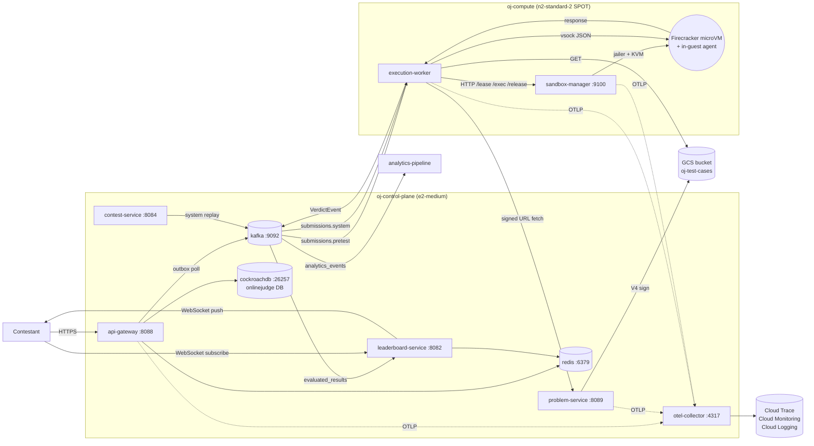
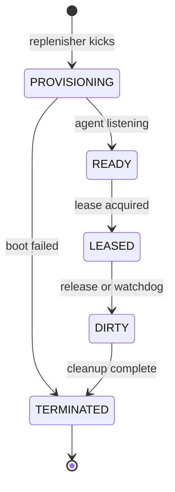
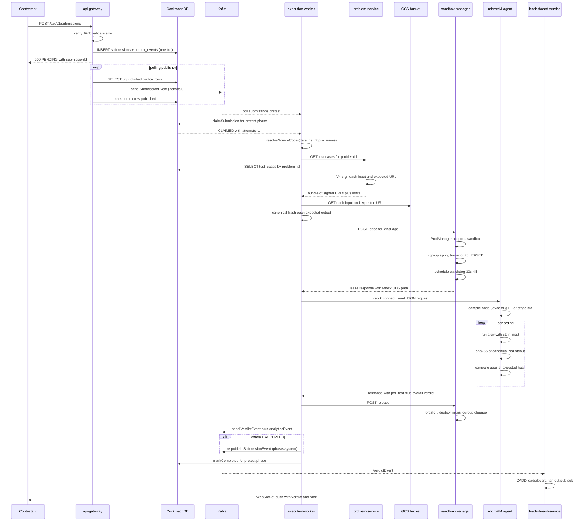

# Online Judge at Scale — Technical Specification

> Canonical reference for the system as it exists on `main`. Last reconciled with the repo on **2026-05-18**. Updated alongside material code changes — when behaviour and this spec disagree, treat the spec as authoritative *intent* and file a ticket against whichever side is wrong.
>
> Audience: a Principal SWE joining the team cold. Should be enough to answer "where does X happen, why was Y chosen, what breaks Z" without reading every file.
>
> Companions: per-service owner pages under [`docs/services/`](./services/) (the four high-complexity services — api-gateway, execution-worker, sandbox-manager, problem-service — have dedicated pages), [`docs/ci-cd.md`](./ci-cd.md), [`docs/code-companion.md`](./code-companion.md), the per-feature [design docs](./design-docs/) (index in [Appendix D](#d-design-doc-index)), and the [prod-readiness roadmap](https://github.com/hemantkgupta/CSE-Raw/blob/main/raw-blog/oj-prod-readiness-roadmap.md).

---

## Table of contents

1. [System overview](#1-system-overview)
2. [Goals, non-goals, and SLOs](#2-goals-non-goals-and-slos)
3. [Architecture](#3-architecture)
4. [Component catalogue](#4-component-catalogue)
5. [Wire formats and data models](#5-wire-formats-and-data-models)
6. [Sandbox architecture (deep dive)](#6-sandbox-architecture-deep-dive)
7. [Auth and security](#7-auth-and-security)
8. [Reliability mechanisms](#8-reliability-mechanisms)
9. [Observability](#9-observability)
10. [Deployment](#10-deployment)
11. [Operations](#11-operations)
12. [Multi-region](#12-multi-region)
13. [Testing strategy](#13-testing-strategy)
14. [Known limitations and debt](#14-known-limitations-and-debt)
15. [Glossary](#15-glossary)
16. [Appendices](#16-appendices)
    - [A. Submission round-trip sequence diagram](#a-submission-round-trip-sequence-diagram)
    - [B. Per-language rootfs toolchain](#b-per-language-rootfs-toolchain)
    - [C. Wire-protocol decoder example](#c-wire-protocol-decoder-example)
    - [D. Design doc index](#d-design-doc-index)

---

## 1. System overview

The online judge accepts source code from contestants over an HTTP API, runs it against a private suite of test cases inside a hardware-isolated sandbox, and publishes a verdict (ACCEPTED / WRONG_ANSWER / RUNTIME_ERROR / TIME_LIMIT_EXCEEDED / MEMORY_LIMIT_EXCEEDED / COMPILE_ERROR / INTERNAL_ERROR) on Kafka. Downstream consumers update a Redis sorted-set leaderboard, write analytics events, and propagate ACCEPTED pretest submissions onto a deferred system-test phase that runs the full suite.

The system supports three languages today: Python, Java (class `Solution`), and C++ (single TU). Each microVM runs one submission to completion, then is destroyed. The pool of warm microVMs is replenished asynchronously.

The deployment target is GCP — two VMs (`oj-control-plane` and `oj-compute`) in a single zone (`asia-south1-a`). The local-dev path uses `docker compose` against the same container images.

The canonical narrative version of this material is the production architecture blog at `raw-blog/execution-service-gcp.md`. This spec is the technical reference; the blog is the story.

---

## 2. Goals, non-goals, and SLOs

### Goals
- **Sub-2-second pretest verdict** at the 99th percentile, on a problem with ≤ 10 test cases each within its declared `time_limit_ms`.
- **Hardware-isolated sandboxing** — a contestant's process cannot read another submission's data, the host filesystem, or the public internet.
- **Exactly-once verdict per (submission, phase)** — Kafka redelivery never produces a duplicate verdict on `evaluated_results`.
- **Cross-language consistency** — the same canonical-hash rule applies to Python, Java, and C++ stdout, so a buggy newline normalisation in one language does not produce false WRONG_ANSWERs in others.
- **Operability** — the entire stack reproduces from `tofu apply` + image push in under ten minutes from a clean GCP project.

### Non-goals (v1)
- Federated identity (Google / GitHub OAuth) — self-hosted signup.
- A polished UI — the React SPA is a roadmap item; submissions today go via a Python harness directly to Kafka.
- Real-time collaboration, mobile clients, plagiarism detection, anti-cheat keystroke logging.
- Languages beyond Python / Java / C++.
- Custom problem checkers or interactive (judge-driven) problems — v1 is hash-compare against a pre-known canonical output.

### Service Level Objectives (target, not measured in v1)

| SLI | Target | Notes |
|---|---|---|
| Pretest verdict latency (gateway accept → `evaluated_results` publish), p99 | < 2 s | Includes Kafka hop + signed-URL fetch + microVM lease + per-test loop. Measured only after the OTel collector lands in prod. |
| Verdict correctness — same submission across two runs | 100 % match | Destroy-never-reuse + canonical-hash invariant; any drift is a P0. |
| Sandbox pool readiness — % of leases that find a warm VM | ≥ 99 % | Below this the pool sizing or replenishment cadence is wrong. |
| Submission acceptance availability | 99.5 % monthly | Bounded by Kafka + CRDB + api-gateway HA; today's single-broker / single-node deployment cannot meet this. The 3-broker / 3-node move is on the roadmap. |

---

## 3. Architecture

The system splits into three trust zones (from Part 7 of the design blog):

1. **Execution Service** — unprivileged, public-facing. Owns the contestant API, persists submissions, drives the per-submission verdict pipeline. Lives entirely on the control plane VM. Components: `api-gateway`, `execution-worker`'s consumer side, plus the supporting `problem-service` / `contest-service` / `leaderboard-service`.
2. **Sandbox Manager** — privileged. Owns `/dev/kvm`, the Firecracker binary, the harness rootfs, and the lease/release REST API. Lives on the compute VM. Never sees contestant code; only sandbox lifecycle.
3. **Execution Agent** — runs inside each microVM as PID 1. Receives JSON-over-vsock requests from the worker, runs the contestant binary, returns per-test verdicts. Cannot reach anything except the vsock control channel back to the host.



**Data plane vs control plane.** The data plane is the per-submission pipeline: Kafka → worker → SM lease → microVM → verdict back to Kafka. The control plane is what the operator interacts with: terraform, CI/CD, the contest-service admin endpoints (future), and the OTel pipeline. Failures in the control plane do not cause data loss; failures in the data plane do.

A full submission round-trip is rendered as a sequence diagram in [Appendix A](#a-submission-round-trip-sequence-diagram).

---

## 4. Component catalogue

Each subsection follows the same shape: purpose, tech stack, external interfaces, key internal mechanisms, failure modes, configuration knobs of interest, pointers to code.

Every service has a **dedicated owner page** under [`docs/services/`](./services/) that goes far deeper than these summaries — full configuration reference, metrics catalogue, runbook, code map. The summaries below are entry-point stubs; treat the per-service pages as the authoritative reference for the implementation. Cross-cutting modules (`common`, the in-guest Go agent) keep their full description inline here because they don't fit the "owned by one team" model — they're shared infrastructure.

### 4.1 api-gateway

The single public-facing component. Owns: contestant identity (signup / login / JWT issuance with `kid` rotation, refresh-token rotation, Argon2id), the `POST /api/v1/submissions` endpoint (validates auth + 64 KiB body cap + persists with outbox pattern), and the Flyway migrations for the entire system (`onlinejudge` schema, V1..V8). The cross-cutting reliability story (outbox publisher + reconciliation scanner) lives here; the policy story (rate limiting) lives here. Spring Boot 3.2.4, port 8088.

→ **Full owner page: [`services/api-gateway.md`](./services/api-gateway.md)** — REST surface, auth design, outbox + reconciliation internals, configuration reference, metrics, runbook (5 incidents), tests, code map.

### 4.2 execution-worker

The translator between Kafka and the synchronous SM lease/exec API. Pulls `SubmissionEvent` from `submissions.pretest` (concurrency 4) and `submissions.system` (concurrency 2); calls `problem-service` for test-case URLs; calls the SM `/lease`; dispatches to the in-guest agent over vsock; publishes `VerdictEvent` (with per-test breakdown) and `AnalyticsEvent`; on Phase-1 ACCEPTED re-publishes the submission to `submissions.system`. Idempotency is claimed AFTER successful sandbox lease so transient `pool_exhausted` 503s don't burn an attempt. Spring Boot 3.2.4; not publicly exposed.

→ **Full owner page: [`services/execution-worker.md`](./services/execution-worker.md)** — Kafka consumer wiring, idempotency state machine, pool-exhausted retry, agent dispatch, configuration reference, metrics, runbook (6 incidents), tests, code map.

### 4.3 sandbox-manager

Per-host privileged daemon. Owns `/dev/kvm`, the Firecracker binary, the harness rootfs, the kernel image, and the per-lease network namespace + iptables + cgroups. Exposes `POST /lease /release` on `:9100` for the worker. Manages the warm-pool state machine (PROVISIONING → READY → LEASED → DIRTY → TERMINATED) with target counts per language (`python:2 / cpp:1 / java:1`). Enforces the wall-clock kill via the watchdog and the per-microVM network namespace + iptables egress lockdown. The trust-zone boundary that lets the worker stay unprivileged. The cross-cutting architectural story for this service is in [§6 Sandbox architecture (deep dive)](#6-sandbox-architecture-deep-dive); the implementation reference is the owner page.

→ **Full owner page: [`services/sandbox-manager.md`](./services/sandbox-manager.md)** — pool state machine + replenisher + watchdog + cgroups + netns internals, configuration reference, metrics, runbook (6 incidents), tests, code map.

### 4.4 problem-service

The narrow waist between the `problems` / `test_cases` CRDB rows and the GCS bytes the worker consumes. Single endpoint: `GET /api/v1/problems/{id}/test-cases?pretestOnly={bool}` returns `{time_limit_ms, memory_limit_mb, test_cases: [{ordinal, input_url, expected_output_url}, ...]}`. URLs are V4-signed in-process (no API roundtrip; RSA-SHA256 against the signer SA's private key fetched from Secret Manager at VM boot) with a 5-minute TTL. Per-problem `time_limit_ms` / `memory_limit_mb` are also returned and flow forward to the SM's cgroup + the agent's wall clock. The only component that holds the GCS signer SA's private key in process. Spring Boot 3.2.4, port 8089.

→ **Full owner page: [`services/problem-service.md`](./services/problem-service.md)** — V4 signing internals, signer-key loading, configuration reference, metrics, runbook (5 incidents), tests, code map.

### 4.5 contest-service

Contest lifecycle state machine — CREATED → REGISTRATION → ACTIVE → CLOSED. Owns the `contests` table + the `contest_problems` join (api-gateway Flyway V6 + V7). On ACTIVE → CLOSED transition, fans out a system-test replay (roadmap §4.23) that re-publishes every ACCEPTED pretest submission for the contest's problems as `phase=system` on `submissions.system`. The phase-scoped IdempotencyService keys in the worker dedupe re-runs. Spring Boot 3.2.4, port 8084. Dockerfile + compose entry shipped (commit `6be38f4`); not yet deployed on the live GCP environment.

→ **Full owner page: [`services/contest-service.md`](./services/contest-service.md)** — state machine + replay flow + encryption hooks, configuration reference, metrics, runbook (5 incidents), tests, code map.

### 4.6 leaderboard-service

Consumes `evaluated_results`, caches each verdict in Redis (`verdict:{submissionId}` STRING with 24 h TTL), and pushes via STOMP-over-SockJS to subscribed WebSocket sessions. The WebSocket endpoint is `/ws`; clients SUBSCRIBE to `/topic/leaderboard/{contestId}` for contest-wide updates and `/topic/verdicts/{userId}` for per-user verdict feeds. Reads from a **sharded** sorted-set scheme `leaderboard:{contestId}:s{idx}` routed by `ScoreRangeShardRouter` (the single-key model in some early docs is stale). **Important caveat**: this service does NOT today write the leaderboard ZSETs — those writes are owned by scoring-pipeline, which isn't deployed yet. Until scoring-pipeline ships, the read path returns empty; the verdict cache + WebSocket push paths work standalone. Spring Boot 3.2.4, port 8082; Dockerfile + compose entry shipped, not yet deployed.

→ **Full owner page: [`services/leaderboard-service.md`](./services/leaderboard-service.md)** — STOMP wiring, score-range sharding, verdict-cache details, configuration reference, metrics, runbook (6 incidents), tests, code map.

### 4.7 scoring-pipeline

Flink DataStream job that would consume `evaluated_results`, apply per-contest scoring rules (first-AC-wins / time-penalty / partial-credit), and write the resulting score deltas to the Redis sorted-set leaderboard. Treats the verdict stream as source of truth and the Redis state as a materialised view. **Status: BLOCKED.** `build.gradle` declares Flink as `compileOnly`; `main()` calls `StreamExecutionEnvironment.getExecutionEnvironment()` expecting an external Flink JobManager + TaskManager. No `Dockerfile`, no compose entry, no Flink runtime provisioned. Deploying scoring-pipeline = standing up Flink in compose (or moving to managed Cloud Dataflow), submitting the fat JAR. Until then, [`services/leaderboard-service.md`](./services/leaderboard-service.md) does NOT compute scores (the read path is empty); a future stand-in could be a simple ZADD-by-points in leaderboard-service, but that's not implemented either.

→ **Full owner page: [`services/scoring-pipeline.md`](./services/scoring-pipeline.md)** — Flink topology, scoring rules, deployment path forward, code map.

### 4.8 analytics-pipeline

Consumes the `analytics_events` Kafka topic (one event per verdict, slimmer schema than VerdictEvent — see §5.1) and writes long-lived rows to **ClickHouse** for offline reporting. The local-dev path uses Spring Boot + HTTP `INSERT ... FORMAT TabSeparated` to `submission_analytics`; the production target per the source's Javadoc is the Kafka Engine + Materialized View pattern with ClickHouse pulling directly from Kafka. **Status: NOT DEPLOYED.** No Dockerfile, no compose entry, no ClickHouse instance, no `submission_analytics` DDL in the repo. The `analytics_events` topic accumulates and ages out per the 7-day Kafka retention.

→ **Full owner page: [`services/analytics-pipeline.md`](./services/analytics-pipeline.md)** — ClickHouse schema, the production Kafka-Engine pattern, deployment path forward, code map.

### 4.9 common

**Purpose.** Shared module: protobuf-generated event classes, common JPA configuration, region resolver, shared constants. Every JVM module depends on `:common`.

**Tech stack.** `protobuf-gradle-plugin` regenerates `Events.java` from `events.proto` on every build of `:common`. The generated classes are the wire types every service uses.

**Code pointers.**
- Proto: `common/src/main/proto/events.proto`
- Region resolver: `common/src/main/java/com/onlinejudge/common/region/RegionResolver.java`

### 4.10 In-guest agent (Go)

**Purpose.** PID 1 inside each microVM. Listens on AF_VSOCK port 1234, accepts one JSON request per session, compiles + runs the contestant code N times (one per test ordinal), returns a JSON response with per-ordinal verdicts and the overall result.

**Tech stack.** Go 1.22, statically linked (`CGO_ENABLED=0`). `github.com/mdlayher/vsock` for the listener. No other dependencies — the rootfs has no shared libraries to dynamic-load against. Built on the host by `build-rootfs.sh` and dropped into the rootfs at `/usr/local/bin/oj-execution-agent`.

**External interfaces.**
- Listens on `AF_VSOCK port=1234`. Single connection per session — when the host drops the connection or the agent process exits, the kernel panics ("Attempted to kill init!") and Firecracker shuts the VM down. That's how the host learns the VM is done.
- Wire format inbound: `{"session_token", "language", "code", "time_limit_ms", "per_test":[{"ordinal","input","expected_hash"},...]}`.
- Wire format outbound: `{"per_test":[{"ordinal","verdict","time_ms","memory_kb","stdout_hash"},...], "overall_verdict", "detail"}`.

**Key internal mechanisms.**
- **Compile once, run N times.** For Python the "compile" step is just `python3 <src>`; for Java it's `javac -d <wd> Solution.java` (class name MUST be `Solution`); for C++ it's `g++ -O2 -pipe -o /tmp/a.out solution.cpp`. The resulting `argv` is run once per ordinal with the ordinal's stdin piped in.
- **Per-ordinal wall clock.** `time_limit_ms` from the request becomes a `context.WithTimeout` on each ordinal's `exec.CommandContext`. Memory limit is enforced by the SM's cgroup, not the agent.
- **Hash canonicalisation.** `sha256(strings.TrimRight(string(stdout), " \t\n\r\v\f"))` — matches the worker's `TestCaseFetcher.canonicalHash` byte-for-byte. Cross-language consistency hinges on this.

**Failure modes & handling.**
- Compile fails → return `{verdict: "COMPILE_ERROR", detail: <stderr>}`, one entry, no per-ordinal runs. Overall verdict COMPILE_ERROR.
- Run exceeds wall clock → kill the process, return `TIME_LIMIT_EXCEEDED` for that ordinal. Continue to the next.
- OOM → the SM's cgroup kills the process with SIGKILL; the agent sees a non-zero exit + the OOM signal, maps to `MEMORY_LIMIT_EXCEEDED`.
- Stdin too large to fit in the OS pipe buffer → the agent uses `cmd.StdinPipe()` + a goroutine that writes the input string and closes. No blocking.

**Code pointers.** `infra/firecracker/agent/cmd/agent/main.go` is the entire surface (~400 lines). The bridge binary the host shells out to is `infra/firecracker/agent/cmd/vsock-client/main.go` (~250 lines).

---

## 5. Wire formats and data models

### 5.1 Protocol Buffers

The canonical wire on Kafka. Schema in `common/src/main/proto/events.proto`. proto3, four messages:

**SubmissionEvent** (field tags 1–9). Produced by api-gateway (outbox publisher) and contest-service (system-test replay). Consumed by execution-worker.

| Tag | Field | Type | Notes |
|---|---|---|---|
| 1 | `submission_id` | string | UUID of the row in `submissions`. |
| 2 | `user_id` | string | UUID; used as Kafka key for partitioning. |
| 3 | `problem_id` | string | UUID; lookup key into problem-service. |
| 4 | `contest_id` | string | UUID; empty string when not contest-scoped. |
| 5 | `s3_code_url` | string | Where to fetch the contestant source. Schemes: `data:` (inline, for smoke tests), `gs://` (production), `s3://`/`r2://`/`http(s)://` (TODO). |
| 6 | `language` | string | `python`/`java`/`cpp`. |
| 7 | `gateway_ts_ms` | int64 | Wall-clock at gateway accept; used downstream for late-arrival ordering in Flink. |
| 8 | `region` | string | Region the api-gateway pod was pinned to; becomes the REGIONAL BY ROW key on the CRDB write (multi-region future). |
| 9 | `phase` | string | `pretest`/`system`. Worker dispatches by *topic*, but the field travels for telemetry. |

**VerdictEvent** (tags 1–13). Produced by execution-worker. Consumed by leaderboard-service, scoring-pipeline, analytics-pipeline.

| Tag | Field | Type | Notes |
|---|---|---|---|
| 1 | `submission_id` | string | Mirrors the SubmissionEvent. |
| 2 | `user_id` | string | Kafka key for downstream partitioning. |
| 3 | `problem_id` | string | |
| 4 | `contest_id` | string | |
| 5 | `result` | string | ACCEPTED, WRONG_ANSWER, TIME_LIMIT_EXCEEDED, MEMORY_LIMIT_EXCEEDED, RUNTIME_ERROR, COMPILE_ERROR, INTERNAL_ERROR. |
| 6 | `execution_time_ms` | int32 | Sum across all ordinals or worst-ordinal time, depending on caller. |
| 7 | `memory_used_mb` | int32 | Peak across ordinals. |
| 8 | `gateway_ts_ms` | int64 | Mirrored from submission. |
| 9 | `points` | int32 | 100 for ACCEPTED, 0 otherwise (in v1; scoring-pipeline will compute partial credit). |
| 10 | `phase` | string | `pretest`/`system`. |
| 11 | `region` | string | Mirrored. |
| 12 | `event_ts_ms` | int64 | Authoritative timestamp for late-arrival correction in Flink. |
| 13 | `per_test` | repeated PerTestVerdict | Per-ordinal breakdown (roadmap §2.4). Consumers predating this field ignore it (proto3 unknown-field tolerance). |

**PerTestVerdict** (tags 1–5).

| Tag | Field | Type | Notes |
|---|---|---|---|
| 1 | `ordinal` | int32 | 1-indexed. |
| 2 | `verdict` | string | Same set as VerdictEvent.result, narrowed to per-test outcomes. |
| 3 | `time_ms` | int64 | Per-test wall clock. |
| 4 | `memory_kb` | int64 | Per-test peak RSS. |
| 5 | `stdout_hash` | string | SHA-256 hex of canonical stdout. **Never the raw bytes** — preserves test-case secrecy. |

**Code/intent gap (per the chosen scope rule).** `per_test` is populated by the worker, but no downstream consumer parses it yet. The leaderboard-service ignores it; scoring-pipeline ignores it; a future React SPA submission-detail page would render it. The field is reserved-for-future on the consumer side and live-on-write on the producer side.

**AnalyticsEvent** (tags 1–11). Produced by execution-worker. Consumed by analytics-pipeline (not deployed). Shape mirrors VerdictEvent's flat fields plus `language` and `event_ts_ms`. Used for offline reports.

### 5.2 CockroachDB schema

Owned end-to-end by api-gateway's Flyway migrations under `api-gateway/src/main/resources/db/migration/`. Single database: `onlinejudge`. Eight migrations:

| Version | Description | Owner section |
|---|---|---|
| V1 | Initial schema: `submissions`, `outbox_events`, `idempotency_keys` | §4.1, §8 |
| V2 | Add `region` column to write-path tables (multi-region prep) | §12 |
| V3 | Unify schema — add `users`, `problems`, `test_cases` on `onlinejudge` (post-`init.sql` retirement) | §2.2 |
| V4 | Add `attempts` column to `idempotency_keys` for §2.5 reclaim cap | §8.3 |
| V5 | Auth tables: `password_hash` on users + `refresh_tokens` + `auth_events` | §7.1 |
| V6 | `contests` table | §4.5 |
| V7 | `contest_problems` (contest ↔ problem join) | §4.5 |
| V8 | `reconcile_attempts` on submissions + partial index on `(status, created_at) WHERE status='PENDING'` | §4.1 (reconciliation scanner) |
| V9 | `region` columns on `users` / `contests` / `refresh_tokens` / `auth_events` / `idempotency_keys` + per-table `LOCALITY` (GLOBAL on shared catalog tables; REGIONAL BY ROW on hot-path tables). **Requires** [`infra/scripts/crdb-multiregion-init.sh`](https://github.com/hemantkgupta/online-judge-at-scale/blob/main/infra/scripts/crdb-multiregion-init.sh) to run BEFORE api-gateway boots — V9's `SET LOCALITY` DDL fails on a single-region cluster. | §12 multi-region; [`docs/runbooks/multi-region.md`](./runbooks/multi-region.md) |

Hibernate `ddl-auto=validate` for every JPA-using service post-V3. The CRDB INT type (BIGINT-flavoured) requires Java `long` on entity fields — `Problem.{time_limit_ms,memory_limit_mb,points}`, `IdempotencyKey.attempts`, etc. all retyped accordingly.

Indexes worth knowing about:
- `idx_test_cases_problem_ordinal` on `test_cases (problem_id, ordinal)` — hot path for problem-service per-problem reads.
- `idx_submissions_stuck_pending` partial index on `submissions (status, created_at) WHERE status='PENDING'` — reconciliation scanner's range scan.
- `idx_contests_state_time` on `contests (state, start_time, end_time)` — api-gateway's ContestWindowFilter (future) freeze check.
- `idx_outbox_region_unpublished` on `outbox_events (region, published, created_at) WHERE published=FALSE` — per-region outbox publisher.

### 5.3 Kafka topics

| Topic | Partitions | Producer(s) | Consumer(s) | Retention |
|---|---|---|---|---|
| `submissions.pretest` | 12 | api-gateway (outbox); execution-worker (Phase 1→2 promotion publishes elsewhere); reconciliation scanner | execution-worker pretest consumer (group `execution-worker-pretest`) | 7 d |
| `submissions.system` | 12 | execution-worker on ACCEPTED; contest-service on CLOSED replay | execution-worker system consumer (group `execution-worker-system`) | 7 d |
| `evaluated_results` | 12 | execution-worker | leaderboard-service; scoring-pipeline (when wired); analytics-pipeline (when wired) | 7 d |
| `analytics_events` | 12 | execution-worker | analytics-pipeline (not deployed) | 7 d |
| `submissions.dlq` | 6 | execution-worker (attempts-cap exceeded); reconciliation scanner (cap exceeded) | (operator-only — manual replay) | 30 d |
| `contest_events` | 12 | contest-service | leaderboard-service (lifecycle UI cues) | 7 d |

**Partitioning key.** All topics use `user_id` as the Kafka key on hot-path events; submissions for the same user always land on the same partition, which gives Flink a natural ordering guarantee on per-user windows. The DLQ uses `submission_id` (no user grouping needed for forensic replay).

**Single-broker today**, RF=1, ISR=1 — see §2.7 / §12 for the 3-broker move. Producer-side `acks=all` is set everywhere, which is correct on both single-broker and 3-broker layouts.

**`AUTO_CREATE_TOPICS_ENABLE=false`** as of the §2.7 stepping-stone hardening. Every topic must come through `infra/scripts/kafka-bootstrap-topics.sh`, which is idempotent (`--create --if-not-exists`).

### 5.4 Redis keys

| Pattern | Type | Owner | Purpose |
|---|---|---|---|
| `leaderboard:{contestId}:s{idx}` | ZSET | (future) scoring-pipeline writes; leaderboard-service reads | Per-contest ranking, score-range-sharded via `ScoreRangeShardRouter` (common module). `{idx}` is the shard ordinal. Reads aggregate across shards. **Not populated today** — scoring-pipeline isn't deployed; reads return empty. |
| `verdict:{submissionId}` | STRING (JSON) | leaderboard-service | Cached last VerdictEvent for the WebSocket bootstrap. TTL 24 h. |
| `/topic/leaderboard/{contestId}` | STOMP destination | leaderboard-service | Per-contest WebSocket push channel. Subscribers receive verdict events. |
| `/topic/verdicts/{userId}` | STOMP destination | leaderboard-service | Per-user verdict push. |
| `rate-limit:{userId}` | STRING (TTL'd token-bucket state) | api-gateway | Lua-script leaky bucket. |
| `rate-limit:ip:{ip}` | STRING (same) | api-gateway | Per-IP variant. |

The pub-sub channels `score_updates:{contestId}` and `score_updates:user:{userId}` are referenced in some earlier design material but have no producer in the current code; the fan-out is via STOMP destinations above, dispatched from `SimpMessagingTemplate.convertAndSend(...)`. See [`services/leaderboard-service.md`](./services/leaderboard-service.md) for the full implementation reference.

### 5.5 GCS layout

Single bucket: `oj-test-cases-{projectId}` (e.g. `oj-test-cases-online-judge-hk`). Naming convention enforced by `problem-service` JPA + the seed scripts:

```
gs://oj-test-cases-<proj>/<problem-slug>/<ordinal>/input.txt
gs://oj-test-cases-<proj>/<problem-slug>/<ordinal>/expected.txt
```

The `<problem-slug>` is operator-chosen — not the UUID — so a human browsing the bucket can tell which folder is which problem. Example: `sum-of-two/1/input.txt`. The `test_cases.input_gcs_key` column stores the path relative to the bucket (no leading slash, no bucket prefix).

URLs handed to the worker are V4-signed with a 5-minute TTL. The signer SA has `roles/storage.objectViewer` (read-only — uploads happen via the operator's own credentials).

---

## 6. Sandbox architecture (deep dive)

This is the largest chunk of novel design in the system; the rest of the components are conventional Spring services. Three sub-sections: the pool state machine, the destroy-never-reuse invariant + its consequences, and the egress-lockdown wiring.

### 6.1 Pool state machine

Each sandbox lives in exactly one of five states:



**PROVISIONING** — a `@Scheduled` thread spawns a Firecracker process inside a fresh netns, configures the machine via the FC REST API (boot, drives, vsock), waits for the in-guest agent to print its readiness line on the host-side UDS, then transitions to READY. Replenishment is bounded by `app.pool.max-parallel-boot` (default 2) so the 2-vCPU compute VM doesn't thrash on N concurrent FC starts.

**READY** — VM is alive, agent is listening, nothing pending. `PoolManager.acquire(language)` pops the head of the language queue and transitions to LEASED. Empty queue → `PoolExhaustedException` with the configured `retry_after_ms`.

**LEASED** — owned by exactly one submission. The watchdog has scheduled a wall-clock kill `app.lease.wall-seconds` (default 30 s) from now. Per-lease cgroup applied. Worker holds the (sandbox_id, session_token) pair.

**DIRTY** — the sandbox is done (either successfully via `/release` or destructively via watchdog forceKill). The host-side cleanup begins: kill the Firecracker process, tear down the netns, drop iptables rules, remove the UDS files, decrement the cgroup. Brief — typically under 100 ms.

**TERMINATED** — cleanup complete. The pool's "in-use" counter is decremented; the replenisher will notice and start a new PROVISIONING in this slot.

The `Sandbox` Java type carries one `AtomicReference<SandboxState>` enforcing the legal transitions. Illegal transitions (e.g. LEASED → READY) throw `IllegalStateException` rather than silently corrupting state.

### 6.2 Destroy-never-reuse + its consequences

Every microVM runs exactly one submission. After verdict, the VM is destroyed and replaced. This is the single biggest design decision in the sandbox layer.

**Why.** Reuse implies trust — that the previous contestant's code didn't leave a trojan in the rootfs, didn't modify a system library, didn't poison the agent's working directory. Audit becomes a per-launch concern AND a per-submission concern. With destroy-never-reuse, every contestant gets a hardware-fresh machine; the only state that crosses submission boundaries is what's baked into the rootfs at build time.

**Consequences.**
1. **Cold-start matters.** A fresh FC boot is ~100–200 ms; a fresh Python interpreter import is another ~80 ms. To keep p99 verdict latency under 2 s, we pre-warm. The pool target `python:2 / cpp:1 / java:1` is sized so that the replenishment cadence + average submission duration stays in equilibrium.
2. **Replenishment is the bottleneck under burst load.** Once the pool is empty, the lease API returns 503 until at least one new sandbox finishes PROVISIONING. Worker now treats this as `PoolExhaustedException` and `ack.nack(retry_after_ms)`, which spreads the load over time instead of pushing it onto the contestant as a RUNTIME_ERROR.
3. **State leaks must be impossible.** No tmpfs that persists. No agent-side state that's not zeroed on init. The rootfs is mounted read-only by Firecracker; writes go to a per-VM overlay that dies with the VM.

### 6.3 Egress lockdown (roadmap §3.1)

The default Firecracker host wiring gives each microVM a tap-device NIC inheriting the host's routing table — meaning `curl http://1.1.1.1` from inside the guest works. That's the canonical OJ exfiltration vector: a malicious submission could leak test inputs / expected outputs to a callback server, or call out to a C2.

The fix is per-microVM network namespace isolation:

1. **At lease time.** SM creates a fresh netns (`ip netns add oj-<sb-id-prefix>`). The netns has only loopback — no NICs, no default route.
2. **Firecracker exec'd inside the netns.** `ip netns exec oj-<sb-id> firecracker --api-sock ...`. When FC opens its tap device, the open fails (no tap device exists in this netns). The microVM boots with zero virtio-net devices.
3. **vsock survives.** vsock is not a network device — it's a Unix-domain socket on the host filesystem. The agent inside the guest can still reach the host via vsock; nothing else.
4. **Host-side iptables (belt and suspenders).** Even though the netns has no NIC, an `iptables -I FORWARD -i fc-tap-<id> -j DROP` rule + `iptables -I OUTPUT -m owner --uid-owner firecracker -j REJECT` are inserted at lease and removed at release. If a future regression accidentally re-attaches a NIC, the rules still block egress.
5. **At release time.** Reverse order — iptables rules first (they reference the sandbox id; cleaner to remove before the netns dies), then the netns. Idempotent — `ip netns del` on a missing namespace returns 0 with a warning.

**Validation.** A Go integration test at `infra/firecracker/agent/cmd/agent/egress_test.go` (build tag `//go:build integration_microvm`) attempts `net.Dial("tcp", "1.1.1.1:80")` from inside a locked-down microVM and asserts the dial fails within 250 ms with `ENETUNREACH` / `EHOSTUNREACH` / `EACCES`. To run:

```sh
GOOS=linux GOARCH=amd64 go test -tags=integration_microvm \
  -c -o /tmp/egress_test \
  ./infra/firecracker/agent/cmd/agent
# scp /tmp/egress_test into the locked-down microVM and run it.
```

The feature is gated by `app.sandbox.egress-lockdown.enabled` (default true) and `app.sandbox.egress-lockdown.iptables-enabled` (default false on dev hosts / CI — macOS doesn't have `iptables`). Full design rationale + alternatives considered in [`design-docs/microvm-egress-lockdown.md`](./design-docs/microvm-egress-lockdown.md).

---

## 7. Auth and security

### 7.1 JWT + signup/login

Real auth was wired in roadmap §2.1 (commit `1b82186`). Today's surface:

| Endpoint | Auth required | Body | Effect |
|---|---|---|---|
| `POST /api/v1/auth/signup` | public | `{username, password}` | INSERT user with Argon2id password hash; 201 with `{userId}`. |
| `POST /api/v1/auth/login` | public | `{username, password}` | Verify password; return `{accessToken, refreshToken, expiresIn}`. |
| `POST /api/v1/auth/refresh` | public (carries refresh token) | `{refreshToken}` | Rotate. New access + refresh token returned. Old refresh token revoked. |
| `POST /api/v1/auth/logout` | authenticated | `{refreshToken}` | Mark the refresh token revoked; subsequent refresh attempts return 401. |

**Access token.** JWT (HS256). Claims: `sub` (user UUID), `iss` (`online-judge`), `iat`, `exp`, `typ=access`. Header carries `kid` (current signing key id). TTL 15 minutes.

**Refresh token.** Opaque 32-byte SecureRandom, base64url-encoded. Server stores SHA-256(rawToken) only — the raw value never persists. TTL 7 days. Rotated on every successful refresh.

**Key rotation.** `JwtTokenProvider` keeps a `Map<kid, SecretKey>`. The current signing kid lives in `app.jwt.kid-current`; a one-version rollback window exists via `app.jwt.kid-previous`. To rotate: deploy with `kid-current=v2, kid-previous=v1`; wait for all access tokens minted under v1 to expire (15 min); drop v1 from the map on the next deploy.

**Today's secret stash.** The actual key bytes are in `app.jwt.keys.v1` / `.v2`. The `random_password.jwt_secret` terraform resource generates `v1` and stores it in tfstate; on container start it's injected via `JWT_SECRET` env. Moving the secret to Secret Manager (with versioning) is roadmap §3.3.

### 7.2 Source-code size cap

`SubmissionRequest.code` carries `@Size(max=65536)`. The Spring validator fires before Jackson finishes deserializing the request body, returning a 413 cleanly. Two Tomcat-level caps also fire (`server.tomcat.max-swallow-size` and `max-http-form-post-size`) so a 50 MB upload doesn't even reach Spring.

### 7.3 V4-signed GCS URLs

Test-case bytes never reach the worker except through a signed URL. The signer SA (`oj-problem-signer@…`) has only `roles/storage.objectViewer` on the bucket — the URLs it signs can read, never write. TTL 5 minutes. The signer's private key lives on disk inside the problem-service container, fetched from Secret Manager at VM boot.

This makes a leaked URL a 5-minute window of exposure rather than a permanent credential. It also means the worker container doesn't need any GCS-side IAM — it just curls the signed URL.

### 7.4 Egress lockdown

Covered in §6.3. Belt-and-suspenders: netns isolation + iptables DROP rules per microVM.

### 7.5 Rate limiting

`RateLimitService` in api-gateway uses a Lua-script leaky bucket against Redis. Two limiters today: per-IP and per-user. Configured via `app.rate-limit.{per-ip,per-user}.{capacity,refill-per-second}`; defaults are dev-grade. Tuning to real production thresholds is roadmap §3.2; the alert on 429 rate that should accompany it is also pending.

The auth endpoints are NOT rate-limited separately today — they share the per-IP bucket with submission posts. A brute-force login attempt eats the contestant's submission budget. Splitting them out is tracked in [`design-docs/auth-end-to-end.md`](./design-docs/auth-end-to-end.md).

### 7.6 IAM posture on GCP

Each VM runs as a dedicated SA:

| SA | Scopes |
|---|---|
| `oj-control-plane@…` | `roles/artifactregistry.reader`, `roles/logging.logWriter`, `roles/secretmanager.secretAccessor` (signer key + future JWT key), `roles/monitoring.metricWriter`, `roles/cloudtrace.agent` |
| `oj-compute@…` | `roles/artifactregistry.reader`, `roles/logging.logWriter` |
| `oj-problem-signer@…` | `roles/storage.objectViewer` on the test-cases bucket |
| `oj-scheduler@…` | `roles/compute.instanceAdmin.v1` (auto-shutdown invocation) |

Workload Identity Federation is the planned auth path for GitHub Actions → AR / GCE (no JSON key on disk). `docs/ci-cd.md` carries the gcloud one-time setup.

---

## 8. Reliability mechanisms

Five interlocking mechanisms. Two are in api-gateway, three are in the worker / SM.

### 8.1 Outbox pattern (api-gateway)

The `POST /submissions` handler writes both `submissions` and `outbox_events` in a single CRDB transaction. A polling publisher (`@Scheduled`, runs every 500 ms) reads `outbox_events WHERE published=FALSE ORDER BY created_at`, sends each to Kafka with `acks=all`, then marks `published=TRUE`. Surviving failure scenarios:

- API gateway crashes between row INSERT and Kafka send → both row and outbox are in CRDB; on restart the publisher picks up the outbox row.
- Kafka is down → publisher fails the send, leaves `published=FALSE`, retries next tick.
- Publisher crashes mid-publish → at-least-once delivery (the same event can arrive twice). De-duped by the worker's idempotency layer.

### 8.2 Reconciliation scanner (api-gateway)

The outbox pattern protects against gateway-crash *between txn and Kafka*. It doesn't protect against gateway-crash *between row insert and outbox insert* — they're in one txn, but a sufficiently weird failure (e.g. the CRDB connection drops mid-txn AFTER the row commits but BEFORE the outbox insert can land) can leave a `PENDING` submission with no outbox row.

The reconciliation scanner (§3.9) is the safety net for this class. Every 60 s it queries `submissions WHERE status='PENDING' AND created_at < now()-15min AND reconcile_attempts < 10` and re-publishes each to `submissions.pretest`. The `reconcile_attempts` column on submissions bounds the retry budget. Beyond 10 attempts, the submission is `markFailed` and dead-lettered. Default config:

```yaml
app.reconciliation:
  enabled: true
  interval-seconds: 60
  stale-after-seconds: 900   # 15 min
  batch-size: 500
  max-attempts: 10
```

Idempotency on the worker side ensures the re-published event doesn't double-execute (the worker's `claimSubmission` for `(submissionId, pretest)` will return COMPLETED for any submission whose original publish already produced a verdict).

### 8.3 Idempotency keys + DLQ (worker)

`idempotency_keys` rows are phase-scoped: key is `"<submissionId>:<phase>"`. The worker's `claimSubmission` produces one of four outcomes:

| Outcome | What the worker does |
|---|---|
| CLAIMED | Proceed to lease + exec. New row inserted with `attempts=1`. |
| IN_PROGRESS | Another consumer holds an active claim. `ack.nack(5s)`. |
| COMPLETED | This submission/phase has already produced a verdict. `ack.acknowledge()`. |
| POISON | The claim has cycled through `max-attempts` reclaims. The consumer publishes a DLQ envelope to `submissions.dlq` and `ack.acknowledge()` — preventing infinite redelivery. |

The reclaim path (when a stale `processing` row is seen by a fresh consumer) increments `attempts` atomically, refreshes `created_at`, and proceeds. Without the cap, a submission that repeatedly fails mid-execution could cycle forever; the cap puts a hard ceiling on the per-submission work the worker will ever do.

`releaseClaim` is the fourth verb (alongside CLAIMED / COMPLETED / POISON / IN_PROGRESS). When a transient failure happens *before* the worker has actually started running the contestant code (specifically: SM pool exhausted, problem-service unreachable), the worker DELETEs the just-inserted row so the next redelivery starts fresh. This keeps "couldn't acquire resources" from burning an attempt against a contestant who did nothing wrong.

### 8.4 Watchdog (sandbox-manager)

Every leased sandbox has a wall-clock kill scheduled `app.lease.wall-seconds` (default 30 s) in the future. When the timer fires:

1. Cancel the timer (idempotency vs the release path).
2. Run `forceKill(sandboxId)` — SIGKILL the Firecracker process, transition to DIRTY, run the cleanup chain (cgroups, netns, UDS files).
3. The release path is a no-op for this sandbox going forward.

The watchdog is the only safety net against an agent that lies about its own time budget. Without it, a deliberately-stuck program could pin a microVM (and the cgroup it's in) until the JVM-side timeout 5 minutes later, eating pool capacity.

### 8.5 Pool-exhausted retry (worker)

Covered in §4.2. The SM's `503 pool_exhausted` becomes `PoolExhaustedException`, which the worker catches separately from production runtime errors, releases the idempotency claim, and `ack.nack(retry_after_ms)`. The contestant sees nothing; the message redelivers; the pool replenisher fills in; the next consumer succeeds.

Without this carve-out the worker would publish `RUNTIME_ERROR` to the contestant for what is purely a server-side backpressure event — user-facing-wrong.

---

## 9. Observability

The implementation is shipped (commit `d2d2bca`); the activation is gated by the operator.

### 9.1 OTel Collector pipeline

A single `otel/opentelemetry-collector-contrib:0.99.0` container runs on the control-plane VM as a sibling of api-gateway et al. Configuration at `infra/gcp/compose/otel-collector-config.yaml`. Pipeline:

```
OTLP receivers (gRPC :4317, HTTP :4318)
  → memory_limiter (caps at 384 MiB to protect the collector itself)
  → resourcedetection (stamps gcp instance + zone)
  → batch (send_batch_size=1024, timeout=5s — Cloud Trace pricing optimisation)
  → exporters:
      traces   → googlecloud         (Cloud Trace)
      logs     → googlecloud         (Cloud Logging)
      metrics  → googlemanagedprom    (Cloud Monitoring, GMP-native)
```

ADC is picked up from the GCE metadata server; the control-plane VM's SA has `roles/{logging.logWriter, monitoring.metricWriter, cloudtrace.agent}`. No service-account JSON key on disk.

The compute VM's services (`oj-execution-worker`, `oj-sandbox-manager`) point at the control-plane collector across the VPC at `http://10.0.0.2:4317`. Single cross-VM hop; latency overhead < 1 ms.

### 9.2 Service-side activation

Every JVM service already bakes the OpenTelemetry Java agent. The compose env carries `OTEL_JAVAAGENT_ENABLED=${OTEL_JAVAAGENT_ENABLED:-false}` — disabled by default. After verifying the collector is healthy, the operator flips the `.env` to `OTEL_JAVAAGENT_ENABLED=true` + `OTEL_ENDPOINT=http://oj-otel-collector:4317` and bounces each service. The two-step rollout is deliberate: flipping the agent on with no reachable collector crashes the JVM during autoconfigure (the autoconfigure validator's known footgun).

### 9.3 Metrics catalogue (planned)

Counter + gauge + histogram names below are aspirational — the OTel agent gives us automatic JVM + HTTP + Kafka metrics for free, but the application-specific ones need explicit `WorkerMetrics` / `SandboxMetrics` / `GatewayMetrics` registration. Today's `WorkerMetrics` ships several of these; the rest are TODO.

| Metric | Type | Labels | Owner |
|---|---|---|---|
| `submission.accepted` | counter | `region` | api-gateway |
| `submission.rejected.size_too_large` | counter | `region` | api-gateway |
| `verdict.published_total` | counter | `verdict`, `language`, `phase` | execution-worker |
| `sandbox.lease.latency_seconds` | histogram | `language` | sandbox-manager |
| `sandbox.pool.ready` | gauge | `language` | sandbox-manager |
| `sandbox.leases.active` | gauge | `language` | sandbox-manager |
| `worker.idempotency.attempts_max` | gauge | (none) | execution-worker |
| `gateway.reconciliation.{swept,republished,dlq}_total` | counter | (none) | api-gateway |

### 9.4 Dashboards and alerts

Shipped as code under `infra/observability/`:

| Dashboard JSON | Panels |
|---|---|
| `dashboards/submission-funnel.json` | accept→outbox / outbox→lease / lease→exec-done / exec→verdict — p50 + p99 each, plus end-to-end verdict throughput |
| `dashboards/sandbox-pool-depth.json` | gauges (python/cpp/java) + per-language pool depth and active leases over time |
| `dashboards/kafka-consumer-lag.json` | per-group lag panels (`execution-worker.{pretest,system}`, `leaderboard-service.evaluated`, `analytics-clickhouse`) + cross-group sum as the alert source |

Five alert policies under `alerts/`: collector pod restart, collector OOM-kill, accept→verdict p99 > 30 s for 5 min, sandbox pool at 0 for any language for 60 s, consumer-group lag > 10 000 for 5 min.

`scripts/validate.sh` is the offline pre-merge gate — parses every JSON, runs `otelcol-contrib validate` on the collector config when the binary is on `$PATH`, and confirms every JVM service in `region.yml` inherits the shared `x-otel-defaults` YAML anchor. `scripts/{apply-dashboards,apply-alerts}.sh` are the idempotent operator commands (`gcloud monitoring …` under the hood); both match on `displayName` and update in place.

Operator runbook for the OTEL_JAVAAGENT_ENABLED flip lives in `infra/observability/activation-runbook.md`.

---

## 10. Deployment

### 10.1 GCP topology

**Two VMs in two regions, each running the FULL application stack.** Replaces the earlier single-region "control plane VM + compute VM" split (commit `<phase-1-sha>`); the trust-zone separation between Sandbox Manager (privileged) and the rest stays a process-level concern, not a host-level one.

| VM | Region | Zone | Type | What runs |
|---|---|---|---|---|
| `oj-region-a` | `var.primary_region` (default `asia-south1`) | `var.primary_zone` (default `asia-south1-a`) | `n2-standard-2` SPOT (2 vCPU / 8 GB, nested-virt) | The full stack: zookeeper, kafka, cockroachdb (locality `region=asia-south1`), redis, api-gateway, problem-service, contest-service, leaderboard-service, otel-collector, sandbox-manager, execution-worker, Firecracker microVMs. |
| `oj-region-b` | `var.secondary_region` (default `us-central1`) | `var.secondary_zone` (default `us-central1-a`) | `n2-standard-2` SPOT, same shape | Identical software; CRDB locality `region=us-central1`. |

Both VMs have **static internal IPs** allocated via `google_compute_address` (`oj-region-a-internal` and `oj-region-b-internal`) so each VM's startup-script can carry the OTHER VM's IP at plan time — required for CRDB `--join`, Kafka cross-region reach, and the leaderboard-service peer fan-out. Without static IPs, terraform hits a dependency cycle between the two VM resources.

Network:
- One global VPC `oj-vpc` with `routing_mode = GLOBAL` (so cross-region private-IP traffic doesn't hairpin via the public internet).
- Two regional subnets: `oj-subnet-primary` (`10.10.0.0/24`) and `oj-subnet-secondary` (`10.20.0.0/24`).
- Firewall: `oj-allow-iap-ssh` (IAP SSH source range) + `oj-allow-cross-region` (all TCP/UDP/ICMP between the two subnets). Both VMs tagged `oj-vm`.

Both VMs have ephemeral external IPs for outbound only (apt / docker pulls / AR cross-region pulls). Inbound is IAP-only.

Two Cloud Scheduler jobs (`oj-auto-shutdown-region-a/-b`) stop both VMs nightly at 23:00 IST.

### 10.2 Terraform inventory

`infra/gcp/terraform/main.tf` is the single source of truth for every billable resource. The 2-region topology adds resources vs the single-region predecessor:

- 1 VPC (`oj-vpc`, global routing) + 2 regional subnets
- 2 static internal IPs (`google_compute_address`, one per region — breaks the cycle described in §10.1)
- 2 firewall rules (`oj-allow-iap-ssh`, `oj-allow-cross-region`)
- 1 Artifact Registry repo (`oj-images`, hosted in the primary region; secondary VM does cross-region pulls)
- 1 shared region service account (`oj-region`) + 1 AR-reader binding + 3 project-level IAM bindings (logging.logWriter, monitoring.metricWriter, cloudtrace.agent)
- Existing: 1 GCS bucket + signer SA + Secret Manager wiring (project-global, no regional duplication)
- 1 archive_file (agent source tarball baked into both VMs' startup-script metadata)
- 1 random_password (JWT secret)
- 2 `google_compute_instance` resources (`oj_region_a`, `oj_region_b`), both `n2-standard-2` SPOT with nested-virt
- 1 scheduler SA + 2 Cloud Scheduler jobs (per-region nightly stop)

A `tofu destroy` from a clean apply tears down everything in dependency order.

### 10.3 Compose: single consolidated `region.yml`

The earlier split (`control-plane-compose.yml` + `compute-compose.yml`) is gone. One file — `infra/gcp/compose/region.yml` — runs on every region VM, parameterised by env vars set by the startup script. Every service's compose entry uses `${REGION}` / `${PEER_REGION}` / `${PEER_INTERNAL_IP}` / `${INTERNAL_IP}` / `${KAFKA_HOST_EXTERNAL}` derived at boot.

CRDB compose command flags (the most material change):

```yaml
command:
  - start
  - --insecure
  - --advertise-addr=${INTERNAL_IP}
  - --listen-addr=0.0.0.0:26257
  - --http-addr=0.0.0.0:8080
  - --locality=region=${REGION},zone=local
  - --join=${INTERNAL_IP}:26257,${PEER_INTERNAL_IP}:26257
  - --max-sql-memory=512MiB
  - --cache=256MiB
```

Notable env-var contracts (operator-driven via `/opt/oj/.env`, generated at boot):
- `AR_URL` — Artifact Registry repo URL (always pulls from primary region's AR)
- `REGION` — the region this VM is in
- `PEER_REGION` — the other region's name
- `PEER_INTERNAL_IP` — the other VM's static internal IP (carried in startup-script metadata; written into `.env`)
- `INTERNAL_IP` — this VM's own IP (resolved at boot from the GCE metadata service)
- `KAFKA_HOST_EXTERNAL=${INTERNAL_IP}` — advertised listener
- `JWT_SECRET` — terraform-generated
- `GCS_BUCKET` — test-cases bucket
- `APP_SANDBOX_BACKEND=firecracker` (no longer flipped to `docker` since both VMs have nested-virt)
- `APP_PROBLEM_SERVICE_REQUIRED=true`
- `APP_PEER_GATEWAY_URL=http://${PEER_INTERNAL_IP}:8088` (api-gateway region-mismatch 307)
- `APP_PEER_LEADERBOARD_URL=http://${PEER_INTERNAL_IP}:8082` (leaderboard-service global fan-out)
- `OTEL_JAVAAGENT_ENABLED=false` (operator flips after collector is healthy; same posture as single-region)

### 10.4 Startup-script flow

`infra/gcp/startup/region.sh.tpl` runs on every boot of either region VM (terraform passes a different `${region}` parameter to each). Combines the responsibilities of the retired `control-plane.sh.tpl` + `compute.sh.tpl`:

1. Install Docker engine + compose plugin (idempotent).
2. Install gcloud CLI.
3. Install Firecracker binary (pinned version) + gVisor (best-effort; non-fatal).
4. Configure docker auth for AR.
5. Materialise `/opt/oj/region.yml` + `/opt/oj/otel-collector-config.yaml` from base64 metadata.
6. Drop `init.sh`, `build-rootfs.sh`, unzip agent source into `/opt/oj/agent/`.
7. Fetch problem-signer SA JSON from Secret Manager → `/opt/oj/gcs-signer.json` (mode 0400).
8. Generate `/opt/oj/.env` (the variables in §10.3).
9. Run `build-rootfs.sh` (idempotent via version marker).
10. Install + start the `oj-region.service` systemd unit (`docker compose -f /opt/oj/region.yml up -d --remove-orphans`).

### 10.5 First-boot bootstrap

A fresh `tofu apply` produces both VMs in stopped state. The operator's first-time bring-up:

1. Build + push all service images to AR (build-and-push GHA on push-to-main, OR local `docker buildx`).
2. `gcloud compute instances start oj-region-a oj-region-b`.
3. Wait ~3–5 minutes for both startup scripts to complete (rootfs builds in parallel per VM).
4. SSH into either VM, run `sudo bash /opt/oj/crdb-multiregion-init.sh asia-south1 us-central1` once — declares the CRDB cluster's PRIMARY REGION + adds the secondary. Idempotent; safe to re-run.
5. api-gateway boots, Flyway runs V1..V9 against `onlinejudge` (V9 applies the multi-region LOCALITY DDL — requires step 4 first; if you start api-gateway before step 4, Flyway crash-loops on the LOCALITY DDL).
6. Bootstrap Kafka topics on each region: `sudo bash /opt/oj/kafka-bootstrap-topics.sh --region asia-south1` on `oj-region-a`, `--region us-central1` on `oj-region-b`. Each region creates only its own region's topics.
7. Seed a problem: SQL INSERT into `problems` + `test_cases` (problems table is GLOBAL — write once, both regions see it); `gcloud storage cp` the input + expected files.
8. Smoke: signup via region A's gateway, log in, `submit-sample.py --expect-verdict ACCEPTED`. Repeat via region B's gateway.

Bringing it back from a torn-down state follows the same flow. ~15 minutes end-to-end including the CRDB cluster init step.

### 10.6 CI/CD (GitHub Actions)

Three workflows under `.github/workflows/`. Documented in `docs/ci-cd.md`.

| Workflow | Triggers | Jobs |
|---|---|---|
| `ci.yml` | `pull_request` to main, `push` to non-main | actionlint → gradle-test matrix (9 modules) → proto-roundtrip → terraform-validate → go-agent build+test |
| `build-and-push.yml` | `push` to main | WIF auth → docker buildx matrix over 6 services → push `<git-sha>` + `:latest` tags to AR |
| `deploy.yml` | `workflow_dispatch` (manual) | WIF auth → `gcloud compute ssh --tunnel-through-iap` → `docker compose pull && up -d` → post-deploy health check |

Required repo secrets: `GCP_PROJECT_ID`, `GCP_WORKLOAD_IDENTITY_PROVIDER`, `GCP_DEPLOY_SERVICE_ACCOUNT`. The one-time WIF setup is in `docs/ci-cd.md`; the broader design considerations (rollback story, blue/green follow-up) live in [`design-docs/ci-cd-github-actions.md`](./design-docs/ci-cd-github-actions.md).

scoring-pipeline is explicitly excluded from the build-and-push matrix — it has no Dockerfile (it's a Flink job, not a Spring container).

---

## 11. Operations

### 11.1 Common runbooks (planned, not yet authored)

Per the roadmap, one Markdown file per canonical incident:

| Incident | Trigger | First diagnostic step | Mitigation |
|---|---|---|---|
| Kafka broker died | producer errors, consumer lag spike | `docker exec oj-kafka kafka-broker-api-versions` | restart container; for the 3-broker future, ISR validation |
| CRDB lease lost | api-gateway 503s, error log "lost connection" | `cockroach node status` | restart cockroachdb container |
| Warm pool empty > 30 s | `sandbox.pool.ready{language=X} == 0` alert | sandbox-manager logs for "Failed to provision" | inspect KVM availability; restart SM |
| Firecracker jailer chroot failure | SM logs "jailer exec failed" | `dmesg` for kernel-side errors | rebuild rootfs |
| Signer key rotated, problem-service 401-ing | worker `test-case GET HTTP 401` | check `/opt/oj/gcs-signer.json` exists + is non-zero | re-fetch from Secret Manager |

None of these are written yet. Roadmap item §3.14.

### 11.2 SPOT preemption (compute VM)

`oj-compute` is SPOT — Google can reclaim it with 30 s notice. Today's behaviour on preemption: in-flight submissions die without publishing a verdict; the next start brings the warm pool back up; the killed submissions' idempotency rows stale-reclaim and eventually go POISON → DLQ.

The right fix is a shutdown script that drains the SubmissionConsumer (commits all in-flight submissions' offsets after publishing a `WORKER_PREEMPTED` verdict). Roadmap §3.8.

### 11.3 Auto-shutdown

Two Cloud Scheduler jobs (`oj-auto-shutdown-control-plane`, `oj-auto-shutdown-compute`) stop both VMs at 23:00 IST nightly. Safety net for "forgot to stop the VMs after testing". Disable for any launch weekend.

### 11.4 Cost model (dev-grade)

Per-day with 8 hours of active work:

| Item | Cost (~) |
|---|---|
| `oj-control-plane` (e2-medium) | ~₹14 |
| `oj-compute` (n2-standard-2 SPOT) | ~₹4 |
| Boot disks (2 × 25 GB pd-balanced) | ~₹2 |
| GCS storage (test cases, < 1 KiB) | ~₹0.001 |
| Artifact Registry storage (~3 GB) | ~₹0.30 |
| Cloud Scheduler (2 jobs, both under free-tier) | ₹0 |
| Network egress (negligible — IAP SSH only) | ~₹0.20 |
| **Daily total (8h active)** | **~₹21** |
| **Daily total (24h running)** | **~₹50** |

A teardown via `tofu destroy` reduces ongoing cost to ₹0 (only persistent state is the AR repo at ~₹0.30/mo, which `destroy` also removes).

---

## 12. Multi-region

Two regions, each running the full stack, sharing one logical CRDB cluster and one logical Kafka cluster across regions. The roll-up plan and historic rationale live in [`design-docs/multi-region-rollout.md`](./design-docs/multi-region-rollout.md); incident procedures in [`docs/runbooks/multi-region.md`](./runbooks/multi-region.md).

### 12.1 Sticky-region routing

Every write-path resource has a home region. Users register in region X; their `users.region` column is stamped at signup time (see §5.1). The access-token JWT carries a `region` claim that the gateway populates from `users.region` at login. If a request lands at the wrong region's gateway, `RegionMismatchFilter` returns **HTTP 307 Temporary Redirect** with a `Location` header pointing at `${APP_PEER_GATEWAY_URL}` (set by the startup script to the peer VM's internal address). Clients retry there; idempotent verbs follow the redirect transparently.

This keeps every write — submission insert, contest enrollment, refresh-token rotation — on the user's home node, which is exactly the row's `REGIONAL BY ROW` partition. No cross-region SQL hop in the hot path.

### 12.2 Per-region Kafka topics

Topic names carry the region:

| Topic | Purpose | Producer | Consumer |
|---|---|---|---|
| `submissions.<region>.pretest` | Live-contest pretest fan-out | api-gateway (outbox publisher) | execution-worker (region-local) |
| `submissions.<region>.system` | Post-contest system-test replay | contest-service `SystemTestReplayPublisher` (key off row.region) | execution-worker (region-local) |
| `contest_events.<region>` | Contest open/close fan-out | contest-service | leaderboard-service |
| `submissions.dlq` | Poison messages (region-agnostic) | execution-worker | DLQ tooling |
| `evaluated_results.<region>` | Worker verdicts | execution-worker | leaderboard-service (subscribed to BOTH regions — §12.3) |

Each worker subscribes only to its own region's submissions topic via the `${REGION}` env var. The contest-service replay publisher reads each `AcceptedSubmissionRow.region` and routes that row to `submissions.<row.region>.system` — so a contest contestant who submitted from us-central1 has their system-test fan-out replayed on the us-central1 worker, even if the contest was closed by an asia-south1 operator. Rows with NULL/blank region (legacy data) fall back to the local region's system topic.

Topics are created by [`infra/scripts/kafka-bootstrap-topics.sh --region <name>`](https://github.com/hemantkgupta/online-judge-at-scale/blob/main/infra/scripts/kafka-bootstrap-topics.sh). The script is idempotent (`--create --if-not-exists`).

### 12.3 Leaderboard global view

Leaderboard reads can be region-local (default) or global. Each region's leaderboard-service consumes **only its own** `evaluated_results.<region>` topic and writes to its own Redis ZSET — there is no cross-region Kafka subscription. The global view is layered on top via HTTP fan-out:

| Endpoint | Behaviour |
|---|---|
| `GET /api/v1/leaderboard/{contestId}?global=false` (default) | Returns this region's ZSET only. This is also the path the peer hits in step 2 below. |
| `GET /api/v1/leaderboard/{contestId}?global=true` | The controller first reads its own region's ZSET, then issues an HTTP `GET` to `${app.peer-leaderboard.url}/api/v1/leaderboard/{contestId}?global=false` with a 5 s read timeout, merges the two pages by score, and returns the combined view. On peer failure (timeout, 5xx, URL blank), the response degrades to local-only with header `X-Peer-Region-Unreachable: true`. |

Topics are created per region by [`infra/scripts/kafka-bootstrap-topics.sh --region <name>`](https://github.com/hemantkgupta/online-judge-at-scale/blob/main/infra/scripts/kafka-bootstrap-topics.sh). Details in §4.6 + the [leaderboard-service owner page](./services/leaderboard-service.md).

### 12.4 What's live today vs deferred

| Concern | Status |
|---|---|
| CRDB multi-region locality (V9) | **Live** — schema validated by V9 on a fresh cluster, runbook in `docs/runbooks/multi-region.md`. |
| JWT region claim + 307 mismatch redirect | **Live** — `RegionMismatchFilter` + `JwtTokenProvider.extractRegion` |
| Per-region Kafka topic naming | **Live** — `submissions.<region>.{pretest,system}`, `contest_events.<region>`, `evaluated_results.<region>` |
| Worker region affinity | **Live** — `app.region` env var drives the topic subscription |
| Leaderboard global view via peer HTTP merge | **Live** — `?global=true` fans out to peer; degrades gracefully on failure |
| Region-aware system-test replay | **Live** — `SystemTestReplayPublisher` reads `row.region` and routes per row |
| GCS Cloud DNS geo-routed entry | **Deferred** — clients today talk to a region's external IP directly; multi-region DNS is a §3.x roadmap item |
| 3-broker Kafka / 3-node CRDB per region | **Deferred** — single-broker / single-node per region; RF=1 today, RF=3 after the cluster bump (see §14) |

Cost estimate per `multi-region-rollout.md`: ~2× current monthly burn for the 2-region setup we run today; ~3× for the eventual three-region target.

---

## 13. Testing strategy

### 13.1 Unit tests

Per-module JUnit + Mockito. Run via `./gradlew :<module>:test`.

| Module | Notable test files |
|---|---|
| api-gateway | `AuthServiceTest` (7 scenarios: signup happy/duplicate, login wrong/right, refresh after revoke/expiry, logout idempotent), `ReconciliationScannerTest` (7 scenarios) |
| execution-worker | `SubmissionConsumerTest`, `TestCaseFetcherTest`, `IdempotencyServiceTest` (covers attempts cap, poison, race conditions), `FirecrackerExecutionServiceTest` (pool-exhausted carve-out), `DockerExecutionServiceTest` |
| problem-service | `ProblemControllerTest`, `ProblemServiceFilteringTest` (pretestOnly filter) |
| sandbox-manager | `NetnsApplierTest` (8 scenarios: argv shapes, idempotent destroy, retry-after-existing, iptables when enabled/disabled), `LeaseServiceEgressLockdownTest` (5 scenarios), `PoolManagerTest`, `WatchdogServiceTest`, `CgroupApplierTest`, `SandboxControllerTest` |
| contest-service | `SystemTestReplayPublisherTest` (5 scenarios), `ContestStateMachineSystemTestReplayTest` (5 scenarios) |
| common | (proto regen; thin) |

Full repo test: `./gradlew test` — 41 actionable tasks, all green on `main` as of commit `244449b`.

### 13.2 Smoke tests

**`submit-sample.py`** (`infra/firecracker/test/submit-sample.py`). Publishes a synthetic SubmissionEvent to Kafka. Flags: `--problem-id`, `--code` (inline) or `--code-file`, `--language`, `--bootstrap`, `--expect-verdict`. With `--expect-verdict`, the script also consumes `evaluated_results`, finds its own submission, and exits non-zero if the verdict doesn't match. Used both manually and by `ci-smoke.sh`.

**`sum-of-two`** (`infra/firecracker/test/problems/sum-of-two/`). A canonical multi-test problem with five test cases (basic + edge cases). Reference solutions in Python, Java, C++; one deliberately-wrong Python solution that exercises the WRONG_ANSWER path. Smoke-verified live on GCP during the development session — produces ACCEPTED for the three correct solutions and WRONG_ANSWER for the buggy one.

**`ci-smoke.sh`** (`infra/scripts/ci-smoke.sh`). Bash harness that spins up the docker-compose stack locally, waits for api-gateway health, then runs `submit-sample.py --expect-verdict ACCEPTED`. Currently a skeleton — requires a not-yet-written root `docker-compose.yml` that brings up the full stack with local-only services. Not invoked from `ci.yml` yet.

### 13.3 Integration tests

**Microvm egress test** (`infra/firecracker/agent/cmd/agent/egress_test.go`, build tag `//go:build integration_microvm`). Built outside the microVM, scp'd into a locked-down VM's rootfs, run via the existing harness. Asserts `net.Dial("tcp", "1.1.1.1:80")` fails within 250 ms.

**Scoring pipeline E2E** (`scoring-pipeline/src/test/java/.../ScoringEndToEndTest.java`). Spins up an in-process Flink mini-cluster + TestContainers Kafka, validates the leaderboard math end-to-end. Not run in CI today (Flink isn't deployed; the test exists for local dev).

### 13.4 Manual + production verification

The "ACCEPTED on live GCP" smoke is the final integration check — running `submit-sample.py` from `oj-control-plane` against the full stack and reading back the verdict from `evaluated_results`. Documented in `docs/ci-cd.md` and the production blog.

---

## 14. Known limitations and debt

Short list — each item points at deeper material.

| Item | Where it lives | Severity |
|---|---|---|
| Single-broker Kafka, single-node CRDB | [`design-docs/kafka-cluster-and-crdb-cluster.md`](./design-docs/kafka-cluster-and-crdb-cluster.md) | High — SPOF for the data plane |
| OTel collector deployed and configured; dashboards/alerts shipped as code; awaits the `/opt/oj/.env` flip per `infra/observability/activation-runbook.md` | §9 + `design-docs/otel-collector-activation-plan.md` | Low — single-line operator flip; dashboards/alerts apply via `gcloud` |
| JWT secret + signer SA key both in tfstate, no rotation cron | Roadmap §3.3, §3.4 | Medium — key rotation discipline missing |
| Auth endpoints share the per-IP rate limit bucket with submission posts | §7.5 + [`design-docs/auth-end-to-end.md`](./design-docs/auth-end-to-end.md) | Medium — brute-force login eats submission budget |
| scoring-pipeline not deployed (Flink cluster) | §4.7 + Agent I's audit | Medium — leaderboard-service does a stand-in calculation |
| React SPA not built | Roadmap §4.20 + [`design-docs/react-spa-and-websockets.md`](./design-docs/react-spa-and-websockets.md) | High for v1 launch — no UI |
| `analytics-pipeline` not deployed | §4.8 | Low — produces topic data is buffered for later |
| `RUNTIME_ERROR` vs INTERNAL_ERROR conflation | §4.2 failure modes | Low — minor UX paper-cut |
| No DLQ dashboard for the poison topic | Roadmap §3.10 | Medium — operators don't see dead-lettered submissions |
| No SPOT preemption shutdown script | §11.2 + roadmap §3.8 | Medium for `oj-compute` cost-optimised path |
| `network-policy` rules on `oj-allow-internal` too permissive (`0-65535/tcp`) | Roadmap §3.5 | Low — intra-VPC, no public ingress |
| `pre-test ≤ ordinal 10` is a magic number | Constants in `TestCase` entity + worker | Low — refactor to config |
| `idempotency_keys.processing-lease-seconds` is 300 s; not tunable per-problem | §8.3 | Low |

For each item the design doc / roadmap section is where the implementation plan lives.

---

## 15. Glossary

- **Canonical hash** — SHA-256 of `stripTrailing(stdout_bytes)` UTF-8-decoded. Matches between worker (TestCaseFetcher.canonicalHash) and agent (Go `sha256(strings.TrimRight(...))`). The cross-language equality invariant.
- **Destroy-never-reuse** — Each microVM runs exactly one submission, then is destroyed. Eliminates state leakage between contestants.
- **Idempotency claim** — A row in `idempotency_keys` scoped by `(submissionId, phase)`. Prevents the same submission from producing two verdicts.
- **Lease (sandbox)** — A claim on a specific READY microVM, returned by the sandbox-manager's `POST /lease`. Carries a wall-clock kill deadline; expires via release or watchdog.
- **Phase** — `pretest` (Phase 1, first 10 ordinals, live during contest) vs `system` (Phase 2, full suite, deferred or post-contest).
- **Pool** — The warm-microVM cache. Targets configured per-language; replenisher fills toward target asynchronously.
- **Pretest** — Phase-1 ordinal (1–10 by convention). The result the contestant sees during the contest.
- **System test** — Phase-2 ordinal (any ordinal; the suite is identified by `pretestOnly=false`). Determines final scoring after contest close.
- **Vsock** — Linux AF_VSOCK; the only "network" available inside a locked-down microVM. The agent listens on port 1234.
- **Watchdog** — The wall-clock kill scheduled at lease creation; fires `forceKill` to prevent stuck submissions from pinning the microVM.
- **Workstream** — Historical label from the blog's planning docs: A = problem-service, B = test-case-aware execution, F = the Go agent, G = api-gateway, H = observability. Surfaces in comments + commit messages.

---

## 16. Appendices

### A. Submission round-trip sequence diagram



### B. Per-language rootfs toolchain

The Firecracker harness rootfs (built by `infra/firecracker/rootfs/build-rootfs.sh` on every compute-VM first boot) is Ubuntu 22.04 minimal + the following:

- `python3` — CPython 3.10, default Ubuntu Jammy
- `openjdk-21-jdk-headless` — for `javac` + `java`
- `g++` + `libc6-dev` + `libstdc++-11-dev` — for C++ compile + link
- `busybox-static`, `coreutils`, `util-linux` — `timeout`, `head`, `sync`, `poweroff`, `mount`
- `ca-certificates` — required by the in-guest agent's TLS path (not used today; reserved)
- `/init` — 30-line shell script (PID 1) that mounts /proc /sys /tmp, exports PATH, exec's the agent
- `/usr/local/bin/oj-execution-agent` — the Go binary

Versioning: `OJ_HARNESS_VERSION="oj-rootfs-v5-prod-init"` — bumped whenever `init.sh` or the agent change. `build-rootfs.sh` checks the marker before rebuilding (idempotent).

### C. Wire-protocol decoder example

For debugging — decode a raw `VerdictEvent` byte payload off Kafka. Python, no protoc dependency:

```python
def _vparse(d, o):
    out, shift = 0, 0
    while o < len(d):
        b = d[o]; o += 1
        out |= (b & 0x7f) << shift
        if not (b & 0x80): return out, o
        shift += 7
    raise IndexError("varint truncated")

def decode_verdict(buf: bytes) -> dict:
    fields = {1: "submission_id", 5: "result", 6: "execution_time_ms",
              9: "points", 10: "phase", 11: "region"}
    out = {}; off = 0
    while off < len(buf):
        tag, off = _vparse(buf, off)
        field, wire = tag >> 3, tag & 7
        if wire == 0:
            v, off = _vparse(buf, off); out[fields.get(field, f"f{field}")] = v
        elif wire == 2:
            ln, off = _vparse(buf, off)
            if off + ln > len(buf): break
            out[fields.get(field, f"f{field}")] = buf[off:off+ln].decode("utf-8", "replace")
            off += ln
        else: break
    return out
```

The full decoder used by `submit-sample.py --expect-verdict` mode is more complete; this snippet is intended for ad-hoc debugging.

### D. Design doc index

Eight per-feature design docs live in [`docs/design-docs/`](./design-docs/). Each is a self-contained spec covering one workstream: problem statement, design, implementation phases, risks, acceptance criteria. Together they total ~15K words. The index [`docs/design-docs/README.md`](./design-docs/README.md) carries one-sentence summaries plus the roadmap section each addresses.

| Doc | Roadmap | Status today | What it covers |
|---|---|---|---|
| [`auth-end-to-end.md`](./design-docs/auth-end-to-end.md) | §2.1 | Implemented | Signup / login / refresh / logout endpoints; Argon2id + JWT `kid` rotation; refresh-token storage as SHA-256 hash; rate-limit split between auth and submission buckets (the split itself is still TODO). |
| [`otel-collector-deployment.md`](./design-docs/otel-collector-deployment.md) + [`otel-collector-activation-plan.md`](./design-docs/otel-collector-activation-plan.md) | §2.6 | Shipped end-to-end; awaits the `OTEL_JAVAAGENT_ENABLED=true` flip | OTLP collector pipeline; GCP exporter wiring; the three dashboards + five alerts under `infra/observability/`; the `x-otel-defaults` YAML anchor every JVM service inherits; the operator runbook in `infra/observability/activation-runbook.md`. |
| [`kafka-cluster-and-crdb-cluster.md`](./design-docs/kafka-cluster-and-crdb-cluster.md) | §2.7 | Stepping-stone shipped; full 3-broker/3-node not implemented | KRaft single-broker hardening (already in place) + the full 3-broker + 3-node multi-AZ migration; cert handling for inter-node TLS; disk co-tenancy risk (the highest-impact production-incident class). |
| [`microvm-egress-lockdown.md`](./design-docs/microvm-egress-lockdown.md) | §3.1 | Implemented | Per-microVM netns; iptables belt-and-suspenders; Firecracker machine config sans `network-interfaces`; the Go integration test that validates the lockdown. |
| [`ci-cd-github-actions.md`](./design-docs/ci-cd-github-actions.md) | §3.11 | Workflows shipped, secrets pending operator | PR / merge-to-main / manual-deploy workflows; WIF auth; rollback story; blue-green follow-up. |
| [`react-spa-and-websockets.md`](./design-docs/react-spa-and-websockets.md) | §4.20 | Not implemented | React + monaco-editor SPA; STOMP-over-SockJS for verdict push; Cloud CDN hosting. |
| [`contest-close-system-tests-replay.md`](./design-docs/contest-close-system-tests-replay.md) | §4.23 | Implemented | ACTIVE → CLOSED transition fires the replay; per-problem ACCEPTED submissions re-published as `phase=system`; phase-scoped idempotency dedup. |
| [`multi-region-rollout.md`](./design-docs/multi-region-rollout.md) | §5 | Not implemented | Three-region target (asia-south1 / us-east1 / europe-west1); per-region Kafka with no MirrorMaker; CRDB LOCALITY REGIONAL BY ROW; Cloud DNS geo-routing; cost estimate. |

These docs were authored before the corresponding code landed (or, in two cases, before the implementation got scoped). Treat the *design* as authoritative for items not yet built; treat the *spec* (this document) as authoritative for items that are.

---

*End of spec.*
